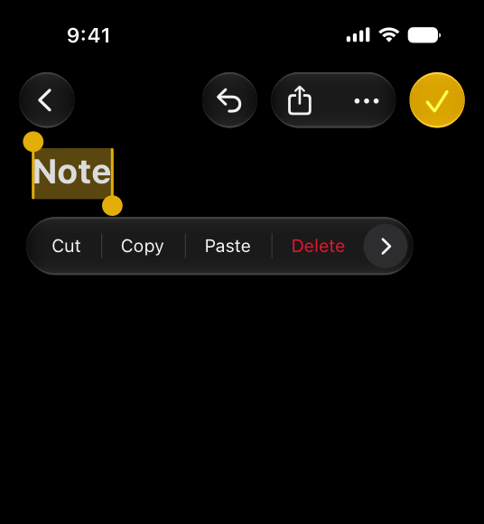
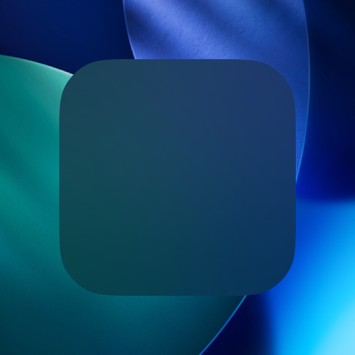
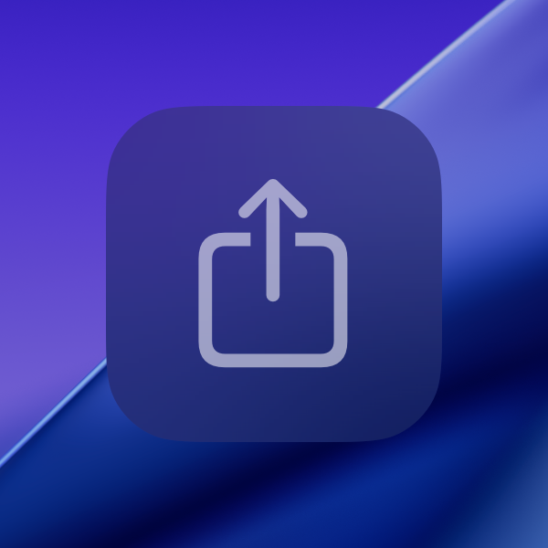
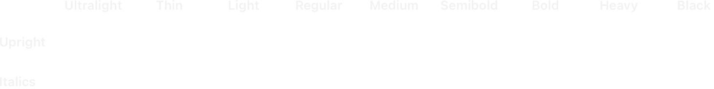
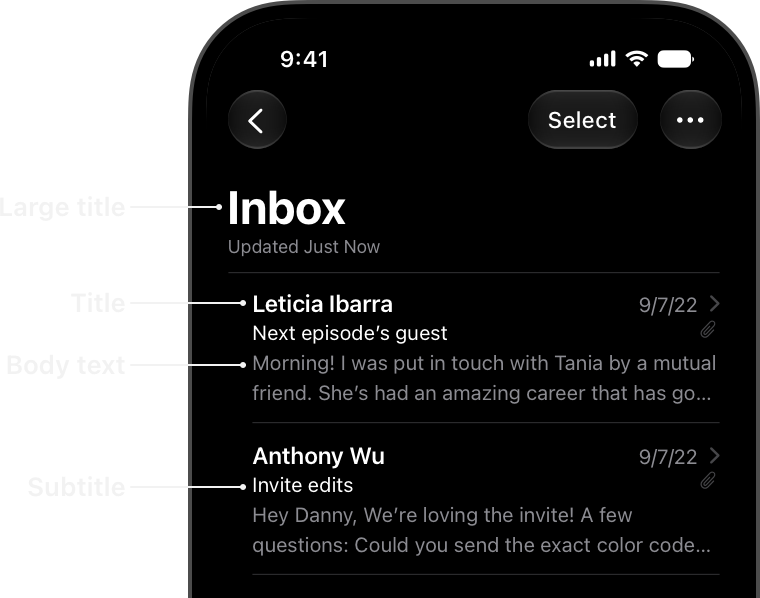
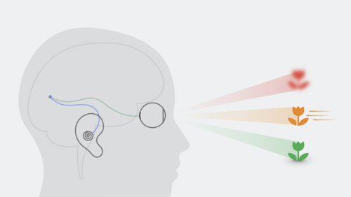
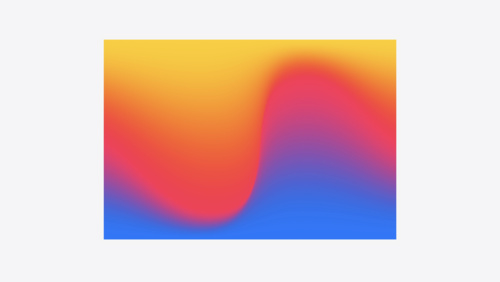
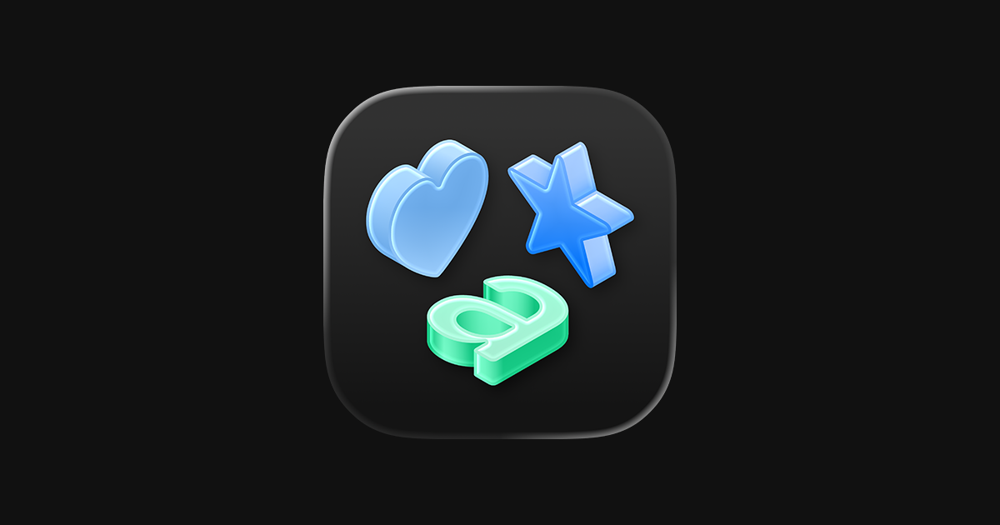
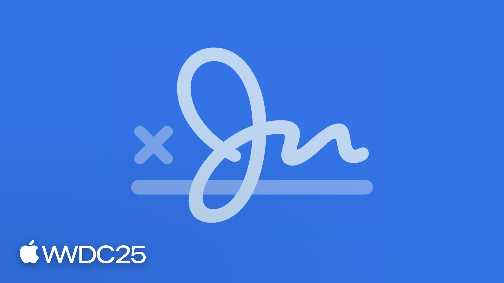

# Apple 暗黑 UI 设计调研

> 检索日期: 2026-08-15
> 检索范围: Apple macOS 暗黑模式（Dark Mode）视觉设计——HIG 规范、NSVisualEffectView 材质、配色、排版、动效、强调色/SF Symbols、Xcode 暗黑 UI
> 来源优先级: 官方文档 > 源码仓库 > 技术博客 > 社区讨论；官方数据经 `developer.apple.com/tutorials/data/...` 官方 JSON 接口直抓原文（WebFetch 被网络策略拦截，全部官方引文逐字取自抓取原文）

## 1. 概览

Dark Mode 是 Apple 系统级外观设置，自 macOS 10.14 Mojave 引入，定位为**低光环境下舒适的观看体验**："Dark Mode is a systemwide appearance setting that uses a dark color palette to provide a comfortable viewing experience tailored for low-light environments" [3]。仅 iOS/iPadOS/macOS/tvOS 支持 Dark Mode，visionOS/watchOS 不支持 [3]。

设计语言一句话定性：**「更暗的背景 + 更亮的前景」的语义化色彩体系，叠加按语义选择的半透明模糊材质（translucency + vibrancy）构建界面层级——刻意不是亮色模式的简单反色**（"these colors aren't necessarily inversions of their light counterparts: while many colors are inverted, some are not"）[3]。系统色与材质外观随 appearance 自动切换，官方明令禁止硬编码颜色值（"Avoid hard-coding system color values... The actual color values may fluctuate from release to release"）[1]。2025 年起 macOS 26 引入 Liquid Glass 新材质体系，与既有 standard materials 并存 [9]。

## 2. 视觉设计语言

### 2.1 配色

**语义色体系（token 化，非色值命名）**：macOS 定义 35 个动态系统色（semantic colors），"Each dynamic color is semantically defined by its purpose, rather than its appearance or color values" [1]。按用途分四类 [1]：

| 类别 | 系统色（AppKit API） |
|------|---------------------|
| 前景/文本 | `labelColor`、`secondaryLabelColor`、`tertiaryLabelColor`、`quaternaryLabelColor`、`controlTextColor`、`disabledControlTextColor`、`headerTextColor`、`textColor`、`selectedTextColor`、`unemphasizedSelectedTextColor`、`selectedControlTextColor`、`selectedMenuItemTextColor`、`alternateSelectedControlTextColor`、`windowFrameTextColor`、`placeholderTextColor`、`linkColor`、`findHighlightColor` |
| 背景 | `windowBackgroundColor`、`underPageBackgroundColor`、`controlBackgroundColor`、`textBackgroundColor`、`selectedContentBackgroundColor`、`unemphasizedSelectedContentBackgroundColor`、`selectedTextBackgroundColor`、`unemphasizedSelectedTextBackgroundColor`、`alternatingContentBackgroundColors`（交替行背景数组） |
| 控件/表面 | `controlColor`、`selectedControlColor`、`controlAccentColor`（macOS 11+ 强调色）、`keyboardFocusIndicatorColor`、`currentControlTint` |
| 分隔/杂项 | `separatorColor`、`gridColor`、`shadowColor`、`highlightColor` |

**官方暗色 hex（iOS 表格，2025-06-09 更新版）**：HIG Color 页 iOS/iPadOS 动态色表给出 Default (dark) 色值（SwiftUI unified colors 跨 Apple 平台）[2]：

| 色名 | dark | Increased contrast (dark) | 色名 | dark | Increased contrast (dark) |
|------|------|--------------------------|------|------|--------------------------|
| red | `#FF4245` | `#FF6165` | indigo | `#6D7CFF` | `#A7AAFF` |
| orange | `#FF9230` | `#FFA056` | purple | `#DB34F2` | `#EA8DFF` |
| yellow | `#FFD600` | `#FEDF43` | pink | `#FF375F` | `#FF8AC4` |
| green | `#30D158` | `#4AD968` | brown | `#B78A66` | `#DBA679` |
| mint | `#00DAC3` | `#54DFCB` | systemGray | `#8E8E93` | `#AEAEB2` |
| teal | `#00D2E0` | `#3BDDEC` | Gray2 | `#636366` | `#7C7C80` |
| cyan | `#3CD3FE` | `#6DD9FF` | Gray3 | `#48484A` | `#545456` |
| blue | `#0091FF` | `#5CB8FF` | Gray4 | `#3A3A3C` | `#444446` |
| — | — | — | Gray5 | `#2C2C2E` | `#363638` |
| — | — | — | Gray6 | `#1C1C1E` | `#242426` |

版本注意：2025-06-09 官方整体更新过色值（blue dark 由 `#0A84FF` 改为 `#0091FF`）[2]；**macOS AppKit 专用系统色（windowBackgroundColor、separatorColor、label 系列等）官方明确不公布 hex**（"Documented color values are for your reference"）[1]。

**macOS 暗色背景第三方实测**（官方无值，供参考；来源均为 GitHub 源码仓库，非 Apple 官方）：
- iTerm2-Color-Schemes「Apple System Colors」主题（wezterm 收录，双方互证）：background `#1e1e1e`、foreground `#ffffff`、cursor `#98989d`、selection `#3f638b`；ansi 暗色系 `#1a1a1a`、bright blue `#0a84ff`、bright red `#ff453a`、bright green `#32d74b`、bright yellow `#ffd60a`、bright magenta `#bf5af2` [4][5]
- sfthemes（R 包，基于 macOS 系统色提取）macos_dark_cols：`#0a84ff`、`#98989d`、`#32d74b`、`#ff9f0a`、`#ff375f`、`#bf5af2`、`#ff453a`、`#ffd60a` 等 11 色，背景 `#262626` [6]
- TiddlyWiki CupertinoDark（"A macOS inspired dark palette"）：背景 `#282828`、前景 `#FFFFFF`、链接 `#32D74B` [7]
- colorpickercode 博客四色板：Background `#1e1e1e`、Surface `#2c2c2c`、Accent `#007aff`——其中 accent 混用了亮色值（暗色应为 `#0a84ff`），**待核** [8]

macOS 暗色窗口背景并非纯黑，第三方实测集中于 `#1e1e1e`–`#2c2c2e` 区间（与 iOS systemGray6 dark `#1C1C1E` 接近）[4][7][8]。

**暗色配色原则（HIG Dark Mode 章节）** [3]：
- 背景更暗、前景更亮，非简单反色
- **base / elevated 双组背景色**：base 更暗（背景界面后退），elevated 更亮（popover、modal sheet 等前景界面前进），多窗口环境亦用 elevated 区分层级
- 对比度硬指标：最低 **4.5:1**，自定义前景/背景色力求 **7:1**（尤其小字号）
- **desktop tinting**：用户在系统设置选 graphite 强调色时，macOS 令窗口背景从当前桌面壁纸取色，使窗口与周边内容融合；自定义组件背景建议带透明度以便随 tinting 融合
- 白底内容图应适当压暗，避免在暗色上下文中"发光"
- 文本用系统 label 语义色（primary/secondary/tertiary/quaternary 自动适配两种外观）
- 禁止提供应用内自设外观开关

### 2.2 材质与层级（NSVisualEffectView）

"macOS provides several standard materials with designated purposes, and vibrant versions of all system colors" [9]。材质是暗黑模式观感的核心——半透明+模糊让背景透出，vibrancy 提升前景对比 [10]：

- **Translucency**（内容模糊）："the blurring of background content adds depth to your interface"
- **Vibrancy**："a subtle blending of foreground and background colors to increase the contrast and make the foreground content stand out visually"
- 选材原则：**按语义选材而非观感**（"Choose materials and effects based on semantic meaning and recommended usage. Avoid selecting a material or effect based on the apparent color it imparts to your interface, because system settings can change its appearance and behavior"——系统设置如暗黑模式会改变材质外观）[9]
- 材质上必须用 vibrant 颜色（"use vibrant colors on top of it"）；vibrancy 仅建议用于 leaf view，且自定义视图须覆写 `allowsVibrancy` 返回 `true`；灰度前景与 vibrancy 配合最佳 [9][10]
- 默认值：material=`appearanceBased`、blendingMode=`behindWindow`、state=`followsWindowActiveState`（暗色下自动切换暗色观感）[10][57]

**NSVisualEffectView.Material 枚举（19 case，语义材质 vs 旧调色板材质）** [11][12]：

| Case | raw | 官方描述 | 暗色模式表现 |
|------|-----|---------|-------------|
| `appearanceBased` | 0 | 视图有效外观的默认材质 | 随 appearance 自动选暗色材质（默认值） |
| `light` / `dark` / `mediumLight` / `ultraDark` | 1/2/8/9 | 调色板材质 | 10.14 起官方建议改用语义材质（macios 源码 Advice: "Use a semantic material instead."）；`dark` 固定暗色不随外观变化 |
| `titlebar` | 3 | 窗口标题栏材质 | 暗色下深色标题栏底 |
| `selection` | 4 | 选择指示材质 | 强调（isEmphasized）时变蓝 |
| `menu` | 5 | 菜单材质 | 深色半透明菜单底 |
| `popover` | 6 | popover 窗口背景材质 | 深色弹层底 |
| `sidebar` | 7 | 窗口侧栏背景材质 | Finder/文件浏览器侧栏底色 |
| `headerView` | 10 | 内联页眉/页脚材质 | — |
| `sheet` | 11 | sheet 窗口背景材质 | 深色 sheet 底 |
| `windowBackground` | 12 | 不透明窗口背景材质 | 参与 desktop tinting（桌面取色） |
| `hudWindow` | 13 | HUD 窗口背景材质 | 社区描述为 dark translucent |
| `fullScreenUI` | 15 | 全屏模态界面背景材质 | — |
| `toolTip` | 17 | 工具提示背景材质 | — |
| `contentBackground` | 18 | 不透明内容背景材质 | scroll/table/collection view 默认；支持 desktop tinting |
| `underWindowBackground` | 21 | 窗口背景下方材质 | — |
| `underPageBackground` | 22 | 文档页面背后区域材质 | 支持 desktop tinting |

**行为参数** [13][14][15][16]：
- `blendingMode.behindWindow`：与窗口背后内容（桌面/其他窗口）混合——"Sheets and popovers use behind-window blending"
- `blendingMode.withinWindow`：仅与当前窗口内视图背后内容混合——"Toolbars always use in-window blending"
- `state.followsWindowActiveState`（默认）：**窗口失活时材质自动变暗/变灰**——暗色材质活性切换的官方机制
- `isEmphasized`：强调态材质外观变化（如选择态变蓝）
- `maskImage`：alpha 遮罩材质，窗口内容视图为材质时同时作用于**窗口阴影形状**（自定义圆角窗口常配合）

**窗口层级**：AppKit 自动为 titlebar、popover、source list 创建 visual effect view [10]；`titlebarAppearsTransparent = true` 使标题栏不绘制背景、透出下层内容（须配 `fullSizeContentView`）[18]；`toolbarStyle.automatic` 由系统决定 unified toolbar 材质外观 [19]。

**模糊与着色参数**：NSVisualEffectView 公开属性仅 material/blendingMode/state/isEmphasized/maskImage/interiorBackgroundStyle（只读，供内容视图按材质背景绘制），**模糊半径与着色由系统内部决定，无公开 API/数值**（需精确值须实测截图反推）[10][22]。仅第三方库暴露可调参数（如 window-vibrancy 的 `radius: Option<f64>`；macOS 26 Liquid Glass 示例 `radius(26.0)`，为示例用法非系统默认）[22]。

**暗色下内部材质解析（2015 Yosemite 逆向，待核）**：内部 CGS 材质编号表中，`appearanceBased` 暗色模式解析为 MacUltraDark（内部 #5），`selection` 有独立暗色强调变体（SelectionDark）；该表来自 2015 逆向，现代 macOS 编号可能已变，仅作机制佐证 [20]。WWDC18 官方笔记补充规则：禁非语义材质；desktop-tinted 材质 = windowBackground/underPageBackground/contentBackground；vibrancy 之上用不透明灰度色勿用透明度；**侧栏图标不做 vibrancy** [21]。

### 2.3 字体排版（SF Pro）

**macOS 系统字体 = SF Pro**（"SF Pro is the system font in macOS. NY is available for Mac apps built with Mac Catalyst. macOS doesn't support Dynamic Type."）[28]。

**macOS built-in text styles 表（官方唯一权威数值）** [28]：

| Text style | Weight | Size (pt) | Line height (pt) | Emphasized weight |
|---|---|---|---|---|
| Large Title | Regular | 26 | 32 | Bold |
| Title 1 | Regular | 22 | 26 | Bold |
| Title 2 | Regular | 17 | 22 | Bold |
| Title 3 | Regular | 15 | 20 | Semibold |
| Headline | Bold | 13 | 16 | Heavy |
| Body | Regular | 13 | 16 | Semibold |
| Callout | Regular | 12 | 15 | Semibold |
| Subheadline | Regular | 11 | 14 | Semibold |
| Footnote | Regular | 10 | 13 | Semibold |
| Caption 1 | Regular | 10 | 13 | Medium |
| Caption 2 | Medium | 10 | 13 | Semibold |

- 平台字号：macOS 默认 **13pt**、最小 **10pt**（iOS 为 17/11）[28][29]
- 字重：9 字重 Ultralight 100 / Thin 200 / Light 300 / Regular 400 / Medium 500 / Semibold 600 / Bold 700 / Heavy 800 / Black 900（数值为第三方对字体文件实测）[30][31]；官方建议避免细字重（"prefer Regular, Medium, Semibold, or Bold... avoid Ultralight, Thin, and Light... especially when text is small"——暗色低对比环境下更甚）[28]
- SF Pro Text/Display 的 20pt 分界为历史约定（Text 优化 ≤20pt、Display ≥20pt），现代系统用**动态光学尺寸**合并为单一连续设计，无需手动选择离散光学尺寸（官方原文）[30][32]；另有 width 轴扩展（Condensed/Compressed/Expanded，WWDC22）[34]
- tracking 表：6pt +41、12pt 0、17pt −26、20pt −23、28pt +14、48pt +8、96pt 0（1/1000 em），系统在运行中逐点动态调整 [28]
- 行高指导：宽栏/长段落用 loose leading；受限高度用 tight leading；**3 行及以上禁用 tight leading** [28]
- 暗黑模式排版机制：系统用 **vibrancy + 增大对比度**维持深色背景上的文字可读性；文本必须用系统 label 语义色（自动适配两种外观），禁止硬编码 [3]
- macOS 控件级字号（title bar/toolbar/sidebar/menu）官方只给 API（`NSFont.titleBarFont(ofSize:)` 等 12 个）不给 pt 数值——**未给出具体数值** [28][33]

### 2.4 窗口圆角与阴影

官方（HIG + NSWindow 文档）**不发布窗口圆角半径与阴影数值**，由 WindowServer 绘制 [17]。可用参考（均非官方）：
- 2013 年手测 corner radius ≈ 7px（Mac OS X 时代，现代 macOS 已变，**待核**）[23]
- Apple 开发者论坛：默认窗口圆角 10、Control Center 16（原页反爬拦截，仅搜索摘要，**待核**）[25]
- 自定义窗口自设值（非系统默认）：cornerRadius=10.0、shadowOpacity=0.5、shadowOffset=(0,-3)、shadowRadius=5.0 [24]；NSWindowStyles 演示 cornerRadius=16.0 [27]
- 系统级圆角/阴影与材质联动：`maskImage` 遮罩可同时作用于窗口阴影形状 [16]

## 3. 交互动效

**重要结论：Apple HIG Motion 官方章节只给设计原则、零数值**（无毫秒、无缓动曲线参数、无弹簧参数）；页面确认 iOS/iPadOS/macOS/tvOS "No additional considerations"——**无暗黑模式专属动效章节**；最新修订 2025-09-09（Liquid Glass）[35]。独立 Animation 章节不存在（`/design/human-interface-guidelines/animation` 为无正文壳页）[35]。

**官方数值仅存在于 API 默认值**（系统级参考）[36][37][38]：

| 动画 | 参数（官方签名） | 语义 |
|------|----------------|------|
| SwiftUI `spring(response:dampingFraction:blendDuration:)` | **0.5s / 0.825 / 0** | response=弹簧刚度（近似时长秒数，0=无限刚）；dampingFraction=临界阻尼比值 |
| SwiftUI `interactiveSpring(response:dampingFraction:blendDuration:)` | **0.15s / 0.86 / 0.25** | 低 response 便捷版，驱动交互式动画 |
| SwiftUI `spring(duration:bounce:blendDuration:)` | **0.5s / 0.0 / 0** | duration=感知时长（≈settle 时长）；bounce 0=临界阻尼，1=无阻尼振荡，−1=过阻尼 |
| UIKit `UISpringTimingParameters` [39] | 初始化器：`init(dampingRatio:)`、`init(dampingRatio:initialVelocity:)`、`init(duration:bounce:)`、`init(mass:stiffness:damping:initialVelocity:)` | 阻尼比形式与物理常数形式并存；initialVelocity 为单位向量语义（200pt 动画配 100pt/s 初速则 magnitude=0.5，社区解读，待核） |
| UIKit `UICubicTimingParameters` [40] | cubic Bézier，起点 (0,0) 终点 (1,1)，两控制点决定速度曲线 | 官方未公开系统默认曲线的具体控制点数值（待核） |

**非官方/社区数值（均须标注出处）**：
- UIKit 系统过渡时长：社区答主实测「许多系统动画的常见时长约 **0.35–0.40s**，短动画恰为其一半、长动画恰为其两倍」（2012 年回答）——Apple 官方从不公布系统动画时长，**社区实测待核** [41]
- 「150/250/350/500ms 时长 token」为**第三方设计系统惯例，非 Apple 官方数值**（svrnty_design_system 源码 `fast: 150ms / normal: 250ms / slow: 350ms / verySlow: 500ms`；该库自称 "following Apple HIG"，但 Apple HIG 官方页并无这些数值）[42][43]

**动效原则与触发时机（HIG Motion）** [35]：
- 「Add motion purposefully」「Make motion optional」——动效不能成为传达重要信息的唯一方式
- 反馈动画力求简洁精确（"Aim for brevity and precision in feedback animations"）；频繁 UI 交互一般不加动效；动画可被取消
- 游戏保持 30–60 fps 即可流畅
- **Reduce Motion（辅助功能）官方指引**：收紧弹簧减少弹跳、动效直接跟踪手势、避免 z 轴深度动画、**用淡入淡出替代 x/y/z 轴过渡**、避免进出模糊的动画 [29]
- 暗色相关唯一官方表述：visionOS 周边视野运动物体亮度需接近周围内容（暗色场景高亮元素周边运动风险更高）；watchOS 内置缓动不可关闭/定制 [35]
- 第三方 Web 生态实践（非 Apple）：主题切换最佳 150–200ms 全表面 crossfade（>300ms 感觉像页面加载）、感知均匀空间过渡（HSL 锁定色相、或 CSS color-mix() 显式插值设置）避免浑浊中间色 [44]；macOS 下 Reduce Motion 不改变系统过渡总时长、只把 zoom 换成等慢 crossfade（**待核**）[45]

## 4. 布局与组件结构

**信息架构层级（暗色下）**：窗口基底（base 背景，更暗）→ 内容区（contentBackground 等语义材质）→ 前景浮层（popover/sheet/menu 用 elevated 背景与 behind-window 混合材质，更亮以显前进感）[3][13]。macOS 侧栏 = `sidebar` 材质，标题栏/toolbar 由 AppKit 自动创建材质 [10][11]。

| 组件 | 暗色实现 | 来源 |
|------|---------|------|
| 侧栏 | `sidebar` 材质（Finder/文件浏览器底色）；侧栏图标**不做 vibrancy** | [11][21] |
| 菜单 / 弹出层 | `menu`、`popover` 材质 + behind-window 混合 + elevated 背景 | [11][13][3] |
| sheet / HUD / 工具提示 | `sheet`、`hudWindow`、`toolTip` 材质 | [11] |
| 标题栏 / toolbar | 自动材质；`titlebarAppearsTransparent` 透出下层（须配 fullSizeContentView）；unified toolbar 材质由 `toolbarStyle.automatic` 系统决定 | [18][19] |
| 页签 / 状态栏 | 见下方 Xcode 暗色实测值 | [50] |

**SF Symbols 图标体系** [46][47]：
- 4 种渲染模式：**Monochrome**（单色）、**Hierarchical**（单色按层级调透明度）、**Palette**（每层一色）、**Multicolor**（符号内置颜色，如叶子=绿、数据丢失=红）
- 符号路径按层组织（primary/secondary/tertiary，如云/日/雨三层）
- 9 字重 × 3 尺度（small/medium 默认/large，相对 SF 字体 cap height 定义）
- 暗黑模式关键句："**Regardless of rendering mode, using system-provided colors ensures that symbols automatically adapt to accessibility accommodations and appearance modes like vibrancy and Dark Mode.**"
- SF Symbols 7（2025）：新增 gradient rendering 与 Draw On/Draw Off 动画

**Xcode 暗黑 UI** [48][49][50]：
- Xcode 10（macOS 10.14）引入原生暗黑模式，asset catalog 支持 Light/Dark/High Contrast 外观槽位（官方 release notes）
- 主题双机制：**Editor 主题** `.xccolortheme`（安装到 `~/Library/Developer/Xcode/UserData/FontAndColorThemes`，Preferences > Fonts & Colors 选择）；**Interface 主题** `.dvttheme`（未文档化 DVTTheme 机制，`defaults write com.apple.dt.xcode DVTUseTheme <path>` 指向自定义文件）
- 内置暗色主题族：Default (Dark)、Classic (Dark)、Civic (Dark)、Midnight (Dark)（2026-05 新增：编辑器 `#10131A`、侧栏 `#0A0D14`）等 [50]；社区另有 30+ 个 Xcode 暗色主题集合（Gruvbox/Monokai/Tomorrow Night 等）[51]
- Xcode 13 起编辑器侧持续更新（Vim 键位、逐编辑器换行切换等），界面暗色本体未变 [60]
- 内置 **Default (Dark)** 界面色（社区移植值，声称匹配 Xcode 默认，**非官方**）：编辑器背景 `#1F1F24`、前景 `#dfdfe0`、活动页签背景 `#1F1F24`/前景 `#ffffff`、非活动页签 `#26282b`/`#9a9c9d`、状态栏 `#1c1f21`、标题栏 `#383a3d`、选中背景 `#646f8366`（半透明）、光标 `#ffffff`；语法色：comment `#A0D07D`、string `#FC6A5D`、number `#D0BF69`、keyword `#FF7AB2`、preprocessor `#FFA14F`、link `#6699FF`、type `#5DD8FF`/`#E5CFFF`、operator `#A167E6` [50]

## 5. 实现级参数

### 5.1 token 体系机制

- **NSColor 动态系统色**：按语义定义，随 appearance 自动适配（"System colors vary subtly depending on the system appearance, adjusting to ensure proper color differentiation and contrast"）[1]；自定义色须提供 light/dark 两套变体 + 各自 increased contrast 变体 [1][58]
- **asset catalog 外观槽位**：Any/Light/Dark/High Contrast 变体并存（Xcode 10 起）[48]；现代 Asset 结构含 `AccentColor.colorset/` 与 `AppIcon.appiconset`（icon-light/icon-dark/icon-tinted）[59]
- 暗色背景层级：base（更暗，后退）/ elevated（更亮，前进）[3]
- macOS 专属：graphite 强调色触发 desktop tinting（窗口背景取桌面色）[3]
- 对比度：系统色 ≥4.5:1，自定义前后景力求 7:1 [3]

### 5.2 强调色（accent color）

- macOS 11+：可指定强调色定制按钮、选择高亮、侧栏图标；**仅当系统设置 General > Accent color 为 multicolor 时生效**，否则用户所选覆盖 [1]
- API：`controlAccentColor`（macOS 10.14+，"The user's current accent color preference"，官方警告勿假设其色彩空间）[52]；app 级配置 `NSAccentColorName`（Info.plist 键）或 Build Settings → Global Accent Color Name [53]
- 可选强调色 8 色：blue / purple / pink / red / orange / yellow / green / graphite（社区按 hue 映射反推，默认蓝色）[54]
- 暗色 accent 色值官方不公布 hex；社区值（warp-themes `apple_dark.yaml`，文件被反爬拦截、值经搜索摘要确认，**待核**）：blue `#0A84FF`、orange `#FF9F0A`、red `#FF453A`、yellow `#FFD60A`、green `#30D158`、cyan `#64D2FF`、gray6 `#1C1C1E` [55]

### 5.3 Xcode 主题文件（.xccolortheme）token

实际抓取 Dracula.xccolortheme（v1.2.5）逐字验证的结构 [56]：
- 格式：plist/XML（`<?xml...?><!DOCTYPE plist...>`），顶层 `<dict>` 平铺键值
- 颜色值格式：`"r g b a"` 四浮点（0–1）；字体值格式：`"<PostScriptName> - <size>"`（如 `SFMono-Regular - 14.0`）
- 核心 token 键名：`DVTSourceTextBackground`（编辑器背景）、`DVTSourceTextCurrentLineHighlightColor`、`DVTSourceTextSelectionColor`、`DVTSourceTextInsertionPointColor`、`DVTSourceTextInvisiblesColor`、`DVTSourceTextBlockDimBackgroundColor`；`DVTSourceTextSyntaxColors`（嵌套 dict：`xcode.syntax.plain / keyword / comment / string / number / preprocessor / url / attribute / identifier.* / declaration.* / markup.*` 等）+ `DVTSourceTextSyntaxFonts`；控制台族 `DVTConsoleText*`；滚动条标记族 `DVTScrollbarMarkerErrorColor/WarningColor/BreakpointColor/DiffColor/...`；其他 `DVTMarkupText*`、`DVTFontAndColorVersion`（integer 1）、`DVTFontSizeModifier`、`DVTLineSpacing`、`DVTDebuggerInstructionPointerColor`
- Dracula 暗色示例值：编辑器背景 `0.117658 0.122153 0.159778 1`（≈`#1E1F29`）、keyword `1 0.47451 0.776471 1`（≈`#FF79C6`）、comment `≈#6272A4`、plain（前景）`≈#F8F8F2`、string `0.956863 0.976471 0.615686 1`（≈`#F4F99D`，与 Dracula 官方调色板 string `#F1FA8C` 不同）、控制台背景 `≈#282A36`
- 注意：旧键名 `sourceTextBackgroundColor` 属旧版 `.dvtcolortheme`；现行 `.xccolortheme`（DVTFontAndColorVersion=1）用 `DVTSourceTextBackground` + syntax dict 的 plain 键表达前景——**待核**：旧键名在新格式中是否存在（本次抓取的两个仓库文件均无 `sourceText*` 键）

### 5.4 官方色值要点汇总

- macOS AppKit 系统色：官方不给 hex [1]；工程引用以 NSColor 动态解析为准（dark 值须在 DarkAqua 外观上下文解析）
- 官方 iOS 暗色表（跨平台 SwiftUI 统一色）见 2.1 节 [2]
- 官方色值以「设计参考」姿态发布、可随版本波动（2025-06-09 已更新过一次：blue dark `#0A84FF`→`#0091FF`）[2]

## 6. 来源清单

| # | 来源 URL | 类型 | 关键内容 |
|---|----------|------|---------|
| [1] | https://developer.apple.com/design/human-interface-guidelines/color | 官方 HIG | macOS 38 动态系统色表、语义色层级、禁止硬编码、强调色 macOS 11+ |
| [2] | https://developer.apple.com/tutorials/data/design/human-interface-guidelines/color.json | 官方数据 API | Color 章节原文 + swatch alt RGB 色值（2025-06-09 版暗色 12 色 + 6 灰 + increased contrast 变体） |
| [3] | https://developer.apple.com/design/human-interface-guidelines/dark-mode | 官方 HIG | 暗黑模式定义、非反色原则、base/elevated、4.5:1/7:1、desktop tinting、白底图柔化、label 语义色、vibrancy 维持可读性 |
| [4] | https://github.com/wezterm/wezterm/blob/main/config/src/scheme_data.rs | 源码仓库 | "Apple System Colors" 主题：bg #1e1e1e、brights #0a84ff/#ff453a/#32d74b/#ffd60a/#bf5af2 等 |
| [5] | https://github.com/mbadolato/iTerm2-Color-Schemes/commit/d58e107fc18955fd199166f3f3cc6b3d36bc2beb | 源码仓库 | Apple System Colors.itermcolors（sRGB 浮点），与 wezterm 互证 |
| [6] | https://rdrr.io/github/amirmasoudabdol/sfthemes/src/R/macos-colours.R | 源码仓库 | macos_dark_cols 11 色 + bg #262626 |
| [7] | https://github.com/TiddlyWiki/TiddlyWiki5/blob/2f63abc1/core/palettes/CupertinoDark.tid | 源码仓库 | macOS 风格暗色调色板：bg #282828、link #32D74B |
| [8] | https://colorpickercode.com/color-palette/dark-mode-palettes/mac-os-dark/ | 技术博客 | 四色板 bg #1e1e1e/surface #2c2c2c/accent #007aff（亮色值，待核） |
| [9] | https://developer.apple.com/design/human-interface-guidelines/materials | 官方 HIG | 材质定义、标准材质/Liquid Glass、按语义选材、vibrancy 用法、blending 两模式 |
| [10] | https://developer.apple.com/documentation/appkit/nsvisualeffectview | 官方文档 | Translucency+blur+Vibrancy 定义、默认值、leaf-view 规则、titlebar/popover/source list 自动材质 |
| [11] | https://developer.apple.com/documentation/appkit/nsvisualeffectview/material | 官方文档 | Material 枚举 19 case 逐字 abstract |
| [12] | https://github.com/dotnet/macios/blob/main/src/AppKit/Enums.cs | 源码仓库 | NSVisualEffectMaterial raw 值 0–22 + 调色板材质废弃 Advice |
| [13] | https://developer.apple.com/documentation/appkit/nsvisualeffectview/blendingmode-swift.enum | 官方文档 | behindWindow/withinWindow 定义（sheets/popovers、toolbars） |
| [14] | https://developer.apple.com/documentation/appkit/nsvisualeffectview/state-swift.enum | 官方文档 | followsWindowActiveState/active/inactive |
| [15] | https://developer.apple.com/documentation/appkit/nsvisualeffectview/isemphasized | 官方文档 | 强调态材质外观变化 |
| [16] | https://developer.apple.com/documentation/appkit/nsvisualeffectview/maskimage | 官方文档 | alpha 遮罩材质 + 窗口阴影联动 |
| [17] | https://developer.apple.com/documentation/appkit/nswindow | 官方文档 | NSWindow 职责概述（无圆角/阴影数值） |
| [18] | https://developer.apple.com/documentation/appkit/nswindow/titlebarappearstransparent | 官方文档 | 标题栏背景透明 + fullSizeContentView 前提 |
| [19] | https://developer.apple.com/documentation/appkit/nswindow/toolbarstyle-swift.property | 官方文档 | automatic 风格由系统决定工具栏外观 |
| [20] | https://gist.github.com/alemar11/b5dad930b133980874eaf6ec320226ff | 逆向 teardown | 内部 CGS 材质编号、暗色 appearanceBased→MacUltraDark、selection 暗色强调变体（2015，待核） |
| [21] | https://github.com/drd/NetNewsWire/blob/b78406073cd66f5bfaa45732e010fdfb00b2fdda/Technotes/DarkMode.md | 技术笔记 | WWDC18：禁非语义材质、desktop-tinted 清单、侧栏图标不 vibrancy、vibrancy 上忌透明度 |
| [22] | https://github.com/tauri-apps/window-vibrancy | 源码仓库 | radius Option\<f64\> 参数、Liquid Glass radius(26.0) 示例；系统 blur 值无公开来源 |
| [23] | https://graphicdesign.stackexchange.com/questions/18689 | 社区问答 | 手测窗口圆角 7px（2013，待核） |
| [24] | https://stackoverflow.com/questions/19940019 | 社区问答 | 自定义圆角 10.0 / shadowOpacity 0.5 / radius 5.0 / offset (0,-3)（自设值） |
| [25] | https://developer.apple.com/forums/thread/765410 | 社区讨论 | 默认圆角 10、Control Center 16（反爬拦截，仅搜索摘要，待核） |
| [26] | https://github.com/FirefoxUX/photon/issues/139 | 社区讨论 | 来源无效：实际为「Doorhanger component: Understand」issue，与 menupopup 圆角无关（6px 数值出处未能定位） |
| [27] | https://github.com/lukakerr/NSWindowStyles | 社区 showcase | vibrant dark 背景代码、自定义 cornerRadius=16.0 |
| [28] | https://developer.apple.com/design/human-interface-guidelines/typography | 官方 HIG | macOS built-in text styles 表、默认/最小字号、避免细字重、leading、动态光学尺寸、tracking 表 |
| [29] | https://developer.apple.com/design/human-interface-guidelines/accessibility | 官方 HIG | 对比度阈值表（≤17pt 4.5:1 / 18pt 3:1）、Reduce Motion 指引（收紧弹簧/淡出替代位移/避免模糊动画） |
| [30] | https://developer.apple.com/fonts/ | 官方文档 | SF Pro 九字重 + variable optical sizes + 四宽度 + rounded；SF Mono/New York；字体许可 |
| [31] | https://github.com/yell0wsuit/Apple-Fonts-Documentation | 源码仓库（第三方） | 静态九字重 100–900；变量版 weight 1–1000、optical size 17–28 |
| [32] | https://www.three-philosophers.com/design/fonts/sanfrancisco.html | 技术博客 | SF Pro Text ≤20pt / Display ≥20pt 历史分界 |
| [33] | https://developer.apple.com/documentation/appkit/nsfont/systemfontsize(for:) | 官方文档 | macOS 控件字号 API 用途（不提供具体 pt 数值） |
| [34] | https://wwdcnotes.com/documentation/wwdc22-110381-meet-the-expanded-san-francisco-font-family/ | 社区笔记 | width 轴 Condensed/Compressed/Expanded（WWDC22） |
| [35] | https://developer.apple.com/design/human-interface-guidelines/motion | 官方 HIG | 动效原则全文、零数值、无暗色专属章节、changelog 2025-09-09 |
| [36] | https://developer.apple.com/documentation/swiftui/animation/spring(response:dampingfraction:blendduration:) | 官方 API | spring 默认 0.5 / 0.825 / 0 |
| [37] | https://developer.apple.com/documentation/swiftui/animation/interactivespring(response:dampingfraction:blendduration:) | 官方 API | interactiveSpring 默认 0.15 / 0.86 / 0.25 |
| [38] | https://developer.apple.com/documentation/swiftui/animation/spring(duration:bounce:blendduration:) | 官方 API | duration/bounce 语义，默认 0.5 / 0.0 |
| [39] | https://developer.apple.com/documentation/uikit/uispringtimingparameters | 官方 API | dampingRatio/initialVelocity/mass/stiffness/damping 初始化器 |
| [40] | https://developer.apple.com/documentation/uikit/uicubictimingparameters | 官方 API | cubic Bézier (0,0)→(1,1) 双控制点语义 |
| [41] | https://stackoverflow.com/questions/12025622 | 社区问答 | 常见系统动画时长约 0.35–0.40s（单条答案，2012；短动画减半、长动画加倍） |
| [42] | https://pub.dev/documentation/svrnty_design_system/latest/svrnty_design_system/RequiredAnimationTokens/standardValues-constant.html | 第三方设计系统 | token: fast 150ms / normal 250ms / slow 350ms / verySlow 500ms（无 Apple HIG 声明） |
| [43] | https://github.com/raintree-technology/hig-doctor/blob/main/skills/hig-foundations/references/motion.md | 第三方整理 | HIG Motion 结构化快照（2025-02-02，与官方一致零数值） |
| [44] | https://colorarchive.org/notes/july-2026-color-and-motion/ | 技术博客 | 主题切换 150–200ms crossfade、OKLCH 插值（Web 生态，非 Apple） |
| [45] | https://apple.stackexchange.com/revisions/c4843ec5-3503-4468-a893-582bb4adae6a | 社区问答 | Reduce Motion 将全屏 zoom 换为等慢 crossfade（macOS，待核） |
| [46] | https://developer.apple.com/design/human-interface-guidelines/sf-symbols | 官方 HIG | 4 渲染模式、层级、9 字重 × 3 尺度、暗黑模式自动适配、SF Symbols 7 渐变 |
| [47] | https://developer.apple.com/sf-symbols/ | 官方页面 | SF Symbols app 下载页（SF Symbols 7） |
| [48] | https://developer.apple.com/tutorials/data/documentation/xcode-release-notes/xcode-10-release-notes.json | 官方 release notes | Xcode 10 原生暗黑、asset catalog Light/Dark/High Contrast 槽位 |
| [49] | https://gist.github.com/danielmartin/820901f36eb36afc28bed995f7ab4946 | 社区 gist | DVTTheme/.dvttheme 机制、DVTUseTheme、IDEExtensionDebuggingHost |
| [50] | https://github.com/MateoCerquetella/xcode-theme | 源码仓库 | Xcode 内置 Default (Dark)/Midnight (Dark) 主题移植色值（界面 + 语法） |
| [51] | https://github.com/jasonm23/xcode-themes | 社区集合 | 30+ Xcode 暗色主题集合 |
| [52] | https://developer.apple.com/documentation/appkit/nscolor/controlaccentcolor | 官方 API | 用户当前强调色偏好（macOS 10.14+，勿假设色彩空间） |
| [53] | https://developer.apple.com/documentation/bundleresources/information-property-list/nsaccentcolorname | 官方 API | app 全局强调色 = asset catalog 颜色名 |
| [54] | https://pub.dev/documentation/macos_ui/2.2.0/macos_ui/AccentColorListener/hueComponentToAccentColor.html | 社区包文档 | controlAccentColor hue → 8 色映射（blue/purple/pink/red/orange/yellow/green/graphite） |
| [55] | https://git.thauvin.net/erik/warp-themes/blame/commit/9a640b887d29e531a09577b8eb772aeb29e0b692/standard/apple_dark.yaml | 社区主题文件 | 暗色系统色 hex #0A84FF/#FF9F0A/#FF453A/#30D158/#FFD60A/#1C1C1E（Cloudflare 拦截，值经搜索摘要，待核） |
| [56] | https://raw.githubusercontent.com/dracula/xcode/master/Dracula.xccolortheme | 源码仓库（raw） | .xccolortheme 完整结构、token 键名、r g b a 浮点值格式、Dracula 暗色示例值 |
| [57] | https://docs.rs/objc2-app-kit/0.3.1/objc2_app_kit/struct.NSVisualEffectView.html | 源码绑定 | NSVisualEffectView 默认值交叉印证（appearanceBased/behindWindow/followsWindowActiveState） |
| [58] | https://github.com/raintree-technology/hig-doctor/blob/main/skills/hig-foundations/references/dark-mode.md | 第三方整理 | HIG dark-mode 页结构化索引（2025-02-02） |
| [59] | https://raw.githubusercontent.com/fusengine/agents/main/plugins/swift-apple-expert/skills/build-distribution/references/app-icons.md | 社区参考 | iOS 26 dark/tinted 图标变体（#313131→#141414）、AccentColor.colorset |
| [60] | https://developer.apple.com/tutorials/data/documentation/xcode-release-notes/xcode-13-release-notes.json | 官方 release notes | Xcode 13 编辑器功能更新（界面暗色本体未变） |
