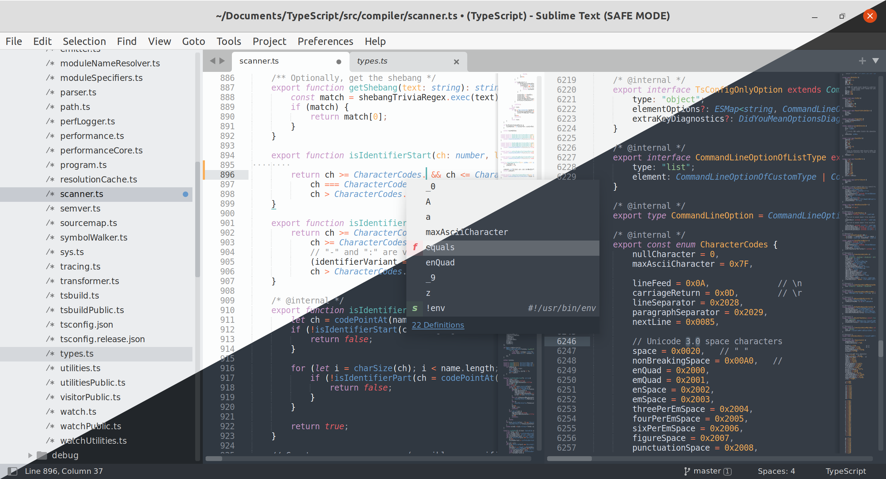
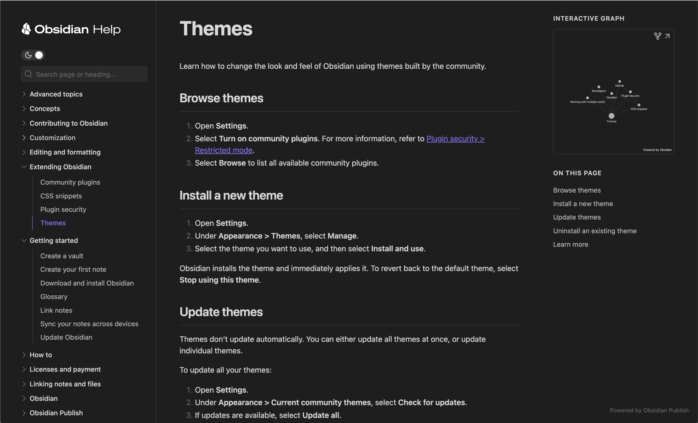
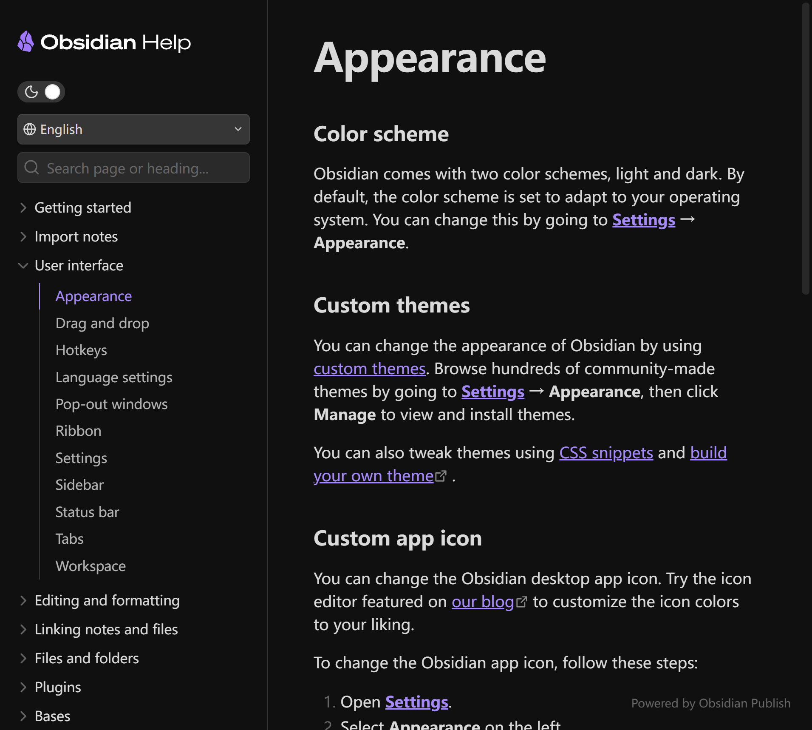

# Sublime Text / Obsidian 暗黑 UI 设计调研

> 范围：仅暗黑模式。所有色值、参数、截图均针对暗黑主题。
> 来源标注：[n] 对应文末「来源清单」；无法核实的描述标注「待核」。

## 1. 概览

- **Sublime Text**：跨平台代码编辑器（Windows/macOS/Linux），定位「轻量、极速、可深度定制」的编辑器。设计风格定性：**以内容为中心的极简暗色**——UI 外壳尽量退让，通过「主题（theme）+ 配色方案（color scheme）」双层体系实现编辑区与 UI 一体化取色，暗黑呈现为低饱和灰黑 + 高对比语法色，几乎零装饰（无圆角卡片、无阴影层）。
- **Obsidian**：基于本地 Markdown 的笔记/知识管理应用（Electron），定位「本地优先、双链为核心」的个人知识库。设计风格定性：**内容优先的柔和暗色**——深灰底 + 紫色系强调色，界面由数百个 CSS 变量驱动，全部组件（页签、侧栏、模态框、状态栏）均可由主题覆盖，暗色是官方一等公民（与亮色并列的基础色模式）[11][19][20]。

## 2. 视觉设计语言

### 2.1 Sublime Text

**双层着色架构**：`.sublime-theme`（UI 主题）只管界面外壳——按钮、侧栏、页签、状态栏；`.sublime-color-scheme`（配色方案）只影响编辑区。二者独立设置[1]。默认 UI 主题为 **Adaptive**（自适主题，引入版本待核）：它从当前配色方案的背景/前景主色中提取主色，自动给侧栏、页签、状态栏着上同色调（深色配色方案 → 深色 UI，浅色方案 → 浅色 UI）[8][7]。默认配色方案：官方 color_schemes 文档称 **Monokai**（原文 "the default Monokai color scheme"）[2]；ST4 官方博客 changelog 记载「Changed default color scheme to Mariana」，即 ST4 起默认改为 **Mariana**（蓝灰调）[4]——两处来源并存如实记录。

**Mariana 配色方案色值**（原版文件随官方安装包发布、未开源，以下为社区移植版交叉值，标注待核）：

| 用途 | 色值 | 备注 |
|------|------|------|
| 背景 background | `#343D46` | 蓝灰调，3 个独立来源交叉一致 [6][7][8] |
| 前景 foreground | `#D8DEE9` | 终端移植版数值 [6]（待核） |
| 光标 caret | `#FCBB6A` | 橙色 [6][7] |
| 选区/高亮 highlight | `#4E5A65` | 亮于背景的灰蓝 [7] |
| 红 | `#EC5F66` | [6][7] |
| 绿 | `#99C794` | [6][7] |
| 黄/橙 | `#F9AE58` | [6][7] |
| 蓝 | `#6699CC` | [6][7] |
| 紫 | `#C695C6` | [6][7] |
| 青 | `#5FB4B4` | [6][7] |

配色内部用 `var(blue) / var(green) / var(orange) / var(pink) / var(red) / var(white1-3) / var(grey)` 等命名变量组织，再经规则层映射到语法 scope（注释、字符串、关键字、函数调用、标签名等）[9]（原版完整变量表待核）。

**Monokai 默认配色关键值**（广为人知的多来源一致值）：背景 `#272822`（近黑黄调）、前景 `#F8F8F2`、注释 `#75715E`（暗橄榄灰）[10]。

**字体排版**：编辑区默认 10pt 等宽字体（Consolas/Menlo 系；10pt 为软件默认值，官方主题文档只给字号书写格式不给默认值，出处待核）；UI 字体大小可在主题中以整数 px 或 `rem` 字符串指定[1]。语法高亮依赖配色方案而非字体样式。

**圆角/阴影/层级**：几乎没有。页签、按钮、命令面板均为直角矩形，边框由 1px 细线区分；层级仅由选中态（背景色差）表达，无投影。ST 提供 `file_tab_style: "rounded"` 可选圆角页签，但默认 Adaptive 为直角[1]。第三方主题（ayu、Material 等）才引入圆角与阴影[7]（第三方，待核）。

**截图**：ST4 官方默认界面（Mariana 暗色，含侧栏/编辑区/状态栏）：

### 2.2 Obsidian

**CSS 变量体系**：Obsidian 整个 UI 由 400+ CSS 变量驱动，变量按作用域分层：`body`（跨色模式，如字体）、`.theme-dark`（暗色模式色值）、`.theme-light`（亮色模式）、`:root`（全局，少量使用）[19][20]。暗色/亮色由「Appearance → Base color scheme」切换，主题只需覆盖 `.theme-dark` 下的变量即可获得完整暗色[19]。

**官方暗色基准色板**（`--color-base-00` ~ `--color-base-100`，官方文档默认值表）[11]：

| 变量 | 暗色默认值 |
|------|-----------|
| `--color-base-00` | `#1c1c1c` |
| `--color-base-05` | `#212121` |
| `--color-base-10` | `#232323` |
| `--color-base-20` | `#282828` |
| `--color-base-25` | `#2e2e2e` |
| `--color-base-30` | `#333333` |
| `--color-base-35` | `#3f3f3f` |
| `--color-base-40` | `#555555` |
| `--color-base-50` | `#666666` |
| `--color-base-60` | `#999999` |
| `--color-base-70` | `#b3b3b3` |
| `--color-base-100` | `#dadada` |

**强调色（accent）**：HSL 参数默认 `258 / 88% / 66%`（紫色系），派生 `--color-accent`（hover/active 有 `-1`/`-2` 位移版本），用户可在设置中覆盖[11]。

**暗色扩展色**（状态消息/标注/callout/语法高亮/图节点）[11]：

| 变量 | 暗色默认值 | | 变量 | 暗色默认值 |
|------|-----------|-|------|-----------|
| `--color-red` | `#fb464c` | | `--color-blue` | `#027aff` |
| `--color-orange` | `#e9973f` | | `--color-purple` | `#a882ff` |
| `--color-yellow` | `#e0de71` | | `--color-pink` | `#fa99cd` |
| `--color-green` | `#44cf6e` | | `--color-cyan` | `#53dfdd` |

> 自 Obsidian 1.13 起颜色混合改用 **OKLCH** 色彩空间，旧的 `-rgb`/`-hsl` 变量已弃用，推荐 `color-mix(in oklch, ...)` [11]。

**语义色**（由默认主题把上述色板映射到用途，如 `--background-primary`、`--background-secondary`、`--text-normal`、`--text-muted`、`--interactive-accent`、`--background-modifier-hover` 等）[11]。官方文档给出变量名与用途，未公开默认主题的具体映射值（默认主题源码不公开，实际映射待核）；参考：官方文档站（同为 Obsidian 生态）暗色背景实测为 `#1e1e1e`，正文 `#dadada`（本站 preload 样式）。

**字体排版**：默认 UI/编辑字体曾为 **Inter**（随安装包内置），现跟随系统默认字体，可在 Appearance 设置中切回（论坛仅确认默认字体为 Inter，切换版本号待核）[22]。字号体系：编辑区 `--font-text-size` 16px（用户可调）；UI 字号 `--font-ui-small` 13px、`--font-ui-medium` 15px、`--font-ui-large` 20px；字重变量 100–900；行高 `--line-height-normal` 1.5、`--line-height-tight` 1.3[12]。

**圆角**：`--radius-s` 4px、`--radius-m` 8px、`--radius-l` 12px、`--radius-xl` 16px[13]；页签另有 `--tab-curve`/`--tab-radius` 独立控制[16]。

**阴影/层级**：分层由 z-index 变量体系表达（`--layer-popover` 30、`--layer-modal` 50、`--layer-menu` 65、`--layer-tooltip` 70 等）[14]；边框统一 `--border-width` 1px[15]。面板/弹层阴影无官方数值文档（默认主题源码不公开，待核）。

**截图**：官方 Publish 暗色示例 + 官方帮助站暗色渲染（浏览器 `prefers-color-scheme: dark` 截图）：

## 3. 交互动效

### 3.1 Sublime Text

动画极少，定位「即时响应」。官方文档未定义动画系统；界面反馈（hover 变色、页签切换、面板开关）基本即时生效，无过渡动画（待核）。可配置的动画项来自设置项（第三方整理，数值官方文档未公开，待核）[9]：

| 设置项 | 作用 | 数值 |
|--------|------|------|
| `animation_enabled` | 界面动画总开关 | true/false |
| `scroll_animation_length` | 滚动动画长度 | 0 可关闭 |
| `tree_animation_enabled` | 侧栏目录树展开/折叠动画 | true/false |
| `scroll_speed` | 平滑滚动速度 | 0.0 关闭 |

无 hover 延迟、无弹性动画、无转场；唯一常见的动效是目录树展开的瞬态缩放与平滑滚动，均可在设置中关闭[9]。

### 3.2 Obsidian

官方文档未提供默认主题动画参数（默认主题动效数据不公开，**待核**）。可确认的动效相关机制：CSS 变量体系中没有官方的动画变量集；hover 反馈依赖 `--background-modifier-hover` 等背景色变量，默认主题下 hover 变色是否带 transition 无官方数据（待核）。

社区主题普遍自建 `--anim-*` 变量族。示例（Primary 主题，第三方）[24]：

| 变量 | 值 | 触发 |
|------|-----|------|
| `--anim-popup` | `0.3s slideUp forwards` | 弹层/提示出现 |
| `--anim-popup-alt` | `0.335s slideUpAlt forwards` | 备选弹层 |
| `--anim-popdown` | `0.4s slideDown forwards` | 弹层关闭 |

社区趋势：弹层/模态 200–400ms、ease 曲线为主；hover 过渡常见 80–150ms（社区主题惯例，待核）。强调色 hover 位移（`--color-accent-1/-2`）用于按钮/链接的悬停状态[11]。

## 4. 布局与组件结构

### 4.1 Sublime Text

**信息架构**：单窗口多页签（文件页签 + 可选侧栏文件树 + 底部状态栏）。核心区域是编辑区（含 minimap 轮廓），侧栏（sidebar_tree）可折叠，状态栏承载 Git 状态、光标位置、语法名等。命令面板（Ctrl+Shift+P 浮层）是主要导航手段。主题可定制侧栏徽标（badge）与状态栏信息[3][5]。

**组件拆解**（均以 `.sublime-theme` 中 class 为定制单元，机制见官方文档[1]）：
- **页签（tab_control）**：直角矩形条，选中页签以更亮背景 + 底边强调区分；可选 `file_tab_style: "rounded"` 圆角变体[1]。页签可用主题改 tint（如 `tint_modifier` 改非选中页签底色）[7]。
- **侧栏（sidebar_tree/sidebar_label/sidebar_heading）**：与编辑区同底色系的暗色面板；选中行以 `tree_row` 高亮；目录树展开/折叠有瞬态动画[7][9]。
- **状态栏**：底部 1px 细线区，背景略亮于编辑区；可由主题定制内容与徽标[3][5]。
- **命令面板**：居中浮层，前景/背景取自配色方案（Adaptive 联动），圆角为 0 的直角卡片[5]。
- **标题栏**：Windows 上自适应主题可把标题栏染成编辑区同色调（如 RGBA `[52, 61, 70, 0.4]` ≈ Mariana 背景）[8]。

### 4.2 Obsidian

**信息架构**：三栏式工作区——最左 **Ribbon**（图标工具栏，`--ribbon-width`/`--ribbon-background` 可调）[18]，左侧边栏（文件浏览器/搜索/书签），中央页签编辑区，可再分左右面板；右侧边栏（反向链接/大纲等）；底部状态栏；一切分隔由可拖动的 Divider 承担（`--divider-color`/`--divider-width`）[17]。

**组件拆解**（变量级官方定义[16][17][18]）：
- **页签（Tabs）**：`--tab-background-active`（激活页签背景）、`--tab-text-color-focused-active` 等 6 档文本色（`--tab-text-color`/`-active`/`-focused`/`-focused-active`/`-focused-highlighted`/`-focused-active-current`）区分聚焦/激活/高亮状态、`--tab-font-size/weight`、`--tab-radius`/`--tab-radius-active`、`--tab-curve`（页签曲线半径）、`--tab-divider-color`、`--tab-outline-color/width`、`--tab-width/max-width`；堆叠页签（tab stacks）有独立变量集（含 `--tab-stacked-shadow`）[16]。
- **侧栏**：导航项 hover/active 由 `--background-modifier-hover`/`--background-modifier-active-hover` 控制[11]。
- **状态栏**：`--layer-status-bar` 15 的 z 层级[14]。
- **模态框/弹层**：`--layer-modal` 50、`--layer-popover` 30[14]，圆角走 `--radius-l/m`[13]。
- **强调交互**：按钮等强调元素用 `--interactive-accent` 背景 + `--text-on-accent` 前景[11]。

## 5. 实现级参数

### 5.1 Sublime Text

**文件路径**：主题与配色方案均为 JSON 格式文本文件，位于 `Packages/` 目录；默认 UI 主题 `Adaptive.sublime-theme` + `Adaptive.sublime-color-scheme`（随官方安装包分发，未开源），默认配色方案 `Packages/Color Scheme - Default/Monokai.sublime-color-scheme`[2][5]。用户覆盖：`Packages/User/<同名>.sublime-color-scheme` 同名文件优先级最高[2]。

**主题文件关键机制**（官方文档[1]）：
- 元素分层：`layer0`/`layer1`/`layer2` + `opacity`/`tint`/`texture`；hover/pressed 等状态经 `attributes` 声明。
- 颜色语法：`tint` 接受 `[r, g, b, alpha]`、CSS 颜色、CSS 函数；还支持从配色方案取基色，如 `["background", 0.9]`（配色方案背景 90% 透明度）、`["foreground", "grayscale", 25]`（前景降饱和）、`["background", 255, 255, 255, 0.1]`（背景混白 10%）——Adaptive 主题的联动即依赖此机制[1][5]。
- 字体：font 大小接受整数 px 或 `px`/`rem` 字符串；`font.bold` 等属性可按元素设置[1]。
- ST3.2 起支持 `extends` 关键字（主题继承）与 CSS 颜色语法直接书写[3]。

**关键数值**：Mariana 背景 `#343D46`[6][7][8]；Monokai 背景 `#272822`[10]；自适应 tint 示例 `[52, 61, 70, 0.4]`（Mariana 背景 40% 叠加）[8]。

### 5.2 Obsidian

**主题体系**：主题 = 单个 CSS 文件（`theme.css`）+ `manifest.json`，置于 vault 的 `.obsidian/themes/<名称>/`；变量覆盖用 `.theme-dark { ... }` 作用域即实现暗色模式[19]。官方约束：优先覆盖 CSS 变量、使用低特异性选择器、禁止 `!important`（便于用户 snippet 覆盖）[21]。`theme.css` 热重载，无需重启[19]。

**关键变量族**（官方文档[11][12][13][14][15]）：

| 类别 | 关键变量 | 默认值（暗色） |
|------|----------|----------------|
| 底色 | `--color-base-00` | `#1c1c1c` |
| 文字 | `--text-normal`/`--text-muted`/`--text-faint` | 由主题映射 base 色板（映射值待核） |
| 强调 | `--color-accent` / `--interactive-accent` | accent-h 258 / s 88% / l 66% 派生 |
| 圆角 | `--radius-s/m/l/xl` | 4/8/12/16px |
| 边框 | `--border-width` | 1px |
| 层级 | `--layer-modal` / `--layer-menu` / `--layer-tooltip` | 50 / 65 / 70 |
| 字号 | `--font-ui-small/medium/large` | 13/15/20px |
| 行高 | `--line-height-normal/tight` | 1.5 / 1.3 |
| 页签 | `--tab-background-active`、`--tab-radius-active`、`--tab-curve` | 主题定义 |

用户侧还可通过设置导出 `--accent-h/s/l`、`--base-h/s/l`、`--base-d`（暗色基准亮度）到 `body` 供主题消费[23]。社区主题生态以这些变量为契约开发（如 Minimal、Things 等），暗色为必选项——主题需同时提供 `.theme-dark` 与 `.theme-light` 两套值[11][21]。

## 6. 来源清单

**Sublime Text**

1. https://www.sublimetext.com/docs/themes.html — 官方主题文档（.sublime-theme 机制）
2. https://www.sublimetext.com/docs/color_schemes.html — 官方配色方案文档（默认 Monokai 确认、覆盖规则）
3. https://www.sublimetext.com/blog/articles/sublime-text-3-point-2 — 官方博客 ST3.2（主题功能、sidebar badges/状态栏定制）
4. https://www.sublimetext.com/blog/articles/sublime-text-4 — 官方博客 ST4
5. https://github.com/sublimehq/sublime_text/issues/3665 — 官方仓库 issue（Adaptive 主题取色机制、theme/color-scheme 职责区分）
6. https://github.com/mbadolato/iTerm2-Color-Schemes/tree/master/colors — Mariana 终端移植版（bg #343d46、fg #d8dee9 等）
7. https://gitcode.com/deepin-community/remmina/blob/master/data/theme/Mariana.colors — Remmina 内置 Mariana 数据（光标 #fcbb6a、高亮 #4e5a65、8 色板）
8. https://placeless.net/blog/customized-adaptive-theme-of-sublime-text — Adaptive 主题定制分析（[52,61,70,0.4] 对应 Mariana 背景）
9. https://www.php.cn/faq/1841928.html — 动画/性能设置项整理（第三方，animation_enabled 等）
10. https://www.php.cn/faq/2202182.html — Monokai/Mariana 常用色值教程（第三方，bg #272822 / fg #F8F8F2 / comment #75715E）
11. 截图源：https://www.sublimetext.com/screenshots/sublime_text_4.png（已下载至 assets/devtools-other/sublime-text-4-main.png）

**Obsidian**

12. https://docs.obsidian.md/Reference/CSS+variables/Foundations/Colors — 官方文档：base 色板/强调色/扩展色/语义色变量与暗色默认值（源文件 obsidianmd/obsidian-developer-docs）
13. https://docs.obsidian.md/Reference/CSS+variables/Foundations/Typography — 官方文档：字体/字号/字重/行高
14. https://docs.obsidian.md/Reference/CSS+variables/Foundations/Radiuses — 官方文档：圆角变量
15. https://docs.obsidian.md/Reference/CSS+variables/Foundations/Layers — 官方文档：z-index 层级变量
16. https://docs.obsidian.md/Reference/CSS+variables/Foundations/Borders — 官方文档：边框宽度
17. https://docs.obsidian.md/Reference/CSS+variables/Components/Tabs — 官方文档：页签变量
18. https://docs.obsidian.md/Reference/CSS+variables/Window/Divider — 官方文档：分隔线变量
19. https://docs.obsidian.md/Reference/CSS+variables/Window/Ribbon — 官方文档：Ribbon 变量
20. https://docs.obsidian.md/Themes/App+themes/Build+a+theme — 官方文档：主题构建（body/.theme-dark 作用域、热重载）
21. https://docs.obsidian.md/Reference/CSS+variables/About+styling — 官方文档：CSS 变量体系说明
22. https://docs.obsidian.md/Themes/App+themes/Theme+guidelines — 官方文档：主题准则（变量优先、低特异性、禁 !important）
23. https://forum.obsidian.md/t/q-default-font-in-default-theme/19301 — 论坛：默认字体 Inter（帖子无版本号）
24. https://github.com/kepano/obsidian-advanced-appearance — accent/base HSL 用户变量
25. https://deepwiki.com/primary-theme/obsidian/3.2-theme-variables — Primary 主题变量（社区动效 --anim-* 数值，第三方）
26. 截图源：https://obsidian.md（publish-example-dark.png）、https://help.obsidian.md/Appearance（暗色渲染截图，已下载至 assets/devtools-other/）

**未能核实项清单（待核）**

- Mariana 原版 `.sublime-color-scheme` 的完整 globals（foreground/selection/lineHighlight/gutter 精确值）——官方默认包不开源，本文采用社区移植版交叉值
- Adaptive 主题默认 UI 各元素的具体 tint 色值（机制有官方确认，数值无官方来源）
- Sublime 动画设置项（animation_enabled/scroll_animation_length 等）的官方出处与默认数值
- Obsidian 默认主题的语义变量映射值（--background-primary 等实际映射到哪个 base 色）与 hover 过渡时长
- Obsidian 默认主题弹层阴影参数
