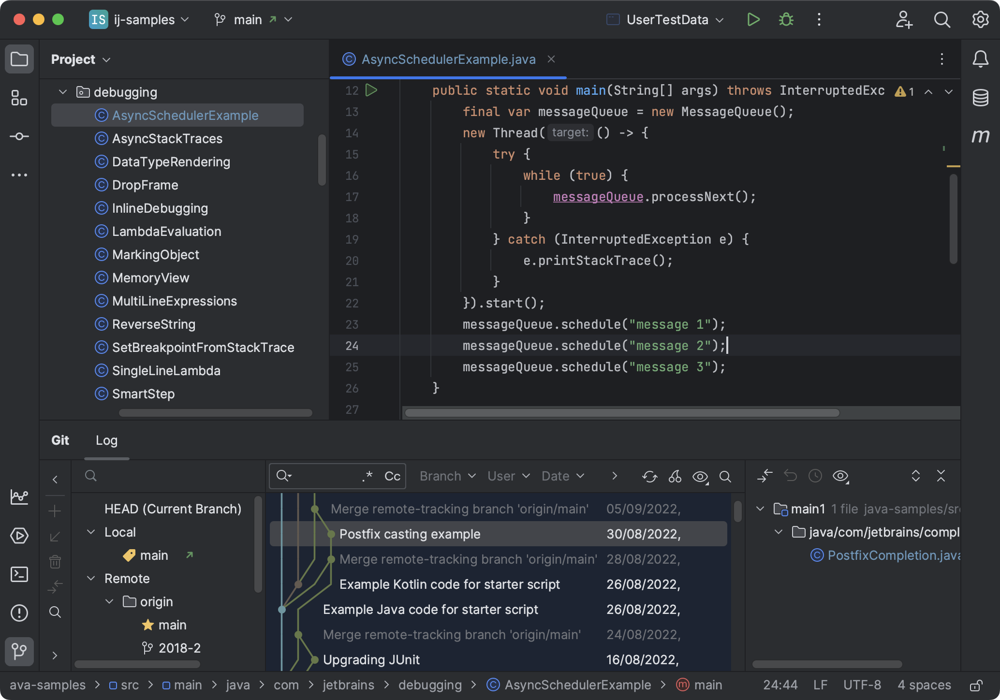
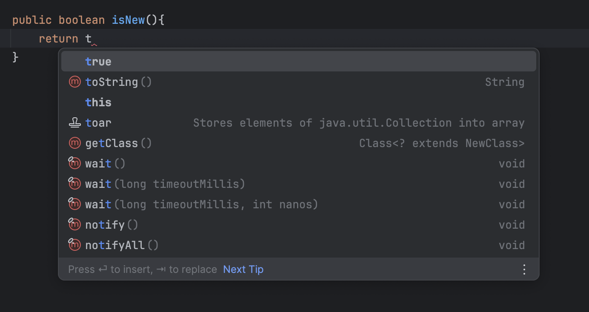
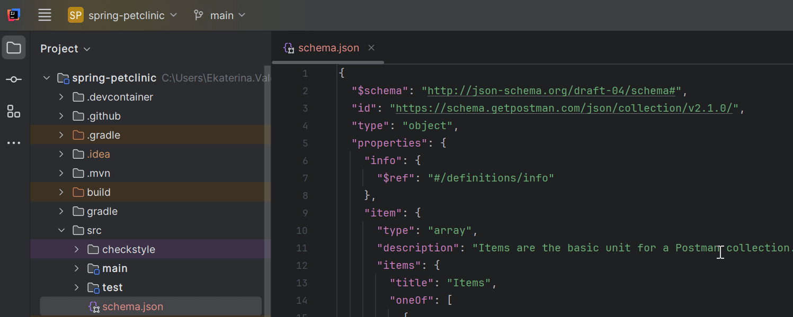
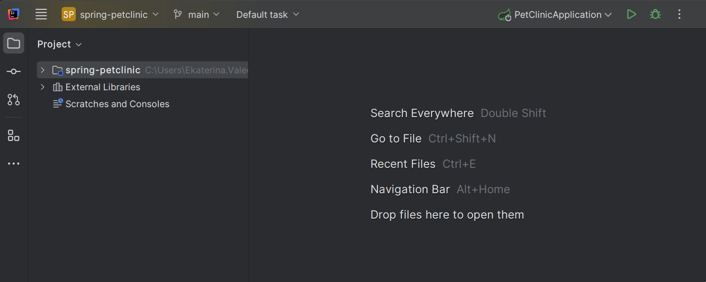
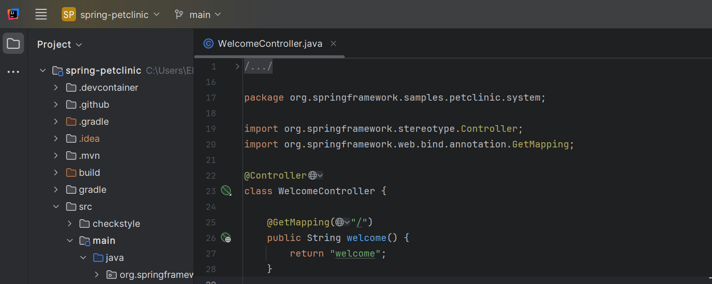
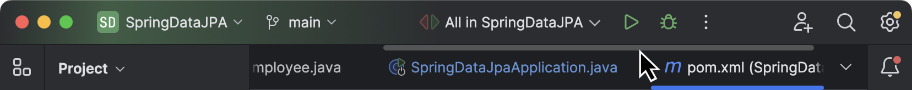
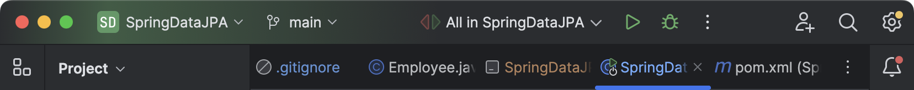
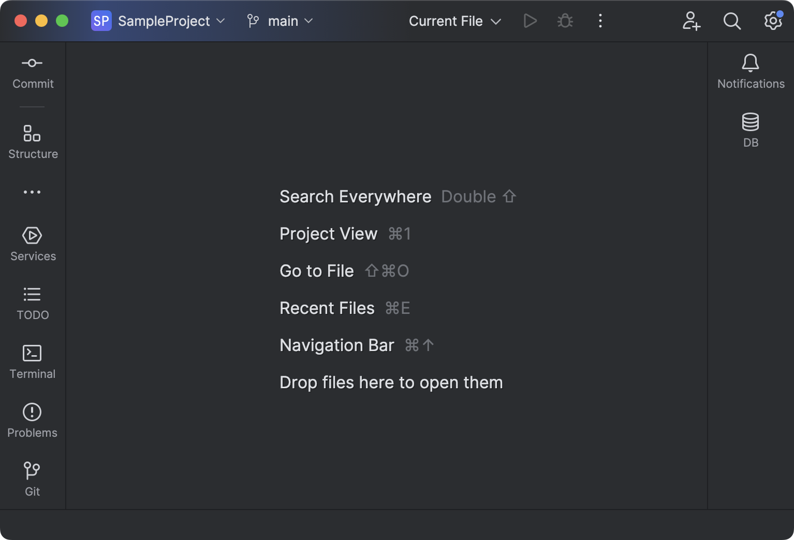
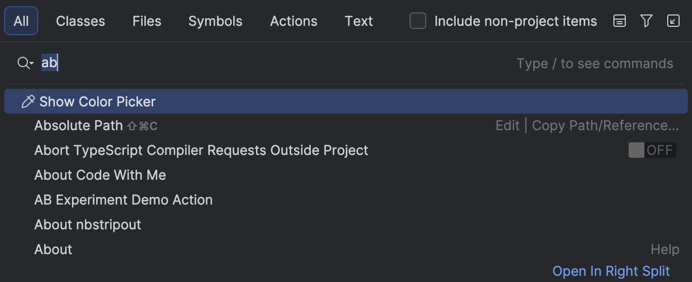
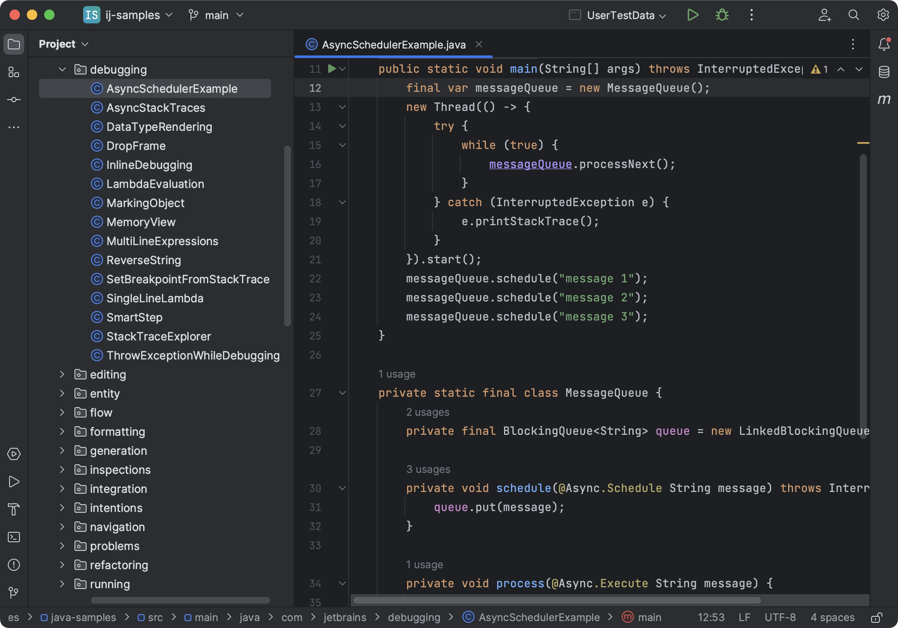

# JetBrains 暗黑 UI 设计调研

> 检索日期: 2026-08-15
> 范围: JetBrains IntelliJ Platform（IntelliJ IDEA 及衍生 IDE）暗色界面。覆盖经典 UI 的 Darcula 主题、New UI 暗色主题、High Contrast 可访问性主题；不含亮色主题。
> 来源优先级: 官方设计系统/官方文档/官方博客 → 主题与源码文件（GitHub intellij-community）→ 第三方 teardown 分析。
> 标注: 「待核」= 未能核实到一手来源的表述。

## 1. 概览

JetBrains IntelliJ Platform 是 IntelliJ IDEA、PyCharm、WebStorm 等 20+ 款 IDE 共用的 UI 基础平台，其暗色模式自 2012 年 Darcula 主题引入后沿用至今，2022 年起随 New UI 重新设计 [21][22][10]。

**风格一句话定性**: 以中灰色阶为骨架（避免纯黑）、低饱和蓝/橙为强调的「工具型深色界面」——高信息密度、低视觉噪声、对比度优先于装饰性；Darcula 背景 #2B2B2B 刻意回避纯黑的刺眼对比 [21]。

设计目标（New UI 官方表述）: 降低视觉复杂度、核心功能触手可及、复杂功能按需渐进披露 [10]。2024.2 起 New UI 成为默认 UI，经典 UI 转为非捆绑插件 [12]。

## 2. 视觉设计语言

### 2.1 配色（Darcula，全部取自已核实的官方主题文件 [1]）

**基础层（`ui."*"` 全局通配）**:

| Token | 色值 | 说明 |
|-------|------|------|
| `*: background` | `#3C3F41` | 全局 UI 面板背景（工具窗口、菜单、弹窗、页签区） |
| `*: foreground` | `#BBBBBB` | 全局正文前景（Label/Menu/Tree/Table 统一继承） |
| `*: caretForeground` | `#BBBBBB` | 光标色 |
| `*: selectionBackground` | `#2F65CA`（os.default）/ `#4B6EAF`（os.windows） | 选中背景，**平台分支取值不同** |
| `*: selectionForeground` | `#DEDEDE` | 选中前景 |
| `*: selectionBackgroundInactive` | `#0D293E` | 失焦选中背景（深蓝灰） |
| `Content.background` | `#2B2B2B` | 编辑器内容区背景 |
| `TextField/TextArea/ComboBox 背景` | `#45494A` | 输入框为提亮一级的深灰 |

**层级灰阶**（从深到浅，构成面板-控件-浮层的层次）: `#131314`（新 UI 页签底色）→ `#1E1F22` → `#2B2B2B`（编辑器）→ `#313335`（gutter/欢迎页细节）→ `#3C3F41`（主面板）→ `#45494A`（输入框/弹窗头部）→ `#4C5052`（按钮/hover）→ `#5E6060`（边框）[1][3]。

**强调色**（低饱和蓝系）:

| Token | 色值 | 用途 |
|-------|------|------|
| `Hyperlink.linkColor` / `Link.activeForeground` | `#589DF6` | 链接、补全匹配高亮（`CompletionPopup.matchForeground` 同值） |
| `Link.pressedForeground` | `#BA6F25` | 链接按下态（橙） |
| `TabbedPane.underlineColor` | `#4A88C7` | 页签选中下划线 |
| `EditorTabs.underlinedTabBackground` | `#4E5254` | 新 UI 页签选中底（underlined 样式） |
| `ToolWindow.Header.background` | `#3B4754` | 经典 UI 工具窗口标题栏（蓝灰，唯一带色相的常驻大块面） |
| `Component.focusColor` | `#3D6185` | 焦点环 |
| `Focus.color` | `#FF0000` | 键盘焦点标记（主题文件中显式定义） |

**语义色**: 错误 `#FF5261`（帮助文档文字语义色表 [6]）、进度条成功 `#008F50` / 失败 `#E74848` / 轨道 `#555555` [1]、书签金 `#D9A343` [3]。

**禁用/次要文本阶梯**: 正文 `#BBBBBB` → 次要信息 `#787878` → 禁用 `#777777` → 辅助说明 `#8C8C8C` [6]。

**按钮**: 常规按钮背景 `#4C5052`、边框 `#5E6060`、禁用文字 `#777777`；默认按钮（主操作）蓝调 `#365880` → `#4C708C`；阴影 `#36363680` 宽 2px [1]。

**High Contrast 主题**（基于 Darcula 的 `parentTheme` [2]）: 纯黑背景 `#000000` + 纯白前景 `#FFFFFF`，选中 `#3333FF`（纯蓝），焦点环 `#1AEBFF`（青色），链接 `#D2F53C`（黄绿）——对比度导向的饱和配色 [2][5]。

### 2.2 字体排版 [6]

| 用途 | 字体 | 字号 |
|------|------|------|
| UI 全平台默认 | Inter | 13 |
| 编辑器 | JetBrains Mono | 默认（行号 = 默认 −1） |

内置字号阶梯（相对默认 13 的偏移，禁止硬编码）: H1 = 默认+5，H2 = 默认+3，Default（正文/输入/树/表），Default semibold（弹窗/工具窗口标题），Paragraph（行高默认+3），Medium = 默认−1（辅助文字），Medium semibold（弹窗分组标题）[6]。

### 2.3 间距

基础行高: List/Tree `rowHeight = 20`（New UI compact 模式 `22`）；Table `rowHeight = 20` 无 compact 变体 [1]。缩进: 树 `leftChildIndent 7` / `rightChildIndent 11` [1]。控件内边距示例: 弹窗菜单 `borderInsets "6,1,6,1"`、Search Everywhere 广告条 `"4,20,5,20"`、工具栏图标 `"3,4,3,4"`（compact）、状态栏 widget `"4,8,3,8"`（compact）[1]。布局指南（对话框级）: 标签左对齐（跨平台统一，不随 macOS 惯例）、2-3 个短标签控件同行、复选框列布局上限、用垂直 inset 分组 [7]。

### 2.4 圆角

| 元素 | 圆角值 | 来源 |
|------|--------|------|
| Button | `arc 6` | [1] |
| Component（通用） | `arc 5` | [1] |
| PopupMenu 边框 | `borderCornerRadius 8` | [1] |
| 代码片段块（Code.Inline/Block） | `borderRadius 10` | [1] |
| 快捷键徽标 | `borderRadius 7` | [1] |

整体为小圆角体系（5–10px），区别于消费级产品的更大圆角。

### 2.5 阴影/层级

- 弹窗阴影: `Ide.Shadow` 用 16px 内缩边框 + 8 段 `#00000012` 半透明黑渐层模拟柔影；Notification 阴影 5px + `#00000010` [1]。
- 按钮阴影: `shadowWidth 2` + `#36363680` [1]。
- 悬浮层级次序: 编辑器 < 面板 < 弹窗/菜单 < 通知，通过阴影强度（12%→10% 黑）与边框（`Popup.borderColor #616161`）区分 [1]。





## 3. 交互动效

### 3.1 已核实动画清单

| 动画 | 时长 | 缓动/机制 | 触发时机 | 开关 |
|------|------|-----------|----------|------|
| 工具窗口滑入/滑出 | 300ms（`UISettings.ANIMATION_DURATION` 常量） | 快照滚动：组件与底层内容各截图到 topImage/bottomImage，由 Surface 面板按锚点方向逐帧位移（`offset += (distance - offset) / iterations`，每帧衰减剩余距离，呈指数逼近式 ease-out） | 工具窗口展开/收起（左/右锚点横向滑动，上/下滑动距离为高度） | `Registry "ide.animate.toolwindows"`，**当前 master 默认 false**；远程桌面会话自动禁用 |
| 加载指示器（AnimatedIcon/AsyncProcessIcon） | 帧循环（`totalFrames` / `cycleDuration` 参数化） | 帧序列按时间轮转（`cycleTime * totalFrames / cycleDuration`），用于后台任务 spinner | 异步任务开始 | — |
| 页签拖拽重排 | 无独立动画 | 拖拽中目标页签旁绘制落点指示，header 即时重绘 | 拖动编辑器页签 | — |

来源: 工具窗口动画实现在 `ToolWindowPane.kt` 的 `addSlidingComponent`/`removeSlidingComponent`（含 Surface 内部类）[14]；时长常量与开关定义于 `UISettings.kt` [15]；帧动画见 `AnimatedIcon.java` [16]；页签拖拽见 `DragHelper.java` [17]。

补充事实: 工具窗口滑入动画在**当前 master 中默认关闭**（registry 默认 false）——即现版本开箱即用的展开/收起为瞬切，动画为可选项 [15]；其历史默认值「待核」。菜单/弹窗的淡入、工具提示延迟等动效参数未找到一手来源，**待核**。

### 3.2 有官方演示、无参数的行为动效

- 紧凑模式（compact mode）切换: 工具栏/页签高度整体压缩（见官方动效演示）[12]。
- 工具窗口条图标 hover 时显示文字标签、失焦时淡出（"Disappearing icons on hover"）[12]。
- 工具窗口更多按钮弹出（"More tool windows"）[12]。







## 4. 布局与组件结构

### 4.1 信息架构（主窗口）

```
┌ 标题栏（新 UI 合并主工具栏: Project/VCS/Run widgets + 右侧工具图标）┐
├ 左工具窗条(图标) | 工具窗口(项目树等) | 编辑器(页签条 + 代码区) | 右工具窗条(图标) ┤
├ 状态栏: 分支/VCS 状态/行号/内存/通知图标等 widgets ┤
└──────────────────────────────────────────┘
```

经典 UI 与 New UI 的差异核心: 新 UI 将经典的多行工具栏压缩为单行 header（合并 VCS/Project/Run 三个 widget），工具窗口改为主图标条 + 可隐藏名称的紧凑面板 [10][12]。2022.3 起 New UI 以 beta 提供，2023.2 新用户默认，2024.2 全员默认，经典 UI 移出捆绑 [12]。

### 4.2 组件拆解（暗色参数）

**编辑器页签**（经典 UI，`TabbedPane` token [1]）:
- 样式 `tabFillStyle "underline"`：下划线指示选中；`underlineColor #4A88C7`，线高 `tabSelectionHeight 3`
- 页签高 `tabHeight 32`（compact 36），内边距 `0,12,0,12`；hover 底 `#2E3133`；内容区分隔线 `contentAreaColor #323232`
- 新 UI 改用 `EditorTabs`：选中底 `underlinedTabBackground #4E5254`、下划线高 3（compact）[1]
- 溢出处理: 多行模式或滚动模式（官方演示截图）[18]
- 规则: 页签置于内容顶部、不超过 8 个优先、溢出折叠进下拉 [8]





**工具窗口**（经典 UI）: 标题栏背景 `ToolWindow.Header.background #3B4754`（蓝灰），失焦回落到面板色 `#3C3F41`；选中 tab 底 `#313B45`；关闭按钮底 `#3F4146` [1]。新 UI 工具窗口无独立彩色标题栏（名称随图标条显示/隐藏，见截图与演示 [12][18]）。



**状态栏**: 背景随面板色 `#3C3F41`（`StatusBar.background "panel"`），顶边框 `#464646`，widget hover 底 `#4C5052`，前景 `#BBBBBB` [1]。

**项目树**: 背景 `#3C3F41`，行高 20，**无连接线**（`paintLines false`，现代扁平化处理），缩进 7/11 [1]。

**Search Everywhere 弹窗**: 头部背景 `#45494A`，分类页签选中底 `#555A5E`（比面板亮一级），搜索框背景 `#3C3F41` + 边框 `#646464`，列表分隔线 `#505050` [1]。



**新 UI 页签（MainWindow.Tab token，暗色值）**: 选中 `#3C3F41` + 前景 `#CED0D6`；未选中底 `#131314`（近黑）、hover `#1A1A1B`；分隔线 `#2B2D30` [1]。新 UI 顶部工具区在暗色下整体比经典 UI 更深。



**图标体系**: SVG 扁平几何风格，直角直边，2px 统一描边，对齐像素网格（不可整像素时取 0.5px）；动作图标默认 16×16（1px 透明边、可见内容限制在 14×14 区域），工具窗口 13×13，gutter/状态栏 12×12，弹窗 32×32（2px 边）[20]；暗色主题用 `iconName_dark.svg` 变体 [20]；禁用图标经 `grayFilter "-70,-70,100"` 灰化（Darcula 主题定义）[1]。New UI 工具窗口图标放大至 20×20 的表述仅见于二手摘要，**待核** [1][20]。

## 5. 实现级参数

### 5.1 token 体系与主题文件结构

- **Color key 命名**: `组件名.属性`（如 `ComboBox.background`），通配符 `"*"` 配任意属性，支持平台分支 `os.default` / `os.windows` / `os.linux` 与模式后缀 `.compact`（New UI 紧凑模式）[5][1]。
- **主题 JSON 结构**: `.theme.json` 含 `name`、`dark: true/false`、`parentTheme`（继承）、`editorScheme`（编辑器方案引用）、`ui: {}`（UI 色 token）、`icons.ColorPalette`（图标调色板）。自定义主题 = 默认主题 + 新色值 JSON [5]。自定义主题可替换图标、改控件颜色、改边框与 insets、提供自定义编辑器方案、加背景图 [9]。
- **代码侧**: `JBColor.namedColor("key", fallback)` 取色，`JBColor` 替代裸 `java.awt.Color`（DevKit 检查强制）[5]。
- 完整 key 清单在 `themes/metadata/IntelliJPlatform.themeMetadata.json`、`JDK.themeMetadata.json`；运行时可用 LaF Defaults 对话框（internal 模式）实时预览改色 [5]。

### 5.2 主题文件路径与关键值（已核实，master 分支）

| 文件 | 路径 | 内容 |
|------|------|------|
| Darcula 主题 | `platform/platform-resources/src/themes/darcula.theme.json`（小写） | UI 层全部色 token（本文 2.1 节数值即出于此）[1] |
| High Contrast 主题 | `platform/platform-resources/src/themes/HighContrast.theme.json` | `parentTheme: "Darcula"`、`editorScheme: "High contrast"`、纯黑/纯白/高饱和强调 [2] |
| 编辑器配色方案 | `platform/platform-resources/src/DefaultColorSchemesManager.xml`（内嵌 Default + Darcula 两个 `<scheme>` 节） | 编辑器色板与语法高亮（见下）[3] |
| High Contrast 编辑器方案 | `platform/platform-resources/src/themes/highContrastScheme.xml` | — [4] |

### 5.3 编辑器色板（Darcula 方案节，来自 [3]）

| 项 | 色值 |
|----|------|
| 编辑器背景 | `#2B2B2B`（`Content.background`，UI 层 [1]） |
| 光标 / 光标行 | `#BBBBBB` / `#323232` |
| gutter 背景 | `#313335` |
| 行号 / 当前行行号 | `#606366` / `#A4A3A3` |
| 选中背景（编辑器） | `#214283`（失焦 `#4C4F56`） |
| 缩进参考线 / 选中参考线 | `#373737` / `#505050` |
| 右边界线 / 方法分隔线 | `#4D4D4D` |
| 空白字符 / 换行线 | `#606060` / `#555555` |
| 语法: 关键字 | `#CC7832`（橙） |
| 语法: 字符串 | `#6A8759`（灰绿） |
| 语法: 数字 | `#6897BB` |
| 语法: 注释 | `#808080` |
| 语法: 文档注释 | `#629755` |
| 语法: 函数声明 | `#FFC66D`（暖黄） |
| 语法: 常量/实例字段 | `#9876AA`（紫） |
| 语法: 类引用 | `#769AA5` |
| 语法: 元数据/注解名 | `#BBB529` |
| 错误（波浪线/引用） | `#BC3F3C`，警告底 `#52503A` |
| 文件状态色 | 新增 `#629755` / 修改 `#6897BB` / 未知 `#D1675A` / 删除 `#6C6C6C` / 合并 `#9876AA` |

注: 编辑器默认文字色当前 master 以动态引用（`value="ff"`，跟随主题前景）定义，历史稳定值为 `#A8A8A8`，**待核** [3]。

### 5.4 动效实现级参数（源码 [14][15][16]）

- `UISettings.ANIMATION_DURATION = 300`（毫秒）— 工具窗口滑入滑出时长
- 开关: `UISettings.animateWindows` ← `Registry "ide.animate.toolwindows"`，默认 `false`；`RemoteDesktopService.isRemoteSession()` 时强制关闭
- 动画本质: 双截图（组件快照/底层快照）+ 位移 Surface，非组件实时布局动画
- 位移步进: `offset += (distance - offset) / iterations`（每帧将剩余距离均分，指数逼近）
- `AnimatedIcon` 帧轮转: `(cycleTime * totalFrames / cycleDuration) % totalFrames`

## 6. 来源清单

[1] darcula.theme.json（官方主题文件，master）— https://raw.githubusercontent.com/JetBrains/intellij-community/master/platform/platform-resources/src/themes/darcula.theme.json （浏览页: https://github.com/JetBrains/intellij-community/blob/master/platform/platform-resources/src/themes/darcula.theme.json ）
[2] HighContrast.theme.json（官方主题文件，master）— https://raw.githubusercontent.com/JetBrains/intellij-community/master/platform/platform-resources/src/themes/HighContrast.theme.json
[3] DefaultColorSchemesManager.xml（Darcula 编辑器配色方案，master）— https://raw.githubusercontent.com/JetBrains/intellij-community/master/platform/platform-resources/src/DefaultColorSchemesManager.xml
[4] themes 目录清单（GitHub API，含 highContrastScheme.xml 等）— https://github.com/JetBrains/intellij-community/tree/master/platform/platform-resources/src/themes
[5] Platform Theme Colors（IntelliJ Platform UI Guidelines，官方 SDK 文档）— https://plugins.jetbrains.com/docs/intellij/ui-guidelines-welcome.html ／ 源文件: https://github.com/JetBrains/intellij-sdk-docs/blob/master/topics/ui/principles/platform_theme_colors.md
[6] Typography（UI Guidelines，官方 SDK 文档；暗色语义色表在源文件中被注释）— https://github.com/JetBrains/intellij-sdk-docs/blob/master/topics/ui/principles/typography.md
[7] Layout（UI Guidelines，官方 SDK 文档）— https://github.com/JetBrains/intellij-sdk-docs/blob/master/topics/ui/principles/layout.md
[8] Tabs（UI Guidelines，官方 SDK 文档）— https://github.com/JetBrains/intellij-sdk-docs/blob/master/topics/ui/controls/tabs.md
[9] Themes Getting Started（官方 SDK 文档）— https://github.com/JetBrains/intellij-sdk-docs/blob/master/topics/basics/getting_started/theme/themes_getting_started.md
[10] Take Part in the New UI Preview（官方博客，2022-05，Dmitry Jemerov）— https://blog.jetbrains.com/idea/2022/05/take-part-in-the-new-ui-preview-for-your-jetbrains-ide/
[11] Addressing the New UI Comments（官方博客，2022-06）— https://blog.jetbrains.com/idea/2022/06/addressing-the-new-ui-comments/
[12] Bridging the Gap Between the Classic and New UIs（官方博客，2024-10）— https://blog.jetbrains.com/idea/2024/10/bridging-the-gap-between-the-classic-and-new-uis/
[13] Themes in IntelliJ-based IDEs（官方博客，2021-10）— https://blog.jetbrains.com/platform/2021/10/themes-in-intellij-based-ides/
[14] ToolWindowPane.kt（工具窗口滑入滑出动画实现）— https://github.com/JetBrains/intellij-community/blob/master/platform/platform-impl/src/com/intellij/toolWindow/ToolWindowPane.kt
[15] UISettings.kt（ANIMATION_DURATION=300 / animateWindows）— https://github.com/JetBrains/intellij-community/blob/master/platform/editor-ui-api/src/com/intellij/ide/ui/UISettings.kt
[16] AnimatedIcon.java（帧动画体系）— https://github.com/JetBrains/intellij-community/blob/master/platform/platform-api/src/com/intellij/util/ui/AnimatedIcon.java
[17] DragHelper.java（页签拖拽）— https://github.com/JetBrains/intellij-community/blob/master/platform/platform-api/src/com/intellij/ui/tabs/impl/DragHelper.java
[18] New UI（IntelliJ IDEA 官方帮助文档，暗色截图来源）— https://www.jetbrains.com/help/idea/new-ui.html
[19] Searching Everywhere / Discover IntelliJ IDEA（官方帮助文档，暗色截图来源）— https://www.jetbrains.com/help/idea/searching-everywhere.html ／ https://www.jetbrains.com/help/idea/discover-intellij-idea.html
[20] Icons（IntelliJ Platform UI Guidelines，官方 SDK 文档）— https://github.com/JetBrains/intellij-sdk-docs/blob/master/topics/ui/principles/icons_style.md
[21] IntelliJ Darcula Color Palette（第三方调色板分析，2026）— https://colorpickercode.com/color-palette/dark-mode-palettes/intellij-darcula/
[22] JetBrains 官方 Darcula 主题 Vim/Neovim 移植指南（第三方，含 DarculaColorScheme 细节）— https://wenku.csdn.net/doc/6c7j452fiy

截图来源（均已下载至 `assets/jetbrains/`，经像素校验为暗色界面）: [10]（newui-dark-preview.png、newui-banner.png）、[12]（Compact-mode.gif、More-tool-windows.gif、Disappearing-icons-on-hover.gif）、[18]（new_ui_dark_theme.png、ij-new-ui-compact-mode_dark.png、ij_tool_window_names_enabled_dark.png、scroll-tabs_dark.png、squeeze-tabs_dark.png）、[19]（search-everywhere_dark.png、completion_dark.png）。
