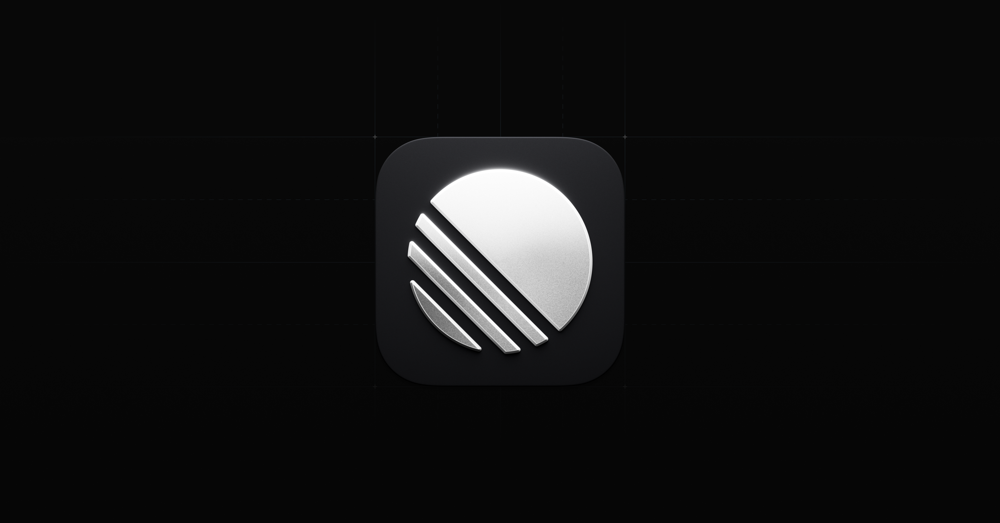
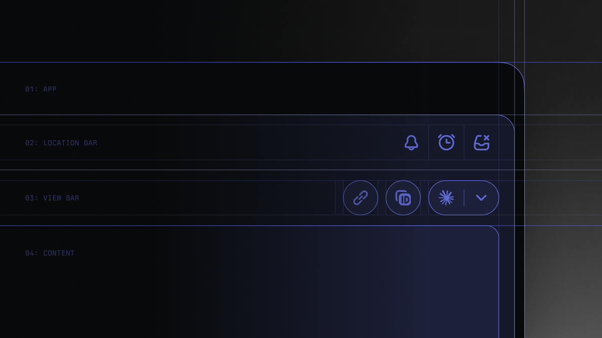
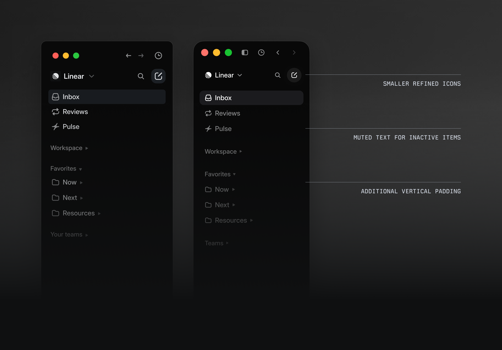
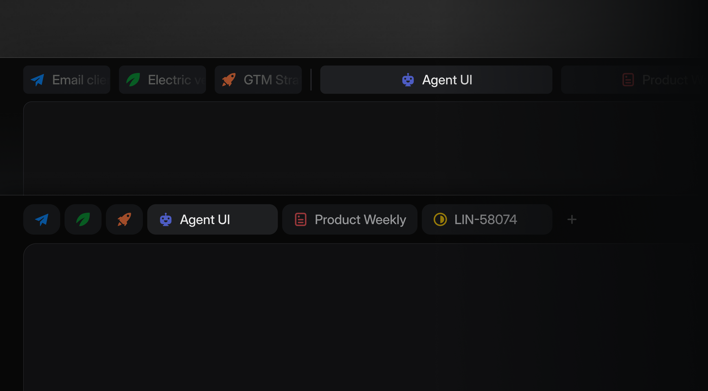
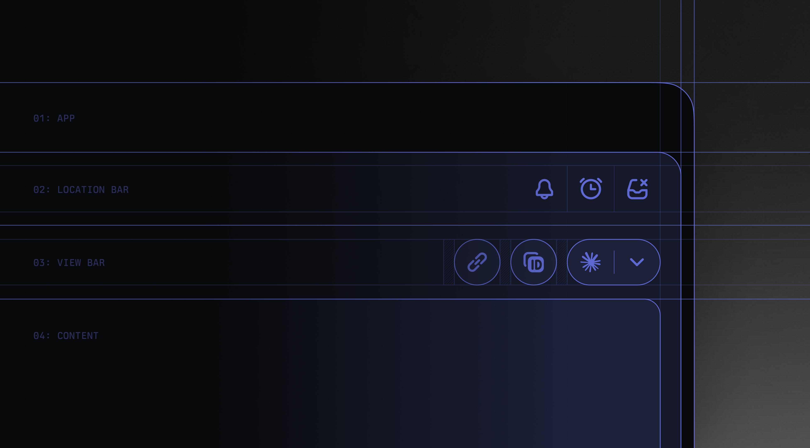
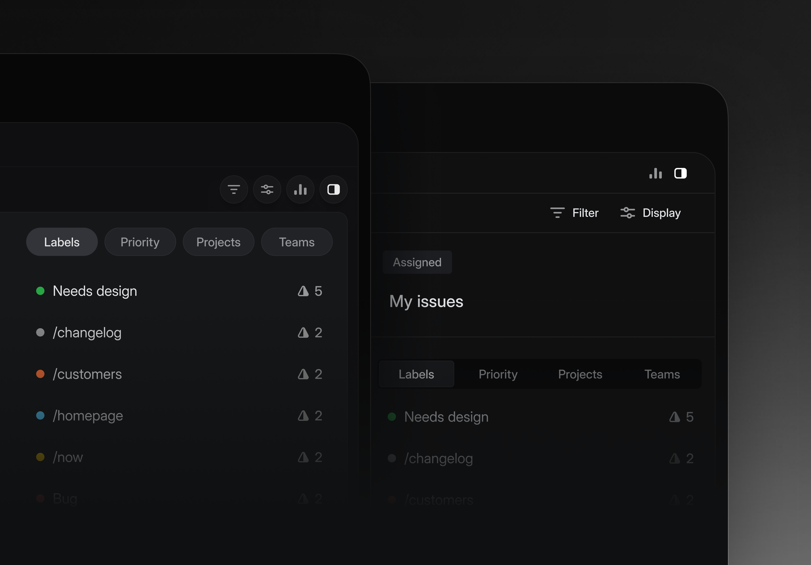
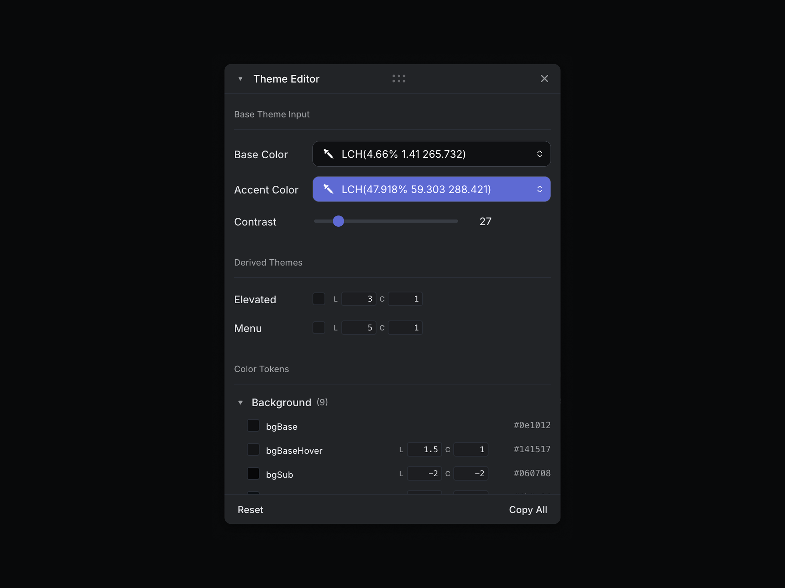

# Linear 暗黑 UI 设计调研

> 调研日期：2026-08-15。仅覆盖 Linear 的暗黑主题；色值、动效参数与组件结构均以暗色模式为准。所有截图下载自 Linear 官方内容资产（webassets.linear.app），来源见文末。

## 1. 概览

Linear 是面向软件团队的项目管理工具（issue tracker / 产品研发系统），其暗黑 UI 被业界视为「开发者工具暗色设计的范式」：**近黑画布 + 单一紫罗兰强调色（Magic Blue）+ Inter 字体体系 + 克制的微动效**，以「暗色为原生媒介」而非「亮色主题的暗化翻版」[7]。产品定位为键盘优先、信息高密度的效率工具，设计语言以精确（对齐、密度、层级）与克制（配色、动效、装饰）为纲，官方自述的设计原则是 "Don't compete for attention you haven't earned"（不为未赢得注意力的元素争抢视觉权重）[1]。

时间线背景：2019 年发布即暗色审美（黑底 + 灰色 Inter + 淡紫渐变圆形 logo，官网 hero 有激光点亮动效）[8]；2024 年 3 月全量 UI 改版（设计债务重置，LCH 色彩空间重构主题系统）[2][3]；2026 年 3 月第二次视觉刷新（默认暗色由冷蓝灰转向更暖的灰、侧栏调暗、边框软化）[1]。

## 2. 视觉设计语言

### 2.1 配色（暗色主题）

Linear 暗色系统近乎全消色，唯一色度来自品牌紫罗兰强调色 [7]。深度不靠阴影而靠背景亮度阶梯与半透明白色边框表达 [7]。

**背景与表面（亮度阶梯，自深至浅）**

| 层级 | 色值 | 说明 |
|------|------|------|
| 最深画布（editor / marketing） | `#010102` | 近纯黑、带不可察觉的冷蓝底调 [7] |
| 默认暗色画布 | `#08090A` | 产品暗色背景，最常被引用的值 [6][7]；社区配方亦以 `#08090A` 为 ground [10] |
| 面板（侧栏等） | `#0F1011` | 一阶提升 [7] |
| 二级表面 | `#191A1B` | 卡片、下拉等 [7] |
| 悬停/更高表面 | `#28282C` | 最浅的暗表面 [7] |
| 分隔线实色 | `#23252A` / `#34343A` / `#3E3E44`；最细线 tint `#141516` | 一/二/三级实色边框 + Line Tint（近不可见分隔线）[7] |

> 注：第三方色板站另有 `#080808` + 表面 `#141414` 的「2020 版」纯灰记载 [12]，与社区逆向的 `#08090A`（冷蓝底调）有出入，疑为不同年代或不同介质（官网 vs 产品）的差异，按最新官方描述（2026 刷新后为暖灰底调 [1]）以 `#08090A` 为准。2026 刷新前默认暗色为「冷蓝灰」，官方明确目标改为「更暖、更少饱和的灰，同时保持锐利」[1]。

**文字**

| 角色 | 色值 | 说明 |
|------|------|------|
| 主文字 | `#F7F8F8` | 近白但非纯白，避免刺眼 [7] |
| 次级 | `#D0D6E0` | 冷银灰 [7] |
| 三级 | `#8A8F98` | 元数据、占位 [7] |
| 四级 | `#62666D` | 时间戳等最弱文字；对近黑背景约 3.45:1 对比度（WCAG 公式计算），低于 WCAG AA（4.5:1），官方用于非正文场景，若作正文则为可访问性缺陷 [6][7] |

**强调色（Linear 标志性紫系）**

| 角色 | 色值 |
|------|------|
| 品牌强调（Magic Blue / Linear Indigo） | `#5E6AD2`（RGB 94,106,210）[6][7][13][14] |
| 交互强调（链接、选中态） | `#7170FF` [7] |
| 强调悬停 | `#828FFF` [7] |
| 安全相关元素 | `#7A7FAD`（Lavender 变体）[7] |

使用纪律：强调色只用于 CTA、焦点环、激活态、品牌标记与微型 pill，占全界面像素 <5%，禁止装饰性使用 [7][10]。品牌色官方并未使用亮紫渐变——唯一渐变是官网 hero 的极低透明度（<8% 不透明度）渐变网格 [10]。

**状态色**：成功 `#27A644` / `#10B981` [7]（designsystems.one 另有成功口径 `#4cb782` [6]）、告警 `#F2994A`、错误 `#EB5757` [6][7]。

**边框/分割**：半透明白 `rgba(255,255,255,0.05)`–`0.08` 为默认「发丝线」，暗色下以白色不透明度而非实色描边 [7]；2026 刷新将边框「圆角化 + 降低对比度 + 减少分割线数量」[1]。

**Overlay**：模态遮罩 `rgba(0,0,0,0.85)` [7]。





### 2.2 字体排版

- 正文字体：**Inter Variable**（回退 `'SF Pro Display', -apple-system, sans-serif`），全局开启 OpenType 特性 `"cv01", "ss03"`（几何化字形变体，是「Linear 的 Inter」与通用 Inter 的差异所在）[7]。
- 签名字重 **510**（介于 regular 400 与 medium 500 之间），配合 400（正文）与 590（强调）构成三档体系；最大字重 590，不使用 700 [7]。
- 2024 改版起标题改用 **Inter Display**（笔画更粗、字距更紧），正文保持标准 Inter [2][8]。
- 产品内字号（社区逆向）：正文 15px/行高 24px、小字 13px/19px、micro 12px/16px；type scale：title-1 56px/61px、title-3 24px/32px [6]。
- 等宽字体：**Berkeley Mono**（回退 ui-monospace/SF Mono/Menlo），用于代码与快捷键 chip [7]。
- 展示级标题使用激进负字距（72px 时 -1.584px、48px 时 -1.056px），仅存在于官网营销页；产品内从 24px 以下恢复常规字距 [7]。

### 2.3 间距

- 产品间距基准 4px（社区逆向：4/8/12/16/24/32）[6]；风格配方为 4/8/12/16/24/40/64/96 [10]。
- 营销页间距含 7px、11px 等光学微调值 [7]。
- 2024 改版后收件箱行距收紧（行高 1.5 倍保舒适度），一屏可容纳更多条目 [8]。

### 2.4 圆角

| 名称 | 值 | 应用 |
|------|-----|------|
| micro | 2px | 行内徽章、工具栏小按钮 [7] |
| small | 4px | 小容器、列表项 [6][7] |
| comfortable | 6px | 按钮、输入框、功能性元素（CTA 按钮 8px×16px padding + 6px 圆角）[7] |
| medium / card | 8px | 卡片、下拉、popover [6][7] |
| large | 12px | 面板、特性卡片 [6][7] |
| pill | 9999px | 过滤 chip、状态 pill [6][7] |

社区配方给出的产品级上限是 16px（「modest, precise, never gummy」）[10]；官网大面板有 22px 圆角记载 [7]。

### 2.5 阴影 / 层级

- 暗色下传统阴影不可见，层级主要由**表面亮度阶梯 + 半透明白边框**表达（背景白色不透明度 0.02→0.04→0.05 逐级抬升）[7]。
- 浮动元素阴影：`0 8px 32px rgba(0,0,0,0.35)` [6]；对话框用多层阴影堆叠（`rgba(0,0,0,0.01~0.08)` 5 层 + 1px ring）[7]。
- 凹陷面板用 inset：`rgba(0,0,0,0.2) 0px 0px 12px 0px inset` [7]。
- 焦点环：`rgba(0,0,0,0.1) 0px 4px 12px` + 附加层 [7]。

## 3. 交互动效

### 3.1 动效原则（官方与设计团队口径）

Linear 动效哲学由设计工程师 Emil Kowalski 概括：**「UI 动画一般应低于 300ms」**；180ms 的动画比 400ms 更有响应感，速度即感知性能 [11]。核心决策框架是频率法则——高频交互（每天数百次）不动画或瞬时响应，键盘触发的操作**永不播放动画**；低频/首次体验才允许更富表现力的动效 [11]。动效只作用于合成属性（transform/opacity，偶用 background-color/border-color），从不触发布局属性（width/height/margin/top/left）[11]。动画须可中断（CSS transition 而非 keyframes，可中途重定向）[11]。

### 3.2 参数表

| 动画/交互 | 时长 | 缓动曲线 | 触发时机 | 来源 |
|-----------|------|----------|----------|------|
| 状态变更（默认 transition） | 180ms | `cubic-bezier(0.22, 1, 0.36, 1)`（motion-fast token） | 通用状态切换 | [6] |
| 快速反馈（fast token） | 100ms | ease-out | 微交互 | [6] |
| 默认动效（default token） | 250ms | `cubic-bezier(0.25, 0.46, 0.45, 0.94)` | 通用 | [6] |
| 视图切换 / 列表重排 / 模态进入 | 120–180ms | eased（社区逆向归纳） | 视图间切换、拖拽重排、弹窗入场 | [6] |
| 悬停 | ~150ms | ease-out | 可悬停元素 | [10] |
| 布局级位移 | 350–450ms | quint 类曲线（如 `cubic-bezier(0.22, 1, 0.36, 1)`） | 布局移动 | [10] |
| 按钮按压 | 待核 | — | :active 按下，`scale(0.97)`（时长/缓动数值未公开） | [11] |
| 弹层/下拉展开 | <300ms（总原则，无专项数值） | 自定义贝塞尔，**origin-aware**：从触发元素处展开而非居中 | 悬停/点击触发 | [11] |
| 2019 官网 hero 激光点亮 | — | — | 首次发布记忆点动效（产品图标点亮） | [8] |
| 移动端 metadata 选择器 | — | spring 物理 | 键盘下滑 + bottom sheet 上滑联动 | [15] |

> 注：`cubic-bezier(0.22, 1, 0.36, 1)` 是 Linear 生态最常被引用的「签名曲线」（ease-out-quint 变体，陡起缓落），designsystems.one 的 motion-fast token 与社区配方均指向它 [6][10]。

### 3.3 动效行为细节

- **不从 scale(0) 动画**：入场从 scale(0.9)+ 开始，避免不自然运动 [11]。
- **tooltip 规则**：同组首个 tooltip 有延迟+动画，后续即时显示 [11]。
- **clip-path 揭示**：用于 reveal 与页签切换（硬件加速、无布局抖动、零额外 DOM）[11]。
- **模糊兜底**：`filter: blur(2px)` 在粗糙状态过渡期遮蔽瑕疵 [11]。
- **键盘操作零动画**：快捷键面板/命令菜单的键盘路径无入场动画 [11]。
- **loading 骨架**：Linear 以本地优先同步引擎为主，界面状态切换多为瞬时/100ms 级（`--speed-quickTransition` 0.1s 等 CSS 变量记载见 §5.2，出处待核）[11]。

## 4. 布局与组件结构

### 4.1 信息架构

全局框架为「倒 L 形」：顶部应用标题栏（面包屑 + 页签 + 右侧动作区 + 可选子标题栏）+ 左侧导航侧栏，主内容区承载 list / board / timeline / split / fullscreen 等视图，侧板展示 meta 属性 [2][9]。2024 改版将导航元素归纳为「侧栏、页签、应用标题、视图标题」四类主要组件并逐一记录行为 [2]。

### 4.2 侧栏（Sidebar）

- 2024 改版重点：图标/文字/按钮的像素级对齐（横向纵向）、层级与密度平衡，不依赖收藏夹或极简模式的用户都能感知「更不杂乱」[2][4]。
- 2026 刷新：侧栏**调暗几个档位**，让用户到达目的地后主内容区占据视觉优先（"Don't compete for attention you haven't earned"）[1]。
- 图标治理：减少图标用量、缩小尺寸、移除彩色团队图标背景 [1]。



### 4.3 页签（Tabs）与标题栏（Header）

- Header 四段结构：Title（上下文面包屑）、Tabs（视图/筛选）、Side（右侧图标按钮组）、Subheader（筛选器）[9]。
- 响应式：`ResponsiveSlot` 组件用 ResizeObserver 按优先级动态隐藏槽位内容（低优先级先隐藏），不依赖传统断点；内部为 MobX 小型 store + React context 注入 [9]。
- 页签溢出：超出容器宽度的页签以 `visibility: hidden` 保留在 DOM（不触发重排闪烁），容器溢出隐藏；隐藏数量以「+N」按钮呈现，激活页签被隐藏时按钮显示其标签；popover 内可拖拽排序（dnd-kit）[9]。
- 2026 刷新：桌面端页签从通栏改为紧凑式——圆角、更小图标与文字、icon-only pill [1]。





### 4.4 命令菜单（Command Menu）

- 2019 年即实现**上下文命令菜单**：只显示与当前视图/选中项相关的动作；从屏幕居中改为**出现在触发它的 UI 元素旁**，行为近似下拉 [5]。
- 与快捷键体系打通：`⌘K` 统一入口，右键菜单可复制/打开链接 [5][7]。
- 快捷键以 pill chip 形式内嵌于 UI（与命令栏同款样式），键盘优先是品牌语言的一部分 [7][10]。

### 4.5 其他组件

- **Inbox**：2024 重设计——聚焦通知类型、强调队友头像、简化标题与筛选器 [2][4]。
- **主题入口**：命令菜单与设置均可切换到怀旧主题 Magic Blue（2024 改版后的新主题仍以它致敬旧版观感）[4]。
- **移动端选择器**：Priority/Team/Labels 等元数据按钮点击后，系统键盘下滑 + 底部 sheet 上滑联动切换 [15]。

### 4.6 边框与分割的暗色结构

2026 刷新：边框/分割线「圆角化 + 降低对比度」，分割线数量减少——结构通过更弱的视觉线索表达而非密集描边 [1]。



## 5. 实现级参数

### 5.1 主题系统（官方口径）

- **LCH 色彩空间**：2024 改版起暗/亮主题与自定义主题统一由 LCH 生成（此前为 HSL，感知不均匀，同亮度下不同色相观感不同）[2][8]。主题定义从每主题 98 个变量精简为 **3 个：base color、accent color、contrast**；contrast 变量可自动生成高对比度主题（满足无障碍需求）[2]。
- **主题生成器**：内置于产品，用户可选基础色/强调色并调节对比度；2026 refresh 期间团队用 Claude Code 在内部 dev toolbar 中构建了可逐 token 调 hue/chroma/lightness 的颜色工具，最终以 JSON 导出 token 并经 Figma 插件同步设计系统 [1]。
- 主题用 token 覆盖 background/foreground/panels/dialogs/modals 等多级表面（LCH 更接近人眼感知，便于处理不同 elevation）[2]。



### 5.2 第三方逆向的 CSS 变量与 token（非官方，供参考）

designsystems.one 的社区 token 快照（标注 unofficial、数值为对线上产品的 reading）[6]：

```css
--linear-accent:        #5e6ad2;  /* 品牌强调 */
--linear-text:          #f7f8f8;  /* 暗色主文字 */
--linear-text-secondary:#8a8f98;
--linear-bg:            #08090a;  /* 暗色画布 */
--linear-surface:       #1c1c1f;
--linear-border:        #26262a;
--motion-fast:          180ms cubic-bezier(0.22, 1, 0.36, 1); /* 状态变更默认 */
--motion-default:       250ms cubic-bezier(0.25, 0.46, 0.45, 0.94);
--radius-small: 4px; --radius-medium: 8px; --radius-large: 12px; --radius-pill: 9999px;
--shadow-floating:      0 8px 32px rgba(0,0,0,0.35);
```

另有动效速度 CSS 变量记载：`--speed-highlightFadeIn: 0s`、`--speed-highlightFadeOut: .15s`、`--speed-quickTransition: .1s`、`--speed-regularTransition: .25s`，以及 hover 背景色 0.12s、图标箭头 transform 0.15s 的实现值（出处为搜索引擎摘要转述，原始文档未能核实，且 designsystems.one 页面并无这些变量，标注待核）。

### 5.3 社区重实现（shadcn 版 HSL token）

GitHub 上的 shadcn 风格 Linear UI 复刻（marvkr/linear-shadcn，`globals.css`）以 HSL 表达暗色层级，与官方 LCH 系统不是同一体系，仅作层级结构参考 [17]：

| 变量 | HSL | 角色 |
|------|-----|------|
| `--background` | `234 17% 12%` | 最暗画布 |
| `--foreground` | `0 0% 100%` | 文字 |
| `--card` / `--popover` | `236 18% 15%` | 抬升表面 |
| `--primary` | `235 100% 71%` | 主 CTA 紫 |
| `--border` | `237 15% 26%` | 最亮边框 |

### 5.4 GitHub 主题文件

- **dracula/linear**：Dracula 配色的 Linear 暗色主题（**JSON 主题导入**，非 userstyle），2025-10 已适配 Linear 新主题系统（官方主题生成器可导入自定义主题）；安装入口 draculatheme.com/linear。本次调研未能获取其主题 CSS 文件本体（仓库文件树接口 403），仅确认仓库存在与适配状态 [16]。

## 6. 来源清单

1. Linear 官方博客（Now）：*A calmer interface for a product in motion*（2026-03-12，Charlie Aufmann & Maxime Heckel）——2026 视觉刷新官方说明 — https://linear.app/now/behind-the-latest-design-refresh
2. Linear 官方博客（Now）：*How we redesigned the Linear UI (part Ⅱ)*（2024-03-28，Karri Saarinen 等）——LCH 主题系统、侧栏对齐、五里程碑 — https://linear.app/now/how-we-redesigned-the-linear-ui
3. Linear 官方博客：*A design reset (part I)*（2024-03-27，Karri Saarinen）——设计债务与重置理念 — https://linear.app/blog/a-design-reset
4. Linear Changelog：*Welcome to the new Linear*（2024-03-20）——新侧栏/页签/收件箱、Magic Blue 怀旧主题、主题生成器 — https://linear.app/changelog/2024-03-20-new-linear-ui
5. Linear Changelog：*Contextual command menu*（2019-10-07）——命令菜单上下文化与定位方式 — https://linear.app/changelog/2019-10-07-contextual-command-menu
6. designsystems.one：*Linear — Design System Breakdown*（社区 token 快照，标注 unofficial；动效/圆角/阴影/字号 token 主要来源）— https://www.designsystems.one/design-systems/linear
7. awesome-design-md（sweetkey）：`design-md/linear.app/DESIGN.md`（社区逆向分析：色板全表、Inter 字重体系、组件规格、阴影层级）— https://raw.githubusercontent.com/sweetkey/awesome-design-md/main/design-md/linear.app/DESIGN.md
8. 少数派：*聊聊 Linear 的设计变革*（2025-12-11，燕耳Firenze）——2019 起源、hero 激光动效、HSL→LCH 转述 — https://sspai.com/post/104449
9. Tomas Pustelnik：*Reverse engineering Linear — part 1: Header*（2025-09-07）——Header 四段结构、ResponsiveSlot、MobX、页签动态隐藏源码分析 — https://pustelto.com/blog/reverse-engineer-linear-1-header/
10. garden-skills（ConardLi）：`style-recipes/linear.md`（社区风格配方：150ms 悬停 / 350–450ms quint 曲线、圆角上限、间距节奏）— https://github.com/ConardLi/garden-skills/blob/main/skills/web-design-engineer/references/style-recipes/linear.md
11. design-motion-principles（kylezantos）：`references/emil-kowalski.md`（Linear 设计工程师 Emil Kowalski 的动效原则与参数：<300ms、scale(0.97)、origin-aware、键盘零动画）— https://github.com/kylezantos/design-motion-principles/blob/main/skills/design-motion-principles/references/emil-kowalski.md
12. ColorPickerCode：*Linear App Color Palette — Dark Mode*（第三方色板：#080808/#141414 旧值）— https://colorpickercode.com/color-palette/dark-mode-palettes/linear-dark/
13. Color Palette Generator：*Linear Color Palette — Brand Colors, Hex Codes*（#5E6AD2 品牌色）— https://www.colorpalettegenerator.ai/brands/linear
14. ColorArchive：*Linear Color Palette*（#5E6AD2 品牌色）— https://colorarchive.org/brands/linear/
15. 60fps.design：*Linear Issue Actions Popup Interaction*（移动端 keyboard↔bottom sheet 联动动效）— https://60fps.design/shots/linear-issue-actions-popup-interaction
16. GitHub：*dracula/linear*（Linear 暗色主题，JSON 导入方式，2025-10 适配新主题系统；本次未获取主题文件本体）— https://github.com/dracula/linear
17. GitHub：*marvkr/linear-shadcn*（shadcn 复刻 Linear UI 的 HSL token 体系）— https://github.com/marvkr/linear-shadcn

补充未直接引用、可作延伸核对的来源：
- shadcn 官方展示页 *Linear Design System for React*（Lavender #5e6ad2、Linear Display、22 组件）— https://www.shadcn.io/design/linear
- uicolours：#5E6AD2 的 RGB/HSL/OKLCH 换算 — https://uicolours.com/tools/colour-explorer/5E6AD2
- getdesign.md：*Design System Analysis of Linear* — https://getdesign.md/design-md/linear.app/preview

**未能核实项**：
1. `--speed-highlightFadeIn/FadeOut/quickTransition/regularTransition` 及 hover 0.12s、transform 0.15s 等「样式表中具体实现值」，仅见于搜索引擎摘要转述，原始出处文档未能定位（§3.2 已标注待核）。
2. dracula/linear 仓库的主题 CSS 具体变量值（GitHub API 403，未取得文件本体）。
3. `#080808` vs `#08090A` 两种暗色背景记载的官方确认（疑为不同年代/介质差异）。
4. 2026 刷新后新默认暗色的具体 hex 值——官方文章只描述「更暖、去饱和的灰」方向，未公布数值。
5. buildmvpfast.com 的 *Linear Design System, Decoded*（token 级 teardown）访问 403，未纳入引用。
