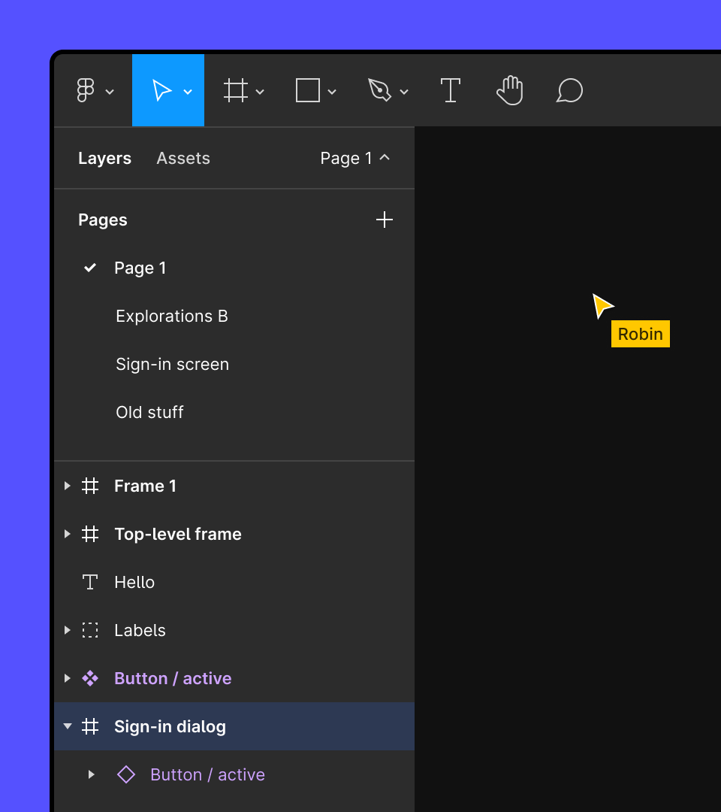
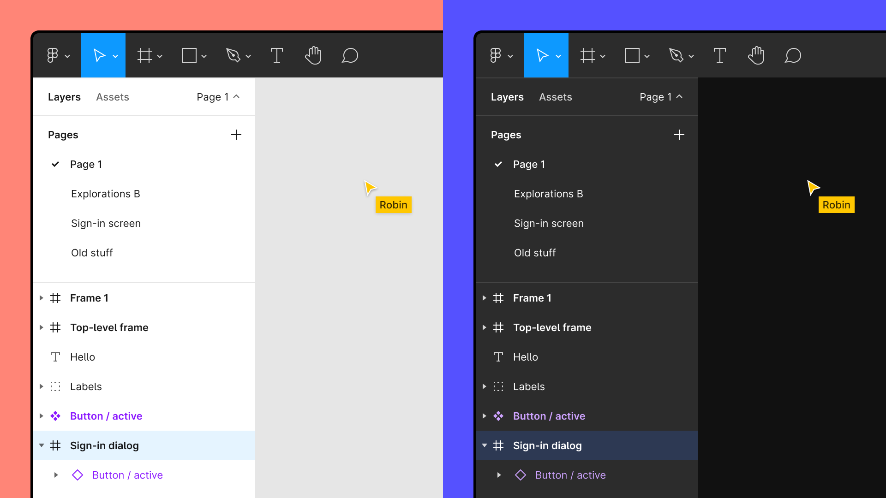
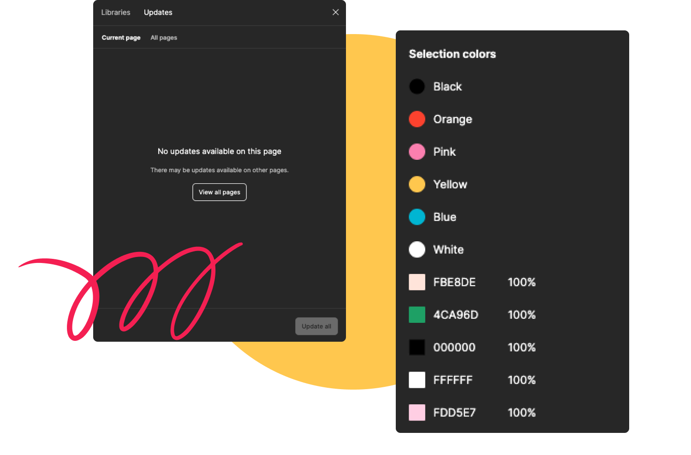
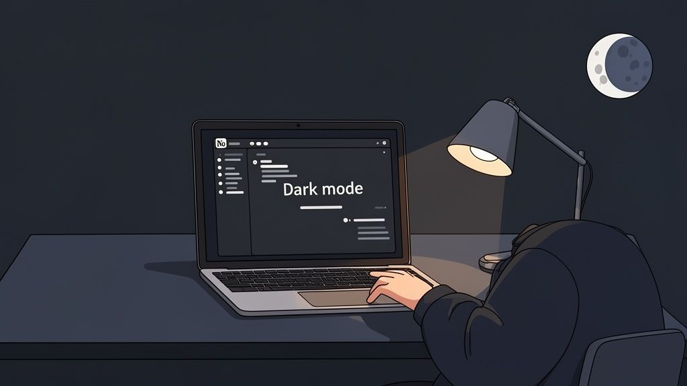

# Notion / Figma 暗黑 UI 设计调研

> 检索日期: 2026-08-15
> 来源优先级: 官方文档 > 源码仓库 > 技术博客 > 社区讨论
> 范围: 仅暗黑主题（Dark Mode / Dark theme）。无法核实的数值统一标注「待核」，集中清单见文末。

## 1. 概览

**Notion** —— 文档/笔记/知识库一体化工具。暗黑模式是跟随系统的全局偏好主题（2021-01 起提供 Always light / Always dark / Use system setting 三档 [7]）。设计风格一句话定性：**近纯黑（#191919）背景 + 极低色彩预算（六种柔和色调仅用于高亮与 callout，绝不用于按钮）+ 发丝线边框替代阴影表达层级**，刻意"almost monochrome on purpose" [6][1]。

**Figma** —— 界面设计协作工具。暗黑模式是编辑器原生主题（2022-05 上线 [15]），与亮色同为正式渲染路径而非皮肤。设计风格一句话定性：**off-black 画布（#1E1E1E）+ 明暗反转的默认面板 + 全量语义 token 驱动的系统性暗色**，是工程化程度最高的暗黑模式实现之一（约 350 个语义 token、5100 处颜色声明迁移）[13][15]。

## 2. 视觉设计语言

### 2.1 Notion

#### 配色（背景层级色，来源为第三方主题对原生内联值的映射实测 [1]，双源互证 [2]）

| 层级 | 色值 | 说明 |
|------|------|------|
| 页面/编辑器背景 | `rgb(25,25,25)` = **#191919** | 2022 年由偏灰 `rgb(47,52,55)`（#2F3437）改近纯黑，社区有"太黑"争议 [1][3] |
| 侧栏、弹窗背景 | `rgb(32,32,32)` = **#202020** | 比页面背景亮一档 [1] |
| 卡片（Collection 等） | `rgb(37,37,37)` = **#252525** | [1] |
| 点击态背景 | `rgb(47,47,47)` | 另有旧值 `rgb(61,66,69)` [1] |
| hover 背景 | `rgba(255,255,255,0.055)` | 白色低透明度叠加 [1] |
| 边框 / 底边框 | `rgb(32,32,32)` / `rgb(60,63,67)` → `rgb(37,37,37)` | [1] |
| 正文文字 | `rgba(255,255,255,0.73)` | 第三方汇总口径为 #D4D4D4 [1][2] |
| 次级文字 | `rgb(150,150,150)` = **#969696** | [1] |
| 弱文字 | `rgba(255,255,255,0.39)` | [1] |
| 品牌蓝（链接/主按钮） | `rgb(46,170,220)` = **#2EAADC** | 按钮原色 `rgb(0,141,190)`、hover `rgb(6,156,205)` [1] |

标注色（text / background 配对，第三方汇总 [2]）：默认 #D4D4D4 / #191919；灰 #9B9B9B / #252525；棕 #A27763 / #2E2724；橙 #CB7B37 / #36291F；黄 #C19138 / #372E20；绿 #4F9768 / #242B26；蓝 #447ACB / #1F282D；紫 #865DBB / #2A2430；粉 #BA4A78 / #2E2328；红 #BE524B / #332523。

Notion 运行时把颜色以内联 `style`（RGB/rgba）直接注入元素，**无 CSS 变量体系**（证据见第 5 节映射表）[1]。官方未公开 design token（官方 Color Palette 页面为 JS 渲染，仅检索到 `--notion-black #000000`、`--notion-white #ffffff` 等品牌基础色，待核 [11]）。

#### 字体排版

- 主字体 NotionInter（Inter 修改版），fallback 栈 `NotionInter, Inter, -apple-system, system-ui, Segoe UI, Helvetica, Apple Color Emoji, Arial, Segoe UI Emoji, Segoe UI Symbol`（待核：源自第三方设计引用页摘要，非官方公告）[6]
- 产品侧仅三种字体预设：Default / Serif / Mono，不支持自定义字体 [10]
- iOS 字号 token 表（第三方实测拆解，非官方声明 [6]）：`--page-title` 30px/700/-1.0px 字距；`--h1` 26px/700/-0.6px；`--h2` 22px/700/-0.4px；`--h3` 18px/700；`--body` 16px/400；`--caption` 14px/500；`--meta` 12px/500；`--code` 13px/400。行高 1.45–1.5
- 暗黑模式**不换字体**，仅改颜色与对比（各来源一致口径）[6]

#### 圆角

半径阶梯几乎不超过 6px（iOS 实测拆解 [6]，值来自亮色实测，暗黑下半径一致的可能性高但未逐项确认，待核）：Block 0px、Hairline 2px、Tag 3px、Card 4px、Input 5px、Button 6px、Modal 8px、系统 Sheet 14px（14px 为 iOS 系统继承）。

#### 阴影 / 层级

靠**发丝线边框（hairline borders）**表达层级而非阴影：Kanban 卡片 = 4px 圆角 + 1px 边框、无阴影（no shadow）[6]。

### 2.2 Figma

#### 配色

官方**唯一公开的暗色 UI 值**是画布背景默认 **#1E1E1E**（off-black；亮色默认 #F5F5F5），帮助中心逐字确认「While in dark mode, they'll default to an off-black color #1E1E1E」[13][14]。画布背景色是文件级设置（新建页面继承当前页画布色而非主题）[14]。

面板/工具栏的暗色 hex **官方未公开**；社区逆向值（Primary #2C2C2C、Secondary #1E1E1E 等）为第三方推导，可信度低，仅作参考（待核）[23]。中文教程给出的 #121212 / #E0E0E0 / #333333 同为第三方推荐值（待核）[24]。

暗黑下的 accent 处理（官方博客）：accent 色（品牌蓝 #0d99ff 等）在明暗主题间微调；C++ 渲染引擎的颜色（选中蓝、组件紫）在暗黑模式下选择性微调 [15]。

品牌五色（明暗主题下 accent 的来源，第三方品牌色汇总站逐字确认 [22]）：#A259FF（紫）、#F24E1E（红）、#FF7262（橙）、#1ABCFE（蓝）、#0ACF83（绿）——属品牌/营销色板，非编辑器 UI 面板色。2024 品牌刷新扩展配色为 bold primaries / bright neons / muted earthy tones 三组，但官方未公开新色板 hex（待核）[16]。

#### 字体排版

- 界面字体 **Inter**：2018 年末 UI 重设计采用，此前多年用 Roboto（小字号可读性不佳）；Inter 相对 x-height 恰为 cap height 的 3/4 [17]
- 界面字号/行高/字重数值官方未公开（待核）[17]
- 2024 品牌刷新：品牌主字体 Figma Sans（与 Grilli Type 合作），另有 Figma Condensed、Figma Mono、Figma Hand [16]

#### 圆角 / 阴影

编辑器 UI 的 border-radius、阴影/层级数值**官方未公开**（待核）[15]。官方变量体系支持 Number 变量绑定 corner radius、shadow blur 等属性，即官方工具链可 token 化圆角/阴影，但 Figma 自身 UI 的具体取值未公开 [21]。

## 3. 交互动效

### 3.1 Notion

动画清单（来源属性注明实测/官方/用户注入）：

| 动画 | 时长 | 缓动 | 触发时机 | 来源 |
|------|------|------|----------|------|
| 块（blocks）动画 | 200ms | easeOut | 块创建/插入/移动 | iOS 实测拆解 [6] |
| 侧栏抽屉 | 280ms | easeInOut | 侧栏滑出（覆盖式，宽 86%，遮罩 rgba(15,15,15,0.4)） | iOS 实测拆解 [6] |
| AI 输出下划线 | 800ms 后淡出 | — | AI 生成内容的下划线装饰 | iOS 实测拆解 [6] |
| 打开页面 slide-in | 未公开 | — | 页面切换（Reduce motion 关闭对象） | 官方无障碍设置清单 [8] |
| 数据库视图切换 fade | 未公开 | — | 视图切换（Reduce motion 关闭对象） | [8] |
| toggle 块/嵌套页展开折叠 | 未公开 | — | toggle 展开/折叠（Reduce motion 关闭对象） | [8] |
| 侧栏面板/弹窗菜单滑出 | 未公开 | — | 面板弹出（Reduce motion 关闭对象） | [8] |
| 侧栏分区折叠 | 0.3s ease-out | — | 侧栏折叠（**用户注入 CSS 数值，非原生动画参数**） | [29] |

- 桌面/Web 端侧栏折叠、弹窗的**原生**动画时长与缓动官方未公开（待核）；iOS 实测 200ms / 280ms 不保证桌面一致 [6]
- **Reduce motion**（内置无障碍设置，Settings & members → My Settings → Accessibility）：开启后禁用上表后四项非必要动画，保留 spinner、进度条等功能指示；即时生效、跨设备同步 [8]
- **块拖拽**：所有块类型（文本/标题/图片/数据库行/嵌入）悬停时出现统一的**六点拖拽手柄**（six-dot drag handle），同一手柄、同一位置、同一行为，刻意不做花哨抓取动画（"one signifier, one behavior"）；iOS 手柄 14×14pt，点击目标扩至 36pt [6][9]

### 3.2 Figma

动画机制官方公开的唯一定量体系是 **spring 物理动画**（面向原型功能，编辑器自身 UI 动画参数官方未公开，待核）[20]：

| 参数/概念 | 值/说明 | 来源 |
|-----------|---------|------|
| 物理模型 | Mass（F = m·a）+ Stiffness（Hooke 定律 F = −k·x）+ Damping（F = −b·v） | 官方博客 [20] |
| 交互降维 | 双 handle：水平位置控制相对速度，垂直位置控制 overshoot；duration handle 标定终止点 | [20] |
| 阻尼比 | damping / (2·sqrt(stiffness·mass))，上限 1（不处理过阻尼） | 论坛工程回复 [25] |
| 终止容差 | 0.1%（1000px 动画停在终点 1px 内；对比其他库常用 2%） | [25] |
| 实现 | WebKit SpringSolver；Framer motion 用 mass/damping/stiffness、react-spring 用 mass/friction/tension 术语对应 | [20] |
| 预设 | Figma Motion：Gentle、Quick、Bouncy、Slow + 自定义 | 官方帮助 [26] |
| Timing/Easing 变量 | Timing 以毫秒计（官方文档示例 500ms）；Easing 支持曲线或 spring | 官方帮助 [21] |

- 面板切换、选中态、hover、拖拽等编辑器 UI 动画的时长与缓动**官方未公开**（待核）[15][20]
- 品牌刷新动效三原则（2024，官方博客 [16]）：Craft（fast, snappy）、Interactivity（元素响应输入）、Freeform（camera moves + parallax）

## 4. 布局与组件结构

### 4.1 Notion

**信息架构**：左侧栏（workspace 树 + 页面树）+ 主编辑区（页面内容 + 数据库视图页签位于标题下方，类浏览器页签，激活页签为单条黑色下划线）[6][29]。iOS 拆解归纳三个 surface、色彩预算极低：六种柔和色调只用于高亮 pill 与 callout 背景，绝不作按钮色 [6]。

**组件拆解**（iOS 实测 [6]，桌面端同理的可能性高、数值待核）：

| 组件 | 参数 |
|------|------|
| 侧栏抽屉 | 覆盖式，宽 86%，遮罩 rgba(15,15,15,0.4)（暗黑遮罩） |
| slash 命令面板 | sheet radius 6px、行高 44px、图标 36px |
| 页面边距 / 块间距 | 18pt / 4pt（标题上方 8pt），封面通栏出血 |
| 拖拽手柄 | 六点手柄 14×14pt，tap 目标 36pt |
| 块 hover | 背景 rgba(255,255,255,0.055) [1] |

### 4.2 Figma

**信息架构（五区域，官方文档 [18]）**：

| 区域 | 内容 |
|------|------|
| (A) Navigation bar（最左侧竖条） | 图层/资源/变量/通知等入口 |
| (B) Left sidebar（左侧面板） | 随导航栏页签切换：File 页签含页面与图层树 |
| (C) Canvas（画布） | 主工作区，暗黑默认 #1E1E1E [13] |
| (D) Right sidebar（属性面板） | 未选中时显示本地样式/变量；选中图层时按权限显示 Design/Prototype 页签 |
| (E) Toolbar（工具栏） | 创建工具、快捷操作菜单、模式切换 |

**UI3 重设计**（2024-10-10 全量上线 [19]）：工具栏移到编辑器**底部浮动**（全产品统一），顶栏移除，文件名/分支/项目线性列于左侧导航面板；beta 期间浮动画板（navigation/properties）因用户反馈"占画布、慢"被回退为**固定面板**（仍可调宽）；新增 **Minimize UI** 一键折叠侧栏；组件属性面板重排；约 200 个新图标（Tim Van Damme 手绘，含明暗模式方向图标）[19]。

## 5. 实现级参数

### 5.1 Notion

**主题/样式文件**：Notion 官方前端**不使用 CSS 变量，颜色全部内联注入**——证据是第三方主题（NotionThemes，浏览器扩展）必须用 `.notion-dark-theme *[style*="..."]` 精确匹配内联值再 `!important` 覆盖 [1][4]。

原生暗黑内联值映射表（第三方主题对官方值的映射注释，即实现级参数 [1]）：均为**暗色语境内的值替换**（暗色旧值 → 暗色现行值，含 2022 年暗色改版迭代），并非亮→暗映射。

| 暗色旧值 | 暗色现行值 |
|-----------|-----------|
| rgb(63,68,71) → | rgb(32,32,32)（侧栏/弹窗背景） |
| rgb(47,52,55) → | rgb(25,25,25)（页面背景） |
| rgb(37,37,37) → | rgb(55,60,63) |
| rgb(47,47,47) → | rgb(88,91,93) |
| rgba(255,255,255,0.055) → | rgba(255,255,255,0.1)（hover） |
| rgb(32,32,32) → | rgb(37,37,37)（边框） |
| rgb(60,63,67) → | rgb(37,37,37)（底边框） |
| rgb(150,150,150) → | rgb(159,164,169) |
| rgba(255,255,255,0.73) → | rgba(255,255,255,0.9)（正文文字） |
| rgba(255,255,255,0.39) → | rgba(25,23,17,0.6)（弱文字） |

第三方主题变量体系（NotionThemes githubDark 示例 [4]）：`:root` 定义 `--bg #161b22`、`--bg-light #222830`、`--bg-lighter #0d1117`、`--fg #ffffffe6`、`--main #1f6feb`、`--hover #30363d`、`--border #30363d`，另含 9 个标注色与 9 个标注背景变量；暗黑主题仅在 Notion 切到 dark mode 时生效 [4]。

**主题切换机制**：三档设置（Always light / Always dark / Use system setting）于 2021-01-27 release 上线，桌面与移动端均有 [7]；设置在 Settings & members → My Settings → Appearance，快捷键 Cmd/Ctrl + Shift + L（待核：帮助中心 SPA 无法全文抓取，快捷键来自搜索摘要）[7]；对同一账号全部 workspace 生效；Reduce motion 路径同见第 3 节 [8]。

### 5.2 Figma

**官方语义 token 体系**（暗黑模式的工程骨架，官方博客逐字 [15]）：

- 命名 schema 5 级：Type { bg, text, icon, border } × UI Element { default, menu, toolbar, tooltip } × Color role { default, brand, selected, design, figjam, component, assistive, danger, warning, success, disabled, info } × Prominence { default, secondary, tertiary, strong } × Interaction { default, hover, pressed }；省略 default 级拼接，示例名 `color-bg-menu-secondary-hovered`；另出现 `background-brand`、`text-secondary` 等 token
- 全量约 **350 个语义 token**；迁移前用 PostCSS 简单变量（构建期替换为 hex，如 `$figmaBlue → #0d99ff`），无法运行时按主题切换，审计出约 **5100 处**实例，人工逐个替换为 CSS custom properties
- 关键决策：菜单/工具栏在亮色下本就常暗，暗黑**不反转**（不换 token 值）；默认面板（左右侧栏）随主题明暗切换
- 导出管线按 **DTFM（Design Tokens Format Module）** 规范产出 JSON，再生成 Web 端 CSS tokens、移动端 Swift/XML 输出
- 代码写法：`color: var(--color-text-brand, $figmaBlue);`（legacy 模式不赋值即回退）
- 主题管理：代码库 Dark / Light (new) / Debug 三主题并存，生产原主题改名 Legacy；Debug 模式每 token 随机高饱和色核查迁移覆盖；CI linter 强制新代码颜色必须走语义 token
- 执行数据：「Dark Mode Week」40 名工程师一周完成约 80% 在范围表面 [15]

**官方变量机制**（用户侧 design token 工具 [21]）：六类型变量（Color/Number/String/Boolean/Timing/Easing），Color 变量可应用 color styles/fill/gradient stops/shadow effects/stroke；变量可引用同类型另一变量（aliasing）即官方 token 机制；collection 组织变量与 modes，**mode = 每变量一个取值列表，明暗主题即同一 collection 的两个 mode**，切换 mode 全体引用同步更新；每 collection 上限 5000 变量。官方推荐 token 分层：primitive（原始值，如 pink/400）→ semantic（用途语义，如 surface/brand-contrast）→ component（如 button-primary-background-default，格式 asset-type-property-state）[27]。

## 6. 来源清单

1. https://notionthemes.netlify.app/dark/global.css — NotionThemes 主题服务器 global.css，含原生暗黑内联色值映射表（全文抓取，2026-08-15）
2. https://matthiasfrank.de/en/notion-colors/ — 第三方 Notion 色值汇总：暗黑默认背景 #191919、文字 #D4D4D4、9 色标注配对表（搜索摘要）
3. https://global.v2ex.co/t/835835 — 社区讨论：暗黑背景 rgb(47,52,55) → rgb(25,25,25) 变更争议（全文抓取，2022-02）
4. https://notionthemes.netlify.app/dark/githubDark/theme.css + https://raw.githubusercontent.com/mindkhichdi/NotionThemes/main/README.md — NotionThemes 主题仓库与 githubDark 变量示例（全文抓取）
5. https://sotion.so/blog/notion-dark-mode — Sotion 建站暗黑变量示例：#191919 背景、#58A6FF 链接、prefers-color-scheme（全文抓取，2026-03-12）
6. https://code.jiangshu.ai/awesome-design-html/assets/ios/design.notion-ios.html — 第三方 Notion iOS 设计拆解：字号 token 表、圆角阶梯、动画 200ms/280ms、三 surface（全文抓取）
7. https://www.notion.com/es/releases/2021-01-27 — 官方 release：Better dark mode settings 三档设置（全文抓取）
8. https://wisechecker.com/disable-animations-notion-speed/ — Reduce motion 设置路径与关闭动画清单（全文抓取）
9. https://blog.mikenjuki.com/i-used-notion-for-years-before-i-understood-why-it-worked/ — 六点拖拽手柄设计哲学（全文抓取）
10. https://super.so/blog/how-to-change-notion-fonts-beyond-the-default-settings — Notion 三字体预设（全文抓取）
11. https://www.notion.so/Color-Palette-1fbfe293680380109b6fef4cf6c600c5 — Notion 官方 Color Palette 页（仅搜索摘要，SPA 无法全文抓取；--notion-black #000000 等，待核）
12. https://docs.super.site/notion-colors — 第三方 Notion 发布侧 CSS 变量表（搜索摘要，与原生内联体系不同，待核）
13. https://help.figma.com/hc/en-us/articles/5576781786647-Change-themes-in-Figma — 官方帮助：画布暗黑默认 #1E1E1E / 亮色 #F5F5F5、主题切换入口与快捷键、device-specific、Enhanced contrast（全文抓取；截图源 1）
14. https://help.figma.com/hc/en-us/articles/360041064814-Change-the-background-color-of-the-canvas — 官方帮助：画布色文件级设置、Dev Mode 禁改、新页面继承（全文抓取）
15. https://www.figma.com/blog/illuminating-dark-mode/ — 官方博客（2022-07-21）：语义 token 5 级 schema、350 token、5100 处 PostCSS 替换、$figmaBlue→#0d99ff、DTFM 管线、Dark Mode Week、暗黑 2022-05 上线（全文抓取）
16. https://www.figma.com/blog/figma-on-figma-evolving-our-visual-language/ — 官方博客（2024-09-16）：Figma Sans、variables 驱动扩展配色、动效三原则（全文抓取；新色板 hex 未公开，待核）
17. https://www.figma.com/blog/the-birth-of-inter/ — 官方博客（2019-08-08）：Inter 起源、Roboto 替换史、x-height 3/4 cap（全文抓取）
18. https://help.figma.com/hc/en-us/articles/15297425105303-Explore-design-files — 官方帮助：五区域结构与图层类型（全文抓取）
19. https://www.figma.com/blog/our-approach-to-designing-ui3/ — 官方博客（2024-10-01）：UI3 底部浮动工具栏、浮动画板回退、Minimize UI、200 图标（全文抓取）
20. https://www.figma.com/blog/how-we-built-spring-animations/ — 官方博客（2022-06-16）：spring 物理三参数、双 handle 模型（全文抓取）
21. https://help.figma.com/hc/en-us/articles/14506821864087-Overview-of-variables-collections-and-modes — 官方帮助：六类型变量、aliasing、mode 明暗切换机制、5000 上限、Timing 500ms 示例（全文抓取）
22. https://colorarchive.org/brands/figma/ — 第三方品牌色汇总站：品牌五色 #A259FF/#F24E1E/#FF7262/#1ABCFE/#0ACF83（HTML 逐字确认）
23. https://colorpickercode.com/color-palette/ui-ux-palettes/figma-dark/ — 社区色板 "Figma Dark"：#2C2C2C/#1E1E1E 等（搜索摘要，非官方）
24. https://m.php.cn/faq/2260910.html — 中文教程暗色变量示例 #121212/#E0E0E0/#333333（搜索摘要，非官方）
25. https://forum.figma.com/archive-21/how-does-spring-animation-duration-work-33227 — 官方论坛工程回复：阻尼比公式、0.1% 终止容差（搜索摘要）
26. https://help.figma.com/hc/en-us/articles/360051748654-Prototype-easing-and-spring-animations — 官方帮助：spring 预设 Gentle/Quick/Bouncy/Slow（搜索摘要）
27. https://help.figma.com/hc/en-us/articles/18490793776023-Update-1-Tokens-variables-and-styles — 官方帮助：primitive/semantic/component 三层 token 建议（搜索摘要）
28. https://devanddeliver.com/blog/design/dark-mode-made-easy-with-variables — 技术博客：暗色 variables 实操配图（全文抓取，图片；figma-dark-panels.png 来源）
29. https://blog.gitcode.com/298b9687eda82f39e4252defa816036b.html + https://m.17golang.com/article/406985.html — 第三方 CSS 注入教程：`.sidebar-section { transition: max-height 0.3s ease-out; }` 折叠 CSS（搜索摘要，用户注入值非原生）
30. https://help.figma.com/hc/en-us/articles/360039831974-Explore-the-navigation-bar-and-left-sidebar + https://help.figma.com/hc/en-us/articles/360039832014-Design-prototype-and-explore-layer-properties-in-the-right-sidebar — 官方帮助：左/右侧栏功能（搜索摘要）
31. https://www.figma.com/blog/figma-2024-we-shipped-it-you-shaped-it/ + https://forum.figma.com/t/new-figma-ui-sucks/82376 — 官方博客与论坛：UI3 迭代与用户反馈（搜索摘要）
32. https://www.justzix.com/en/examples/nt-dark-contrast + https://github.com/notionnext-org/NotionNext/pull/4411 — 第三方 `.notion-dark-theme` 对比度 CSS 示例与 NotionNext 修复 PR（搜索摘要）

## 未核实项清单（文中已标「待核」）

1. NotionInter 字体栈与 OpenType 特性——源自第三方设计引用页摘要，非官方公告 [6][11]
2. Notion 官方帮助中心 Appearance settings 全文与 Cmd/Ctrl+Shift+L 快捷键——SPA 抓取失败 [7]
3. Notion 桌面/Web 端侧栏折叠、弹窗的**原生**动画时长/缓动——官方未公开，仅有 iOS 实测（200ms easeOut / 280ms easeInOut）[6]
4. Notion 暗黑下圆角是否与亮色完全一致——iOS 拆解给的是亮色实测值 [6]
5. Notion 官方 Color Palette 页面 token 值（--notion-black 等）——仅搜索摘要 [11]
6. Figma 编辑器面板/工具栏/图层面板的暗色 hex——官方仅公开画布 #1E1E1E；社区逆向 #2C2C2C 等非官方 [23][24]
7. Figma 界面字号/行高/字重数值——仅知字体 Inter [17]
8. Figma 编辑器 UI 的 border-radius、阴影/层级数值——官方未公开 [15]
9. Figma 面板切换/选中态/hover/拖拽的具体动画时长与缓动——官方未公开，仅 spring 原型体系有定量数据 [15][20]
10. Figma 2024 品牌刷新新色板的 hex 值——官方未公开 [16]
11. 第三方色值站（matthiasfrank.de、docs.super.site）数据随版本漂移情况——两站存在版本差异（如灰 #9B9B9B vs rgb(150,150,150)）[2][12]
