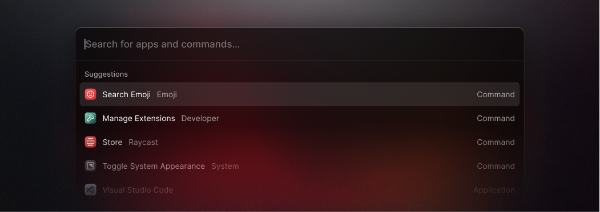
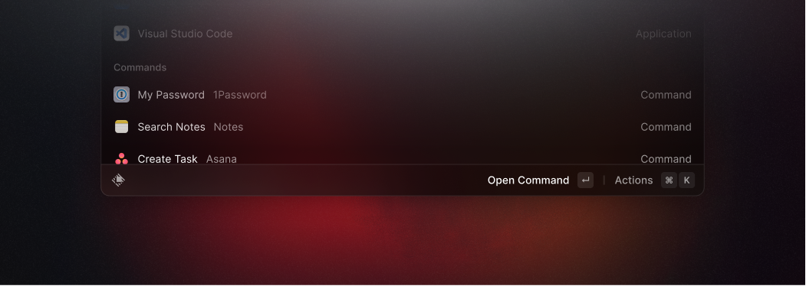
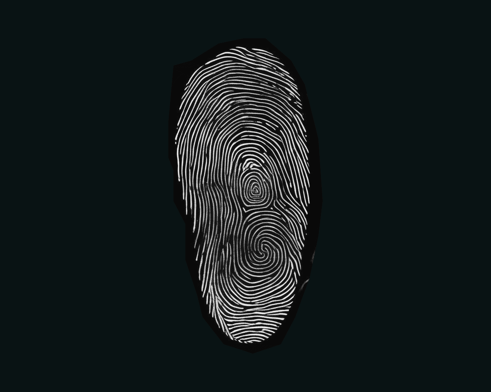
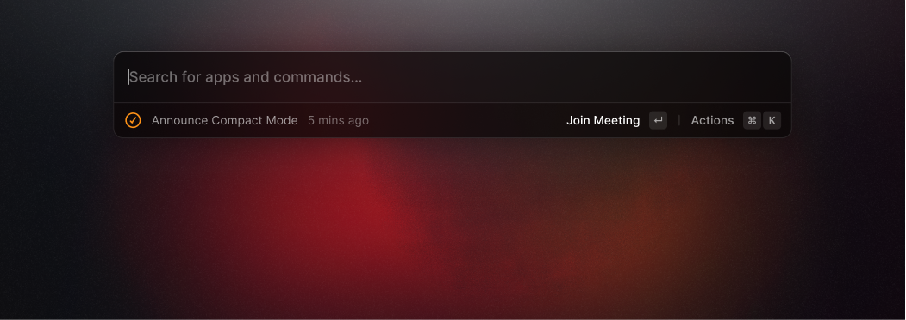
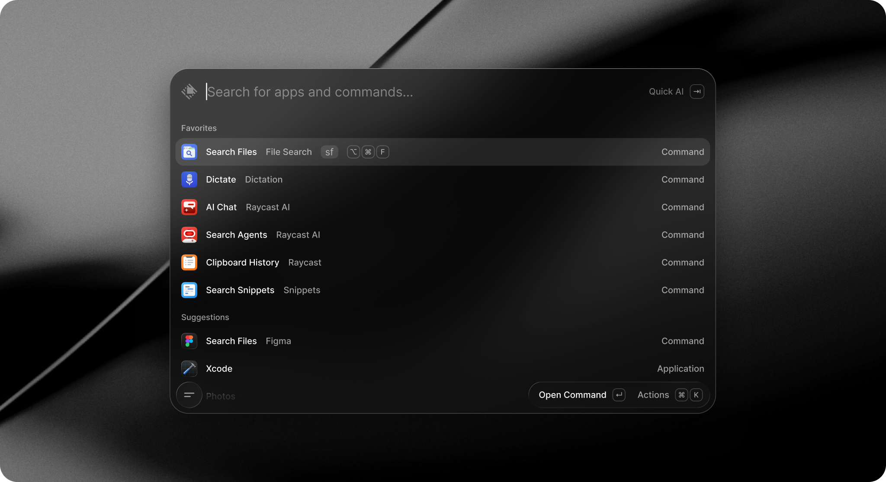

# Raycast / Arc 暗黑 UI 设计调研

> 检索日期: 2026-08-15
> 范围: 仅暗黑模式（dark theme）；两产品均已做官方渠道与社区复刻双轨核验
> 来源优先级: 官方设计系统/官方文档/官方博客 → 主题/源码文件（GitHub）→ 第三方 design teardown
> 标注约定: 「待核」= 来源为搜索摘要或第三方转述，未能原文核实；「未公开」= 官方渠道检索确认无公开资料

## 1. 概览

**Raycast**——macOS 启动器/命令面板（2020 年创立，伦敦），键盘优先的生产力工具。设计风格一句话定性：**「精密仪器」式暗色 UI**——冷调近黑表面阶梯、克制单点品牌红（#FF6363）、紧凑行高与正字距排版，追求"界面消失、工具感立现"（fast, simple, delightful 三原则）[1][2]。2026 年 5 月全面重写后融入 macOS Tahoe 的 Liquid Glass 液态玻璃材质 [3]。

**Arc 浏览器**——The Browser Company 出品（2023 年 7 月公测，2025 年 5 月停运转向 Dia，2025 年 9 月被 Atlassian 收购）[4][5]。设计风格一句话定性：**「个人工作台」式暗色 UI**——侧栏即页签栏的竖向信息架构 + Space 色彩主题化 + 玻璃拟态（backdrop-blur 叠渐变），设计理念上刻意"留指纹"（leaving fingerprints）而非统一设计系统 [6][7][8]。

两者共同点：都把「暗色深色背景 + 高饱和强调色点缀」作为默认气质；差异点：Raycast 追求系统级原生一致（macOS 原生组件、明暗跟随系统），Arc 追求品牌化的"氛围感"（每 Space 独立主题、渐变、玻璃）。

## 2. 视觉设计语言

### 2.1 Raycast

**配色（暗黑）**

官方渠道只公开了极少数带文字 hex 的暗色值，其余以色块/变量形式呈现 [9][10]：

| 角色 | 值 | 来源 |
|------|-----|------|
| 品牌红 Raycast Red | `#FF6363` | 官方 ANSI 表（暗色前景 Red）+ 品牌页 [9][11] |
| ANSI 暗色前景 | Green `#59D499` / Yellow `#FFC531` / Blue `#56C2FF` / Magenta `#CF2F98` / Cyan `#52EEE5` | 官方 script-commands 文档 [9] |
| Raycast Dark（应用深背景/app chrome） | `#151515` | 品牌库（第三方采样）[11] |
| Raycast Black（最深背景） | `#070A0B` | 品牌库 [11] |
| Muted Gray（次要文字） | `#929292` | 品牌库 [11] |

第三方对 raycast.com 营销站 DESIGN.md 的 token 分析给出完整表面阶梯（注意：覆盖官网而非 macOS 应用内 chrome）：Canvas `#07080a` → Surface `#0d0d0d` → Surface Elevated `#101111` → Surface Card `#121212`；边框 hairline `#242728`（1px）/ soft `rgba(255,255,255,0.08)` / strong `rgba(255,255,255,0.16)`；文字 ink `#f4f4f6` → mute `#9c9c9d` → ash `#6a6b6c` → stone `#434345`；语义强调蓝 `#57c1ff`、红 `#ff6161`、绿 `#59d499`、黄 `#ffc533`（各带 15% 透明 soft 变体）[12]。另一份独立分析给出品牌红 #FF6363、bg #07080a、fg #f9f9f9、圆角 12px，且主张"macOS 多层 inset 阴影"——与"无投影"口径冲突，两版均为第三方，无法裁决，并存 [13]。另有仅搜索摘要的 app UI 色值（背景约 #1C1C1E 系）**待核**，不采用 [14]。

官方主题系统的暗色值载体是**主题 JSON**（Theme Studio "Copy as JSON" 导出）[15][16]：

```json
{ "authorUsername": "joshua_burri", "version": "1", "author": "Joshua Burri",
  "name": "Nord Dark", "appearance": "dark",
  "colors": { "background": "#2E3440", "backgroundSecondary": "#3B4252",
    "text": "#ECEFF4", "selection": "#ECEFF4", "loader": "#ECEFF4",
    "red": "#BF616A", "orange": "#D08D70", "yellow": "#EBCB8B", "green": "#A3BE8C",
    "blue": "#5E81AC", "purple": "#CD97C3", "magenta": "#C766A5" } }
```

字段集：顶层 `authorUsername/version/author/name/appearance`；`colors` 下 12 键 `background, backgroundSecondary, text, selection, loader, red, orange, yellow, green, blue, purple, magenta` [15][16]。

**字体排版**：全站 Inter（含 `font-feature-settings: "calt","kern","liga","ss03"`，ss03 为品牌签名字形特征），代码/快捷键用 GeistMono [12][13]。字号阶梯：body 16px/14px、caption 13px/12px、标题 18–24px、display 56–64px（营销站）[12]；正字距 0.1–0.4px（暗色上透气）[12]；正文基准字重 500 而非 400 [12]。官方 2022 焕新确认：搜索结果列表图标 16→20px（+25%）[2]。

**圆角**：第三方 token 表：`0/4/6/8/10/16/9999px`（"most chrome at 6–10px"）；keycap 4px、按钮/输入框 8px、功能卡 10px、命令面板容器 16px、pill 全圆 [12]。另一版主张 12px 窗口圆角（第三方，冲突并存）[13]。官方确认新 icon set "same rules for stroke width and corner radii"（未给数值）[1][17]。

**阴影/层级**：官方未公布窗口阴影参数。第三方两口径冲突：「无投影、层级靠表面阶梯」[12] vs 「macOS 多层 inset 阴影模拟玻璃」[13]——均非官方，**待核**。官方确认窗口材质为 macOS 原生（2026 重写用 Liquid Glass）[3]。


*图 1：Raycast v1.38 焕新后暗黑启动器（官方博客配图，2022）——置顶搜索栏 + 紧凑等高列表行 + 行内快捷键 [1]*


*图 2：底部 Action Bar——左侧导航标题/toast，右侧上下文动作+快捷键（官方博客配图）[1]*

### 2.2 Arc

**配色（暗黑）**

官方品牌层 6 色（2022 rebrand，注意是**品牌色**，非浏览器 UI 色值）[4]：

| 角色 | 值 |
|------|-----|
| Arc Blue（主色） | `#3139FB` |
| Arc Red（次强调） | `#FF5060` |
| Deep Indigo（深色强调/banner/深背景） | `#2702C2` |
| Royal Purple（logo 深层强调） | `#210784` |
| Arc Pink（插画点缀） | `#FF9999` |
| Brand Off-White（深色表面上的文字） | `#FFFCEC` |

**Arc 浏览器 UI（侧栏/页签）的官方暗黑色值从未公开** [6]——暗黑观感通过 Theme Picker 为每个 Space 定制主题色实现：Space Themes V2 于 2022-09-01 引入，官方原话即含 "more presets, and dark mode"（暗黑模式是 V2 三大卖点之一）[29]；Windows 版 Space theming 2024-01-08 才跟进 [48]，且 2024-04-08 官方明确调整过**暗黑主题明度**（"Dark Space Themes now appear darker"，无数值）[48]。官方无独立"UI 明暗开关"概念（"卡在暗色"的官方求助文章给出的解法是排查 Dark Reader 扩展，官方明确不推荐该扩展）[18][19]。社区复刻项目 ArcWTF（Firefox 复刻 Arc UI）给出近似暗色值（**非官方**）：侧栏/工具栏 `#3b3b3b`、URL 栏 `#2B2B2B`、高亮行 `#383838`、悬停行 `#444444`、菜单面板 `#4A4A4A`、非激活文本 `#CBCBCB`、图标注意力色 `#93d0ff` [20]。第三方整理的暗色玻璃 token Glass Dark `rgba(20,20,25,0.6)` **待核** [21]。页签状态色的暗色表现（社区观察，原文反爬仅搜索摘要，**待核**）：暗色下激活页签 = 蓝色竖指示线 + 背景高亮 + 白色文字；hover = 半透明白底平滑过渡 [52]。

**玻璃质感**：招牌效果 = 半透明白表面 + backdrop-blur 叠加在对角柔和渐变上（macOS Big Sur 式透光）[22]。社区逐条复刻出"8 要素"：对角粉/紫/靛渐变背景、`bg-white/40` + `backdrop-blur` 玻璃侧栏、macOS 三色圆点、⌘T 药丸命令栏、10px 大写灰色分区标题、彩色头像页签行（激活 = 白底+柔和阴影）、2px 未读点、圆角主面板（`rounded-l-2xl` + 外边距让渐变透出）[22]。边框风格多元（与"留指纹"哲学一致）：发光渐变边框、hover 虚线边框（全产品为数不多 0px 圆角处）、低对比背景上的极细白色边框、无模糊的"blur-less"阴影 [7]。

**字体排版**：品牌字体 Marlin Soft SQ（display 标题，400/700，The Browser Company 自造）+ Inter（正文/UI，400–700）[4]。

**圆角**：官方未公布圆角刻度；第三方描述为圆角面板+柔和阴影（侧栏主面板 `rounded-l-2xl` 级）[22]，细节**待核**。


*图 3：Arc 暗色界面截图——出自《What makes design at Arc so unique》访谈文章配图（Dive Club，2024）[7]。左为暗色侧栏、右为内容区。注：该图内容无法逐像素核验，仅依据文章上下文与像素结构分析描述；官方截图因 arc.net 被 Cloudflare 拦截未能获取 [23]。*

## 3. 交互动效

### 3.1 Raycast

**动画清单**：① 启动器呼出/关闭（窗口出现与消失）② 列表高亮随键盘上下键移动 ③ 结果随输入即时刷新 ④ HUD/toast 短暂出现后淡出 ⑤ 成就彩纸动画（confetti，获得徽章时）[2][24]。

**参数表**：

| 动画 | 时长 | 缓动 | 触发时机 | 来源状态 |
|------|------|------|----------|---------|
| 窗口呼出/关闭 | 未公开 | 未公开 | 全局快捷键呼出 | 官方未公开 [2][3][17] |
| 列表高亮移动 | 未公开 | 未公开 | 上下箭头键 | 官方未公开 |
| HUD toast 淡出 | 第三方示意 1.5s 后自动消失 | opacity+scale | 动作完成后 | 第三方示例代码，非官方值 [24] |
| 成就彩纸 | 第三方示意 `.spring()` | spring | 达成成就时 | 第三方示例代码，非官方值 [24] |

官方渠道（博客/手册/changelog 全文检索）**未公布任何动效时长或缓动参数** [2][3][17]。可核实的定性事实：窗口为 macOS 原生呈现（vibrancy 毛玻璃、跟随系统明暗、continuous 圆角——第三方指南描述 [24]）；2026 重写版用 Liquid Glass [3]；产品三原则 fast/simple/delightful 决定了"UI 立即出现、数据异步加载"的响应模型 [1][24]。第三方 GitHub issue 讨论称 Raycast 用 spring 类缓动（约 2–5% 过冲、关闭快于打开）[25]——低权威转述，**待核**。

### 3.2 Arc

**动画清单**（官方 release notes 确认存在、功能级描述，全部无曲线/时长数值 [29][46][47][48]）：

| 日期 | 平台 | 官方条目原文（节选） |
|------|------|---------------------|
| 2022-05-19 | macOS | 启动 shimmer 动画（"New shimmer animation upon starting up Arc"） |
| 2022-06-02 | macOS | 重启窗口动画（"New restart window animation"） |
| 2022-09-22 | macOS | 使用麦克风/摄像头的页签新动画 |
| 2023-02-16 | macOS | 新加载指示器（窗口顶部中央） |
| 2023-03-09 | macOS | 支持多个下载动画同时进行 |
| 2023-04-13 | macOS | 页签拖入文件夹的动画改进 |
| 2023-06-15 | macOS | 进出全屏动画简化（为性能） |
| 2023-10-12 | macOS | Little Arc 打开动画改进 |
| 2023-11-17 | macOS | 页签清空动画（⌘⇧K）；Space 横滑动画含图标过渡 |
| 2024-01-11 | macOS | Toast 通知重设样式（新配色逻辑+新动画） |
| 2024-03-14 | Windows | Pinned 文件夹展开/折叠动画改进 |
| 2024-04-08 | Windows | 侧栏拖拽缩放更平滑（修复 resize 抖动） |

另有社区观察（搜索摘要，原文反爬，**待核**）：下载完成图标高回弹落入 Library、Boost 分享后图标"心跳"动画、iOS 清空页签后 logo 变指尖陀螺 [52]；URL 栏刷新有细微动画、Library 卡片 hover 平滑带"光照"效果 [49]。

**参数表**：

| 动画 | 时长 | 缓动 | 触发时机 | 来源状态 |
|------|------|------|----------|---------|
| 侧栏折叠/展开 | 未公开（第三方示意 0.2s ease-out） | ease-out | 悬停侧栏边缘拖拽 / 双击边缘复位 | 官方未公开；数值为第三方示意代码 [26][29] |
| 页签 hover | 未公开 | 未公开 | 鼠标悬停 | 官方未公开；暗色下半透明白底（社区观察，待核）[52] |
| Space 切换 | 未公开（第三方示意 spring response 0.3） | spring | 点击 Space 图标 / ⌘数字 | 官方未公开；数值为第三方示意代码 [26] |
| 虚线边框 hover | 未公开 | 未公开 | 悬停 | 行为有官方产品记录（第三方访谈），参数未公开 [7] |
| 侧栏拖拽缩放 | 未公开 | 未公开 | 拖拽侧栏边缘 | 官方仅确认"更平滑" [48] |
| Boosts 页面改写 | 即时生效 | — | 编辑保存 | 官方 Boosts 文档 [27] |

**官方 release notes 与帮助文档中不存在任何 ease/spring/duration 数值**（截至 2026-08-15）[29][46][47][48]；第三方教程代码中的 0.2s ease-out / spring(0.3, 0.7) 等均为作者自写示意（其 SwiftUI 示例注明为复刻模式）[26]，**非官方值**。

## 4. 布局与组件结构

### 4.1 Raycast

**信息架构**：单窗口两栏式命令面板。搜索栏置顶（全交互入口，v1.38 起加大以"set it apart from the search results below"）[1]；下方为结果列表（分组 Section + 行 Item）；选中项可展开右侧详情面板（isShowingDetail）；窗口底部为 Action Bar（v1.38 起：左侧导航标题/toast，右侧当前上下文动作+快捷键）[1][17]；Compact Mode 下仅剩搜索栏+Action Bar [1][17]。

**组件拆解**（官方扩展 API 文档，与内置 UI 同构）[30]：

- `List`（顶层容器：isLoading 加载条、isShowingDetail 右侧详情、searchBarPlaceholder、pagination）
- `List.Section` 分组标题 / `List.Item` 单行（title、subtitle、icon、keywords、quickLook）
- `List.Item.Accessory` 行尾元数据（text/icon/tag/date，右侧对齐）
- `List.Item.Detail` 选中项详情面板（CommonMark + Metadata：Label/Link/TagList/Separator，建议 5–8 项）
- `List.Dropdown` 搜索栏右端第二过滤维度（⌘P）
- `List.EmptyView` 空态（isLoading 且搜索为空时永不显示——防闪烁）
- 没有独立"侧栏"组件；两栏即 List + List.Item.Detail 模式

键盘优先细节：快捷键内联显示于行内（⌘1/⌘2…）而非 tooltip；⌘K 动作面板/`→` 二级导航；Esc 逐级返回 [24]。视觉层级靠表面阶梯而非边框（第三方口径）[12]。


*图 4：Compact Mode——仅搜索栏+Action Bar 的最小化形态（官方博客配图）[1]*


*图 5：The New Raycast（2026-05 公开 beta）——Liquid Glass 融入 macOS Tahoe 的暗色外观（官方博客配图）[3]*

### 4.2 Arc

**信息架构**：侧栏即页签栏——单条竖向面板取代横向页签条、书签栏、URL 栏三合一 [8][31]。自上而下四区 [8][31]：

| 区 | 内容 | 行为 |
|----|------|------|
| Spaces 行 | 彩色图标（每 Space 一图标） | 点击切换工作/个人/项目上下文；每 Space 有独立 Pinned/Unpinned 区、独立 Theme、独立 Icon [32] |
| Pinned 区 | 用户钉住的页签（可分组文件夹） | 不受自动归档影响、跨设备同步 [8] |
| Favorites 行 | 少量"永远可见"页签 | 跨 Space 全局 [8] |
| Unpinned（Today）区 | 会话页签 | 默认 12 小时自动归档（可配置）[8][33] |

**组件拆解**：
- **命令栏 ⌘T**：Spotlight 式统一入口（查网址/搜网页/切换页签/执行命令），侧栏隐藏时代替 URL 栏 [8][34]；创始设计师 Nate Parrott 确认其初始设计 [35]
- **Space 主题**：Theme Picker 选色（含渐变；高级项 Intensity/Graininess 两个滑块，2022-05-26 引入，数值范围官方未公开），无独立暗黑开关；入口 = Space 标题 hover → 画笔图标，或 ⌘T 输入 "Edit Theme" [18][19][29][51]
- **Boosts**：页面改写编辑器（官方原文 [27]）："Invert lightness"（灯泡键）一键给网页暗黑模式；Color wheel 拖动改网页配色；滑块组 Contrast / Brightness / Original Saturation（注意官方字段名）；Size 90%–150%（官方唯一数值范围）；Zap 删元素；CSS+JS 编辑器。Boosts 2.0 于 2023-05-25 发布 [28][53]
- **Split View**：拖拽并排成为侧栏内 split tab（水平/垂直），⌘T 可输入 "Add Right/Left/Top/Bottom Split" [38]
- **Little Arc**：独立小窗快速查看（无 chrome）[39]
- **Windows 窗口材质**：Windows 11 上 Mica 与 Acrylic（2024-03-21 v.0.14.2 同时引入，Settings → Appearance 二选一）两种系统材质 [48]
- **Easel**：协作画布；**Notes/Previews/PIP/Mini Audio Player** 等为 2025 停运复盘中被批评的"过度复杂功能集合" [35][5]

停运复盘（官方 2025-05-27 声明）：仅 5.52% 日活用户经常使用超过 1 个 Space、Live Folders 4.17%、日历悬浮预览 0.4%——"太不同、要学太多、回报太少" [5]。

## 5. 实现级参数

### 5.1 Raycast

| 项 | 值 | 来源 |
|----|-----|------|
| 主题文件格式 | JSON，`appearance: "dark"` + colors 12 键（见 §2.1） | 官方 Theme Studio 导出产物 [15][16] |
| 主题入口 | 设置 → General → Appearance；Switch Theme 命令；`themes.ray.so` URL 分享 | 官方手册 [15] |
| 扩展取色 API | `Color.Dynamic = {light, dark, adjustContrast}`；`Color.Raw`（默认自动对比度调整）；`environment.appearance` 返回 `"dark"\|"light"` | 官方开发者文档 [10][41] |
| 标准色行为 | `Color` 枚举（Blue/Green/…/PrimaryText/SecondaryText）自动适配明暗主题，文档不给 hex | 官方开发者文档 [10] |
| 官方暗色 hex 集合 | 仅 ANSI 表 8 色（#FF6363 等）与主题 JSON 字段 | 官方仓库 [9][16] |
| 应用源码 | raycast/raycast-macos 仓库 404——macOS 应用源码未开源，无法读取实现级样式文件 [42] |
| 窗口材质 | 官方未给参数；2026 版 Liquid Glass [3]；macOS 原生 vibrancy（第三方）[24] |

### 5.2 Arc

| 项 | 值 | 来源 |
|----|-----|------|
| 主题机制 | Theme Picker（Space 级选色，含渐变；高级项 Intensity/Graininess 两滑块，数值范围未公开）；恢复默认 = Theme Picker 中 (-) 取消全部颜色；暗黑主题明度于 2024-04-08 官方调暗过（无数值） | 官方帮助中心/release notes [18][29][48] |
| 主题文件格式 | **官方从未发布主题文件格式**（无 .theme/.json 文档、无导出/导入、无存储路径），主题全走内置编辑器；社区主题编辑器 Arcitect 存在但未披露格式 [45][54] | 官方 release notes + GitHub [45][54] |
| 网页端主题 CSS 变量 | 官方经 `arc.net/colors.html` 向 Boosts 暴露主题色 CSS 变量（2022-12-08 Boosts 可检测主题色，"Grab the CSS for your theme colors here"）[29][43]。官方页面当日被 Cloudflare 拦截未直接核实（**待核**）；变量名经封装该页变量的社区包源码实证 [44]：`--arc-palette-background` / `--arc-palette-foregroundPrimary\|Secondary\|Tertiary` / `--arc-palette-backgroundExtra` / `--arc-background-simple-color` / `--arc-background-gradient-color0\|1` / `--arc-background-gradient-overlay-color0\|1` / `--arc-palette-maxContrastColor\|minContrastColor` / `--arc-palette-focus` / `--arc-palette-hover` / `--arc-palette-cutoutColor` / `--arc-palette-title` / `--arc-palette-subtitle`（17 个变量）；darkreader issue 亦确认 Arc 向 :root 暴露 Space 主题全局 CSS 变量 [50] | 官方 release notes [29][43] + npm 包源码 [44] + GitHub issue [50] |
| 应用源码 | Arc 闭源；社区复刻 ArcWTF 的暗色近似值（#3b3b3b 等，非官方）[20] |
| Boosts 暗黑切换 | "Invert lightness" 一键反转页面明暗；Contrast/Brightness/Original Saturation 滑块；Size 90%–150% | 官方帮助中心 [27] |

## 6. 来源清单

| # | URL | 类型 | 内容 |
|---|-----|------|------|
| [1] | https://www.raycast.com/blog/a-fresh-look-and-feel | 官方博客（2022-07-19） | v1.38 焕新：三原则/搜索栏/Action Bar/icon set/Compact Mode |
| [2] | https://www.raycast.com/blog/launch-week-summary | 官方博客（2022-08-09） | 16→20px 图标、导航栏加高、400+ icon set |
| [3] | https://www.raycast.com/blog/the-new-raycast | 官方博客（2026-05-14） | Liquid Glass、全面重写、Root Search |
| [4] | https://www.loftlyy.com/zh/arc-browser.md | 第三方品牌库 | Arc 品牌 6 色、Marlin Soft SQ/Inter、停运时间线 |
| [5] | https://www.163.com/dy/article/K0LE4BC50511B8LM.html | 第三方新闻（IT之家转官方声明，2025-05-28） | Arc 停运声明要点与功能使用率数据 |
| [6] | https://resources.arc.net/hc/en-us/articles/25625261733143-How-Do-I-Restore-the-Default-Theme-for-Arc-for-Desktop | 官方帮助中心 | Theme Picker、默认主题恢复 |
| [7] | https://www.dive.club/ideas/what-makes-design-at-arc-so-unique | 第三方访谈（2024-07-31） | 留指纹哲学、发光渐变边框、虚线 hover 边框、blur-less 阴影 |
| [8] | https://supasidebar.com/blog/what-is-arc-browser-sidebar-2026 | 第三方（2026-06-03） | 侧栏四区结构、12h 自动归档、⌘T 命令栏 |
| [9] | https://raw.githubusercontent.com/raycast/script-commands/master/documentation/OUTPUTMODES.md | 官方 GitHub 仓库 | ANSI 暗色前景色表（8 色 hex） |
| [10] | https://developers.raycast.com/api-reference/user-interface/colors.md | 官方开发者文档 | Color/Dynamic/Raw/adjustContrast |
| [11] | https://www.loftlyy.com/en/raycast | 第三方品牌库 | Raycast Red #FF6363、Dark #151515、Black #070A0B、Muted Gray #929292 |
| [12] | https://github.com/VoltAgent/awesome-design-md/blob/main/design-md/raycast/DESIGN.md | 第三方 token 分析 | 表面阶梯/文字层级/圆角/间距/排版/组件 token（营销站口径） |
| [13] | https://opendesigner.io/ja-jp/design-systems/raycast | 第三方 token 分析 | 多层 inset 阴影口径、12px 圆角（与 [12] 冲突并存） |
| [14] | https://seedflip.co/blog/raycast-design-system-dark-ui | 第三方博客（仅搜索摘要） | app UI 色值 #1C1C1E 系——待核 |
| [15] | https://manual.raycast.com/themes | 官方手册（2026-07-30 更新） | Theme Studio、明暗分离、Copy as JSON、themes.ray.so |
| [16] | https://github.com/raycast/theme-explorer | 官方 GitHub 仓库 | 主题 JSON schema 实证（nord-dark.json 等全字段+色值） |
| [17] | https://www.raycast.com/changelog/macos/1-38-0 | 官方 changelog | v1.38 同 [1] 内容 |
| [18] | https://resources.arc.net/hc/en-us/articles/25541642978583-Why-is-Arc-for-Desktop-Stuck-in-Dark-Mode | 官方帮助中心 | 暗色模式与 Dark Reader、官方不推荐 |
| [19] | https://arstechnica.com/civis/threads/so-the-arc-browser.1492212/ | 社区论坛 | 暗黑主题明暗配对缺陷等批评 |
| [20] | https://github.com/KiKaraage/ArcWTF/blob/main/theme/global-colors.css | GitHub 复刻主题文件 | 暗色近似值（#3b3b3b 等，非官方） |
| [21] | https://open-design.ai/plugins/design-system-arc/ | 第三方整理设计系统 | Glass Dark rgba(20,20,25,0.6)——待核 |
| [22] | https://dev.to/dev48v/i-cloned-arc-browsers-sidebar-in-50-lines-of-html-pastel-gradient-glass-sidebar-12lh | 社区复刻（2026-06） | 玻璃质感 8 要素配方 |
| [23] | https://arc.net/theme | 官方主题页 | 当日 Cloudflare 拦截，未能取得原文 |
| [24] | https://blakecrosley.com/guides/design/raycast | 第三方指南 | vibrancy/continuous 圆角/HUD 定性描述（代码示例非官方） |
| [25] | https://github.com/daintreehq/daintree/issues/3818 | GitHub issue | 第三方称 Raycast 用 spring 缓动——待核 |
| [26] | https://blakecrosley.com/guides/design/arc | 第三方指南 | 侧栏/命令栏/Boosts/Space 设计模式（代码示例非官方） |
| [27] | https://resources.arc.net/hc/en-us/articles/19212718608151-Boosts-Customize-Any-Website | 官方帮助中心 | Boosts 编辑器、Invert lightness 暗黑开关 |
| [28] | https://www.theverge.com/2023/5/25/23735693/arc-browser-boosts-website-appearance-colors-features | 第三方科技媒体 | Boosts 2.0："force a website to have a dark mode? Easy." |
| [29] | https://resources.arc.net/hc/en-us/articles/20498417809815-Arc-for-macOS-2022-Release-Notes | 官方 release notes（2022） | 窄侧栏、Space Themes V2（Intensity/Graininess）、arc.net/colors.html |
| [30] | https://developers.raycast.com/api-reference/user-interface/list.md | 官方开发者文档 | List 组件全部 props 与两栏模式 |
| [31] | https://www.wikiwand.com/en/articles/Arc_(web_browser) | 第三方百科 | 侧栏信息架构、命令栏 Spotlight 类比 |
| [32] | https://resources.arc.net/hc/en-us/articles/19228064149143-Spaces-Distinct-Browsing-Areas | 官方帮助中心 | Space 定义（独立 Theme/Icon/Pinned/Unpinned） |
| [33] | https://sspai.com/post/95844 | 第三方设计体验文（2025-01-23） | 三类页签、12h 自动归档 |
| [34] | https://resources.arc.net/hc/en-us/articles/20595231349911-Keyboard-Shortcuts | 官方帮助中心 | ⌘T/⌘S/⌘D 快捷键表 |
| [35] | https://nateparrott.com/arc/index.html | 设计师一手页面（2024） | Command Bar/Split View/Boosts 等初始设计自述 |
| [37] | https://www.theverge.com/2024/4/30/24144183/arc-browser-windows-launch-features-availability | 第三方科技媒体 | Windows 版发布、侧栏描述 |
| [38] | https://resources.arc.net/hc/en-us/articles/19335393146775-Split-View-View-Multiple-Tabs-at-Once | 官方帮助中心 | Split View 机制与 ⌘T 命令 |
| [39] | https://techbeta.org/software/arc-browser-reimagined-web-browsing-experience/ | 第三方 | Little Arc/Split View 等概览 |
| [41] | https://developers.raycast.com/api-reference/environment.md | 官方开发者文档 | appearance 属性 |
| [42] | https://api.github.com/repos/raycast/raycast-macos | GitHub API | 404 核查——macOS 应用源码未开源 |
| [43] | https://resources.arc.net/hc/en-us/articles/19212718608151-Boosts-Customize-Any-Website | 官方帮助中心 | "Grab the CSS for your theme colors here: arc.net/colors.html"（Boosts FAQ） |
| [44] | https://unpkg.com/use-arc-theme@0.0.1/dist/index.js | npm 包源码（2023-09-05） | Arc 主题 CSS 变量全集（--arc-palette-*，17 键） |
| [45] | https://github.com/turtle-key/Arcitect | GitHub 项目 | Arc 主题编辑器（仓库无主题 JSON 样例） |
| [46] | https://resources.arc.net/hc/en-us/articles/20498377604887-Arc-for-macOS-2023-Release-Notes | 官方 release notes | 页签清空/Space 横滑/文件夹拖放/下载/加载指示/全屏/Little Arc 动画条目 |
| [47] | https://resources.arc.net/hc/en-us/articles/20498293324823-Arc-for-macOS-2024-2026-Release-Notes | 官方 release notes | Toast 主题色+新动画（2024-01-11）、status pill hover 移开 |
| [48] | https://resources.arc.net/hc/en-us/articles/22513842649623-Arc-for-Windows-2023-2026-Release-Notes | 官方 release notes | Windows Space theming（2024-01-08）、Dark Space Themes darker（2024-04-08）、Mica/Acrylic（2024-03-14/21）、Folder 折叠动画 |
| [49] | https://typefully.com/ridd_design/9-design-takeaways-from-using-arc-kTZD6kj | 设计评论（社区） | Library 卡片 hover 光照效果、URL 刷新动画 |
| [50] | https://github.com/darkreader/darkreader/issues/12266 | GitHub issue | 确认 Arc 向 :root 暴露 Space 主题全局 CSS 变量 |
| [51] | https://start.arc.net/paint-the-internet | 官方主题指南 | 主题编辑入口（画笔/⌘T "Edit Theme"）、Intensity/Graininess/blur/noise 可调（Cloudflare 拦截，搜索摘要） |
| [52] | https://zhuanlan.zhihu.com/p/645366945 | 社区设计分析（中文） | 暗色激活页签蓝竖线+白字、hover 半透明、下载 bounce、Boost 心跳（反爬，搜索摘要，待核） |
| [53] | https://techcrunch.com/2023/05/25/arc-browsers-new-tool-lets-you-remove-some-elements-from-a-website/ | 第三方科技媒体 | Boosts 2.0 发布（2023-05-25） |
| [54] | https://apis.io/apis/arc-browser/boosts/ | API 目录 | Boosts = 浏览器内创作的 CSS/JS overlay |

> 补充说明：arc.net/colors.html 与 arc.net/theme 官方页面当日（2026-08-15）被 Cloudflare 拦截，未能直接抓取原文；其变量名经 [44] 间接实证，官方页面内容标注「未直接核实」。
