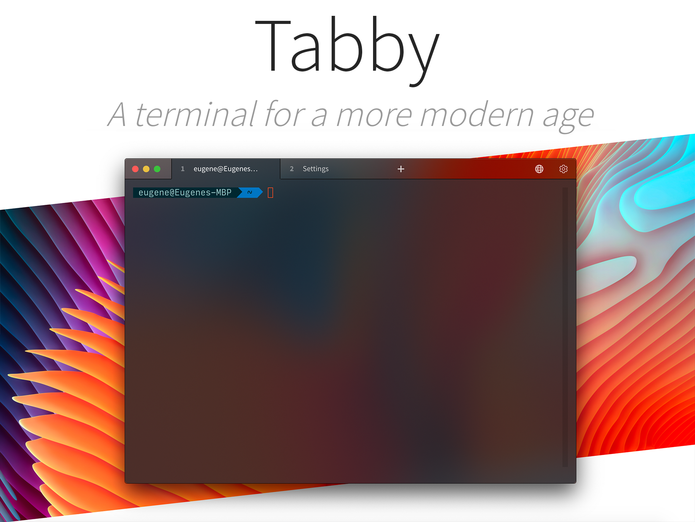
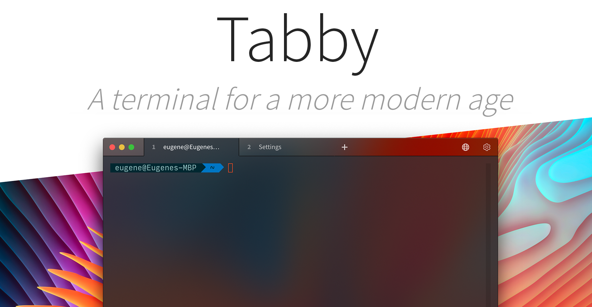
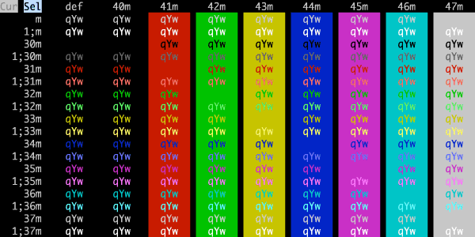
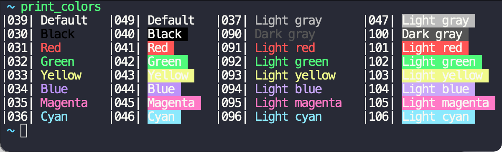
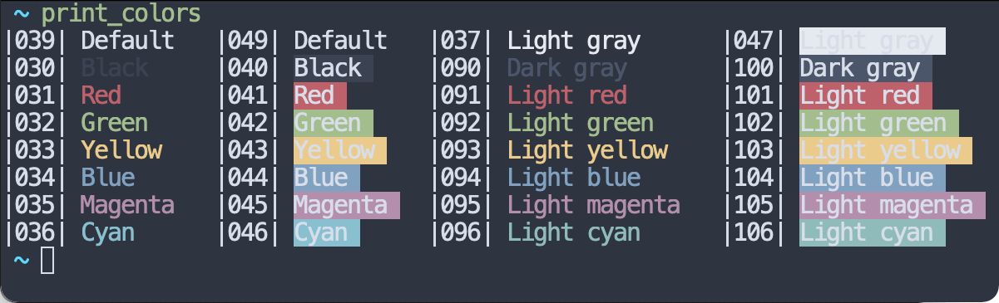
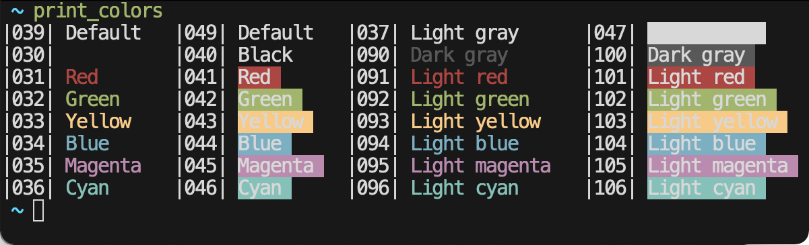
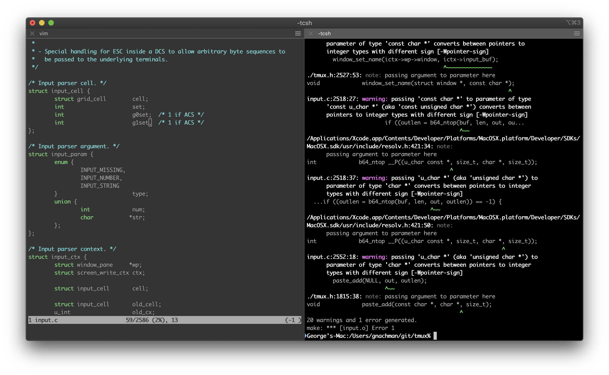
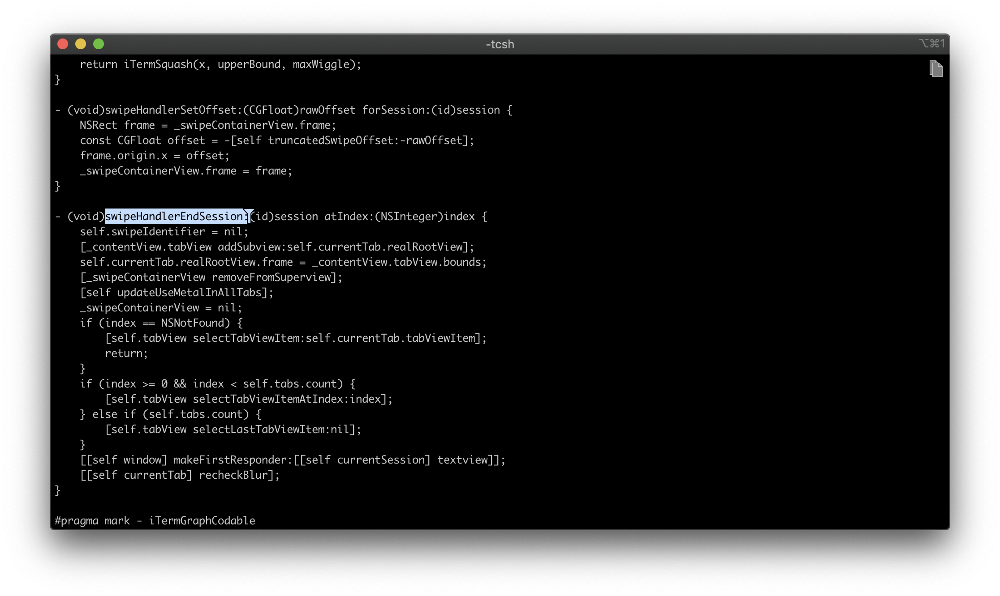

# 其它终端暗黑 UI 设计调研（Ghostty / Tabby / iTerm2 / Alacritty）

> 检索日期：2026-08-15
> 范围限定：仅暗黑模式（各软件默认主题均为暗色，故默认值即暗黑值）
> 来源优先级：官方文档/官方源码 > 主题与源码文件（GitHub）> 第三方分析；色值与键名均以官方原文逐字核实，无法核实项标注「待核」。内联 [n] 对应第 6 节来源清单。

## 1. 概览

| 软件 | 技术栈 | 定位一句话 | 默认暗黑状态 |
|------|--------|-----------|-------------|
| Ghostty | Zig 内核 + 原生 GUI（macOS Swift/AppKit、Linux GTK4） | "fast, feature-rich, and native" 三支柱，零配置开箱即用 [6][5] | 出厂默认主题 StyleDark（bg `#292c33`），无亮色默认 [1] |
| Tabby | Electron + Angular + xterm.js | 高度可配置的跨平台终端，强调主题插件与 SSH/串口/容器集成 | 默认 `colorSchemeMode: 'dark'`，默认配色「Tabby Default」（bg `#171717`）[24][22] |
| iTerm2 | Objective-C（macOS 专属） | 功能最全的 macOS 终端，25 年历史 | 默认 Color Preset「Dark Background」（bg `#000000`）[35] |
| Alacritty | Rust + GPU 渲染（OpenGL） | 极简高性能派——无页签、无状态栏、无动画 | 官方默认背景 `#181818`（base16 default dark 系）[55] |

## 2. 视觉设计语言

### 2.1 Ghostty

**配色**（默认主题 StyleDark，community 命名，`ghostty +show-config --default` 可输出）[1]：

```ini
background = #292c33          # 深蓝灰，非纯黑
foreground = #ffffff
cursor-color = #ffffff
cursor-text = #363a43
selection-background = #ffffff
selection-foreground = #292c33
palette = 0=#1d1f21 1=#bf6b69 2=#b7bd73 3=#e9c880 4=#88a1bb 5=#ad95b8 6=#95bdb7 7=#c5c8c6
palette = 8=#666666 9=#c55757 10=#bcc95f 11=#e1c65e 12=#83a5d6 13=#bc99d4 14=#83beb1 15=#eaeaea
```

- 默认主题色源来自 mbadolato/iTerm2-Color-Schemes 仓库 [1]；源码 `Config.zig` 中 `background` 字段默认另有 `#282C34`（OneDark 风格，`theme` 键默认 null 时被内置 StyleDark 覆盖为 `#292c33`，两层值均属实）[2]。
- 背景视觉：`background-opacity` 默认 1.0、`background-blur` 默认 false（macOS 26.0+ / KDE 支持）、`background-image` 默认 null、`alpha-blending` 默认 macOS native / 其他 linear-corrected [2]。
- 暗色显示差异社区讨论：暗色下比 kitty 显灰/暗（discussion #5595，正文待核）[15]。

**字体排版**：内置默认字体 **JetBrains Mono**（"embeds a default font (JetBrains Mono)"）[5]；`font-size` 默认 macOS 13、其他平台 12（"On macOS we default a little bigger since this tends to look better"）[2]；`window-padding-x/y` 默认 2px，`window-padding-color` 默认跟随背景色 [2]。

**圆角**：无 `corner-radius` 配置键（源码全文检索 `radius` 仅命中 `background-blur-radius` 兼容重命名）——窗口圆角由系统原生窗口提供：macOS `macos-titlebar-style` 默认 `transparent`（隐藏标题栏获系统圆角），GTK 由桌面环境/GTK 主题决定 [2]。

**阴影/层级**：无阴影配置键；`window-decoration` 默认 auto、`window-theme` 默认跟随系统明暗 [2]。

![Ghostty 官方品牌视觉（社交分享卡片，暗色；画面细节未目视核实）[20]](assets/terminals-other/ghostty-social-share-card.jpg)

### 2.2 Tabby

**配色**（两代默认暗色，色值完全不同）：

当前默认「Tabby Default」（master 源码 `colorSchemes.ts` 逐字）[22]：背景 `#171717`（近纯黑）、前景 `#cacaca`、光标 `#bbbbbb`；16 ANSI 色 `#000000 #ff615a #b1e969 #ebd99c #5da9f6 #e86aff #82fff7 #dedacf / #313131 #f58c80 #ddf88f #eee5b2 #a5c7ff #ddaaff #b7fff9 #ffffff`。

旧版默认「Material」（v1.0.190 源码逐字，OceanicMaterial 风格）[23]：背景 `rgba(38,50,56,1)`（`#263238` 深蓝灰）、前景 `#eceff1`、光标黄 `#FFCC00`；ANSI 亮黑为半透明 `rgba(255,255,255,0.2)`。切换版本区间 v1.0.191~v1.0.206（精确版本待核）[22]。

**UI 层颜色由配色方案动态派生**：Tabby 无 `ui.background` 之类 UI 颜色键——主题引擎按配色 background/foreground 的 WCAG 相对亮度判定暗亮（`luminosity() <`），生成 `--theme-bg-more(-2)`/`--theme-fg-more(-2)` 等 CSS 变量（HSL 加深/提亮 0.25/0.5 阶梯），16 ANSI 色直接映射 Bootstrap 变量（`--bs-body-bg`、`--bs-{color}`），低于 `terminal.minimumContrastRatio`（默认 4）时强制提对比度 [25][24]。

**字体排版**：UI 字体 **Source Sans Pro**、终端等宽 **Source Code Pro**；UI 基础字号 14px、行高 1.6；终端 `fontSize: 14`，macOS 默认 Menlo、Windows 默认 Consolas、Linux 默认 Liberation Mono（platformDefaults 逐字）[27][28]。

**圆角**：`$border-radius: .4rem`（页签 `$tab-border-radius: 4px`、索引徽章 10px、分屏最大化面板 10px）[27][26]。

**阴影**：下拉菜单 `0 0 1rem rgba(0,0,0,.25), 0 1px 1px rgba(0,0,0,.12)`；分屏最大化 `box-shadow: rgba(0,0,0,.25) 0 0 30px` + `backdrop-filter: blur(10px)`；按钮激活 inset 阴影 [27][26]。





### 2.3 iTerm2

**配色**（默认暗色 preset「Dark Background」，源码 `ColorPresets.plist` 逐字，hex 由 plist float 换算）[35]：

| 角色 | hex | 角色 | hex |
|------|-----|------|-----|
| Background | `#000000` | Ansi 0–7 | `#000000 #BB0000 #00BB00 #BBBB00 #0000BB #BB00BB #00BBBB #BBBBBB` |
| Foreground | `#BBBBBB` | Ansi 8–15 | `#555555 #FF5555 #55FF55 #FFFF55 #5555FF #FF55FF #55FFFF #FFFFFF` |
| Bold / Cursor Text | `#FFFFFF` | Selection | `#B5D5FF` |
| Cursor | `#BBBBBB` | Selected Text | `#000000` |

- 内置 11 个 Color Presets：Regular / High Contrast / Solarized / Light Background / **Dark Background** / Solarized Light / Solarized Dark / Pastel (Dark Background) / Tango Light / Tango Dark / Smoooooth [35]。
- 其它暗色系 preset：High Contrast（bg `#000000`/fg `#C7C7C7`）、Smoooooth（bg `#15191F`/fg `#DCDCDC`）、Solarized Dark（bg `#002B36`/fg `#839496`）[35]。
- 明暗分离：Colors 面板勾选 "Use separate colors for light and dark mode" 后 profile 可各存一套色（内部键 `xxx_color_light`/`xxx_color_dark`）[37]。
- 暗色可读性设置：**Minimum Contrast**（与背景过近的文字色推向黑白，100 时全纯黑/纯白，永不修改背景色）、**Cursor Boost**（压暗除光标外所有颜色）、Faint text opacity、Tab Color [37]。

**字体排版**：默认字体 **Monaco 12**（源码 `DefaultBookmark.plist`；与流传的"Menlo"说法不符，以现行源码为准）[36]；内置 Powerline 字形自绘、细笔画抗锯齿 "Use thin strokes"、FiraCode 等连字支持 [39]。

**圆角/阴影**：官方未提供窗口圆角/阴影配置项；边框仅 1px 窗口边框（旧版 "Show border around window"）——圆角阴影属系统窗口服务层行为，未获官方文档证据（待核）[44]。



### 2.4 Alacritty

**配色**（官方默认，`config-alacritty.html` 逐字）[55]：

| 键 | 默认值 |
|----|--------|
| `[colors.primary] background` | `"#181818"`（暗色默认背景） |
| `[colors.primary] foreground` | `"#d8d8d8"` |
| `[colors.normal]` | `#181818 / #ac4242 / #90a959 / #f4bf75 / #6a9fb5 / #aa759f / #75b5aa / #d8d8d8` |
| `[colors.bright]` | `#6b6b6b / #c55555 / #aac474 / #feca88 / #82b8c8 / #c28cb8 / #93d3c3 / #f8f8f8` |
| `[colors.dim]` | `#0f0f0f / #712b2b / #5f6f3a / #a17e4d / #456877 / #704d68 / #4d7770 / #8e8e8e` |

- 默认配色为 base16 default dark 系；0.13 之前的官方默认是 tomorrow_night（`#1d1f21`/`#c5c8c6`，仓库 `themes/alacritty_0_12.toml` 注明）[60][55]。
- 透明/模糊：`window.opacity` 默认 1.0、`window.blur` 默认 false（仅 macOS/KDE Wayland）[55]。

**字体排版**：默认字体 Windows **Consolas** / macOS **Menlo** / Linux monospace，字号默认 **11.25pt**；`builtin_box_drawing: true`（内建 box drawing/powerline 字形）[55]。

**圆角/阴影**：无自绘 chrome——原生窗口（winit），装饰层完全交由 OS；`window.decorations = "None"` 即连标题栏都没有；暗色联动的窗口级开关是 `window.decorations_theme_variant = "Dark"` [55]。

![Alacritty 主界面（官方 README 封面图，暗色）[70]](assets/terminals-other/alacritty-readme.png)

  

## 3. 交互动效

### 3.1 Ghostty

终端应用本体**没有动画类配置键**（源码全文检索 `animat` 无命中）[2]，窗口/页签切换等动效由系统原生控件提供；动效集中在品牌侧：

- **官网 splash 动画 = 235 帧字符画动画**：帧文件为 HTML 标签字符画文本（`<span class="b">` 加粗），存放于源码 `src/build/framegen/frames/frame_001.txt` ~ `frame_235.txt`，官网首页由 JS 逐帧渲染 [11][21]。
- **`ghostty +boo` 命令**（tip/nightly 构建彩蛋）：在终端内播放官网同款动画——构建期把全部帧 `\x01` 连接压缩 `@embedFile` 进二进制（+348KB），commit `9cb297202b`（2025-01-08）[10]。
- **自定义 GLSL shaders**：1.3.0 新增 cursor shape/position/time 等 uniform，社区有光标轨迹/涟漪特效教程 [7]。
- macOS secure input overlay 动画优化 PR #10903 [17]；终端内 hover 指针形状由 shell 应用经 Kitty pointer-shape 协议驱动（待核）。

### 3.2 Tabby

| 动效 | 时长 | 缓动 | 触发时机 | 位置 |
|------|------|------|----------|------|
| 应用启动淡入 | 0.5s | ease-out（opacity 0→1） | 启动 | appRoot.component.scss / preload.scss [27] |
| 启动画面进度条 | 1s | ease-out（width） | 启动 | preload.scss [27] |
| 页签进入 | 250ms | ease-out（宽 1px→200px） | 新页签添加 | appRoot.component.ts [26] |
| 页签离开 | 250ms | ease-in-out（宽收缩） | 页签关闭 | appRoot.component.ts [26] |
| 页签宽度过渡 | 0.125s | ease-out | 页签数变化重排 | theme.new.scss [27] |
| 页签拖拽重排 | 250ms | cubic-bezier(0,0,0.2,1)（transform） | 拖拽 | appRoot.component.scss [26] |
| 页签悬停按钮组 | 0.25s | opacity 0→1 | hover | tabHeader.component.scss [26] |
| 终端工具栏滑入 | 0.25s | ease-out（translate(0,-100px)→0） | 鼠标悬顶 / 图钉 pin | baseTerminalTab.component.scss [28] |
| 分屏面板聚焦 | 0.125s | all；非聚焦 opacity .75 | 聚焦切换/最大化 | splitTab.component.scss [26] |
| 窗口背景变色 | 0.25s | background | 主题切换 | appRoot.component.scss [26] |

- **全局动画开关**：`accessibility.animations`（默认 true），关闭时 `document.body.classList.toggle('no-animations')` 一刀切禁动画；窗口 resize 时 `.resizing` 类也禁分屏过渡防逐帧重绘闪烁 [25][26]。

### 3.3 iTerm2

| 动效 | 触发时机 | 参数/行为 | 证据 |
|------|----------|-----------|------|
| 热键窗口滑入/淡入 | 热键呼出/隐藏 | 3.1 起自动判定：窗口贴边且不跨屏→滑动，否则淡入淡出；隐藏时长可设 `defaults write com.googlecode.iterm2 HotkeyTermAnimationDuration -float 0.00001` 近零化 [46]；滑动动画曾因 macOS 10.10 窗口越界问题被作者移除 [49] | issue #2288（opened） |
| 光标移动动画 | 交互式应用内光标移动 | 3.5.12 新增 "Animate movement"（Text 偏好）：光标移动使用 **stretching 动画**（拉伸动画）便于追踪 | changelog 3_5_12 [45] |
| 分屏压暗动画 | 失焦窗格压暗生效 | 旧版 2.1 文档 "Animate dimming — If enabled, window dimming effects are animated."；现行文档已无此项（待核） | 2.1 one-page [44] |
| 全屏切换 | 进入/退出全屏 | 官方："can open a fullscreen window in the same desktop **with no annoying animation**"（同桌面无动画）；Native full screen 选项控制是否用系统动画桌面 | 2.1 one-page [44] |
| 全屏切页签 tab bar 闪现 | 全屏时切换页签 | "Flash tab bar when switching tabs in fullscreen" 短暂闪现 | Appearance 文档 [38] |
| 分割窗格创建动画 | 执行 Split 时 | 社区普遍感知存在滑入/展开动画；无禁用设置、无官方时长参数，现行源码未定位到动画常量（待核） | 社区提及，官方无条目 [44] |

### 3.4 Alacritty

**无任何 UI 动画，且官方明确不打算引入**——issue #2053 "Smooth Scrolling"（open）中维护者 chrisduerr 原文："I feel like there's an extremely high chance that would actually annoy the living crap out of most users. ... I don't really see Alacritty introducing something like that."；核心开发者 nixpulvis："any animation like this is going to 'cost' something, both at runtime, and in code complexity" [64]。CHANGELOG 全版本无动画类功能条目 [65]。想要光标动画只能靠社区 fork（如 alacritty-smooth-cursor，细节待核）[68]。

## 4. 布局与组件结构

### 4.1 Ghostty

- **Tabs**：macOS 用原生 tab bar（SwiftUI/AppKit），Linux 用 GTK4 + libadwaita 的 AdwTabView（DeepWiki 架构描述，待核）[18]；`window-show-tab-bar` 默认 auto（仅多页签时显示）[2]；macOS 右键页签可设 tab 颜色（1.3.0）、双击页签重命名（1.3.1）[7][8]。
- **Splits**：macOS 原生；GTK 前端用自定义 SplitTree 递归结构映射为 GtkPaned 层级（待核）[18]；`split-divider-color` 键存在（默认主题派生）、`toggle_split_zoom`/`equalize_splits` 动作 [2]。
- **Quick terminal**：存在此功能；`quick-terminal-position` 默认 `top`，官方注释 "There is no default keybind for toggling the quick terminal"，`toggle_quick_terminal` 动作需自行绑定 [2]。
- **滚动条**：1.3.0 起原生滚动条，默认 `system`，macOS 与 GTK 均用最小 **overlay 风格**，不占网格空间（"The scrollbar is overlaid on top of...aesthetically unpleasant gap or gutter"）[7]。
- **搜索栏**：1.3.0 起 scrollback search（macOS cmd+f / GTK ctrl+shift+f），独立搜索线程 [7]。
- **无内置 statusline**：源码全文检索无 `statusline`/`status_line` 配置键 [2]。

### 4.2 Tabby

无活动栏（activity bar）、默认无侧栏。结构为「标题栏 + 页签栏 + 内容区」[26]：

| 组件 | 位置/行为 | 样式要点 |
|------|----------|----------|
| `title-bar` | 顶部 30px（`$titlebar-height: 30px`），全屏/dock 隐藏 | 背景 `var(--theme-bg-more-2)`；macOS inset 36px |
| `.tab-bar` | 页签栏 top（默认）/bottom/left/right 四向；侧边宽 `200px * spaciness` | 背景 `--theme-bg-more-2`，高 `38px * spaciness` |
| `tab-header` | 页签：索引徽章 + profile-icon + 名称 + 悬停按钮组 + 进度条（顶 3px）+ 颜色条（底 3px）+ 活动指示器 | 高 38px；激活态背景 `--body-bg`；徽章圆角 10px |
| `terminal-toolbar` | 终端顶部工具栏 40px，悬顶滑入 + 图钉常驻 | 默认 `translate(0,-100px); opacity: 0` |
| `.content-tab` | 内容区容器（终端/设置/欢迎页） | 非激活 `left: -1000%`，激活 `left: 0`（无过渡，瞬时切换） |
| `start-page` | 无页签时的欢迎页 | 背景 `--theme-bg-more-2` |
| `split-tab` | 分屏面板容器 | 最大化时阴影 + blur(10px) + 圆角 10px |

页签栏默认只显示当前窗口页签，不混入 profile 树（`profile-tree` 为可选侧栏，默认 false）[26]。

### 4.3 iTerm2

- **页签**：默认标签名 = 运行中 job 名（`ESC]0;string ^G` 可增补）；状态着色——旧版（2.1 文档）：非选中页签收到新输出→标签变 **magenta**、数秒后变 **red**、会话终止变 **gray**（可关闭）[44]；新版：蓝点/蓝圈表示未查看新输入、活动指示器、"session ends 显示 ⃠ 图标"（新旧色值差异以版本为准）[43]。Minimal/Compact 主题下标签进入标题栏 [38]；活动标签轮廓强度 Advanced 设置 `MinimalTabStyleOutlineStrength`（0–3）[50]。
- **分割窗格**：Cmd+D 垂直 / Cmd+Shift+D 水平；暗色相关：**Dim inactive split panes**（失焦窗格压暗）+ Dimming amount 滑块、"Dimming affects only text, not background"（只压暗文字不压背景）；每窗格可独立标题栏/独立状态栏 [38][43]。
- **状态栏**：位置顶/底；内置组件全集——Battery Level、CPU Utilization、Memory Utilization、Network Throughput（图形式资源监控）、Current Directory、Host Name、User Name、Job Name、git state、Clock、Custom Action、Composer、Search Tool、Filter、Action、Snippet、Triggers、Empty Space、Fixed-size Spacer、Spring、Interpolated String、Call Script Function（Python API 钩子）[41]；组件公共配置：Background/Text Color 可覆盖默认、Priority（默认 5）、Compression Resistance [41]。
- **工具抽屉 Toolbelt**：右侧收纳 Jobs/Notes/Paste History/Profiles + Exposé All Tabs 平铺预览 [44]。
- **窗口装饰**：样式 Normal/Full Screen/Maximized/No title bar/贴边；暗色微调 "Show line under title bar when tab bar is not visible"（官方建议暗色主题下关闭以获得 sleek 外观）；边距 Appearance > Panes > Side/Top & Bottom margins（点为单位）[38][40]。
- **透明度/模糊**：Transparency 滑块 + Blur（需透明>0）+ Background Image 四种模式 + "Keep background colors opaque" [40]。





### 4.4 Alacritty

- **无原生 tabs / 无 splits**：维护者 chrisduerr 在 issue #1360 引用当年 README 原文："The simplicity goal means that it doesn't have features such as tabs or splits (which can be better provided by a window manager or terminal multiplexer) nor niceties like a GUI config editor."，2025-10-24 直接回复 "Alacritty didn't add tabs." [61]；CHANGELOG 中全部 tabs 条目均为 macOS 系统级 tabbing 集成 [65]。
- **无状态栏**：无常驻 UI chrome；唯一底部条是功能性 `footer_bar`（搜索正则输入、hyperlink URI 预览）[55]。
- **多窗口替代分裂**：官方 "Multi-Window" 特性——`CreateNewWindow` 键绑定动作或 `alacritty msg create-window` 子命令创建新窗口 [67]。
- 功能全集仅 Vi Mode / Search / Hints / Selection expansion / 鼠标开 URL / Multi-Window [67]。

## 5. 实现级参数

### 5.1 Ghostty

- 配置文件：`config.ghostty`（1.2.3 前为 `config`）；路径 `$XDG_CONFIG_HOME/ghostty/config.ghostty`、macOS `~/Library/Application Support/com.mitchellh.ghostty/config.ghostty`；运行时重载 `ctrl+shift+,`（Linux）/ `cmd+shift+,`（macOS）[5]。
- 主题键：`theme = <name>` 或 `theme = light:X,dark:Y`（按系统外观自动切换）；`ghostty +list-themes` 列出全部 [4]。
- 自定义主题文件可设键（官方文档逐字）：`background`、`foreground`、`cursor-color`、`selection-foreground`、`selection-background`、`palette`（可设任意配置键）；文档示例为 Catppuccin 暗色主题（bg `#303446`/fg `#c6d0f5`）[4]。
- `palette = INDEX=COLOR`：索引 0–255，支持十进制/`0b`/`0o`/`0x` 前缀；色值可 hex（可省 `#`）或 X11 命名色 [2][4]。
- `palette-generate`：从基础 16 色自动生成 16–255 扩展色（6×6×6 色立方 + 24 步灰度），**默认 false**（源码 822 行注释逐字 "The default value is false (disabled)"；有搜索摘要称"1.3.0 起默认 true"，与源码冲突，以源码为准）[2]。
- 主题查找目录（源码 `theme.zig` 逐字）：`$XDG_CONFIG_HOME/ghostty/themes`（user 优先）→ `$PREFIX/share/ghostty/themes`；支持绝对路径；主题在用户配置**之前**加载，冲突时用户配置覆盖主题 [3]。
- 主题生态：官方无独立主题仓库——内置数百主题直接同步自 mbadolato/iTerm2-Color-Schemes，main 分支**每周更新** [4]。

### 5.2 Tabby

- 配置文件：`config.yaml`（用户配置目录）；配置界面「设置」页签内编辑 [33]。
- 关键配置键（源码逐字）：`appearance.theme`（默认 'Follow the color scheme'）、`appearance.colorSchemeMode: 'dark'`（默认）、`appearance.tabsLocation`（默认 top）、`appearance.opacity`（默认 1.0）、`appearance.vibrancy`（默认 false）、`appearance.css`（自定义 CSS 注入）、`terminal.colorScheme`/`terminal.lightColorScheme`、`terminal.customColorSchemes`（自定义配色数组，与内置合并展示）、`terminal.minimumContrastRatio`（默认 4）、`accessibility.animations`（默认 true）、`terminal.frontend: 'xterm-webgl'` [24][25][28]。
- `TerminalColorScheme` 字段名：`name`、`foreground`、`background`、`cursor`、`selection`、`cursorAccent`、`colors`（16 元素数组，可含 `rgba()` 字符串）[22]。
- 主题插件结构（官方范例 tabby-theme-hype 逐字）：`class HypeTheme extends Theme { name = 'Hype'; css = require('./theme.scss'); terminalBackground = '#010101' }` + NgModule provider 注册；theme.scss 覆盖 Bootstrap SCSS 变量（`$body-bg`、`$input-bg` 等）实现全 UI 换肤 [31]。
- 社区配色仓库以 **Xresources 格式**提交（`*.foreground`、`*.background`、`*.cursorColor`、`*.color0`–`*.color15`），脚本转换为 TerminalColorScheme [30]。

### 5.3 iTerm2

- Color Presets：内置 11 个（`plists/ColorPresets.plist`）[35]；导入导出为 `.itermcolors` 文件——标准 XML plist，键名全集 `Background Color`/`Foreground Color`/`Bold Color`/`Cursor Color`/`Cursor Text Color`/`Selection Color`/`Selected Text Color`/`Ansi 0–15 Color`，每键含 Red/Green/Blue Component 三个 0–1 float；导入命名按文件名 [52]。
- 明暗分离内部键：`xxx_color_light` / `xxx_color_dark` 后缀 [37]；已知缺陷：tab color 在 macOS 明暗切换时丢失（PR #627，2026-03-25 提交、2026-04-09 合并，修复为按「当前 appearance 键→相反键→共享无后缀键」顺序读取）[48]；OSC 10/11 色值在明暗切换时被重置（GitLab #12870，closed）[47]。
- Python API 以 `iterm2.ColorPreset.async_get(connection, "Dark Background")` 作暗色示例 [53]。
- 主题生态：mbadolato/iTerm2-Color-Schemes（450+ 主题，`schemes/*.itermcolors` + `screenshots/` 每主题 PNG，含官方内置 port，声明 source v3.4.19）[51]；官方配色画廊 iterm2colors.com **已下线**（2026-08-15 实测连接失败，确切下线时间待核）[54]。

### 5.4 Alacritty

- 官方主题仓库 `alacritty/alacritty-theme`（2023-01-19 建，2026-08 时点 2889 stars）结构 [56]：

```
alacritty-theme/
├── themes/            # 主题 TOML 文件，命名 {theme}.toml（实测 176 个文件）
├── images/            # 主题色板预览截图，命名 {theme}.png（print_colors.sh 生成）
├── print_colors.sh    # 生成标准化色板预览的脚本
├── README.md          # 安装说明 + 按字母序主题目录（170 条带预览图）
└── LICENSE            # Apache License 2.0
```

- 使用方式（README 逐字）：clone 到 `~/.config/alacritty/themes` 后 `[general] import = ["~/.config/alacritty/themes/themes/{theme}.toml"]`，或把主题 TOML 全文复制进 `alacritty.toml` 根层 [56]。
- 主题 TOML 结构（dracula.toml 逐字）：`[colors.primary]`（background/foreground）+ `[colors.normal]`/`[colors.bright]` 各 8 语义色键（black/red/green/yellow/blue/magenta/cyan/white，无数字下标）[58][55]。
- 官方内置暗色主题代表：dracula、nord、catppuccin_mocha/macchiato/frappe、base16_default_dark、gruvbox_dark、tokyo_night、tomorrow_night、kanagawa_wave/dragon、everforest_dark_*、github_dark、monokai、nightfox、carbonfox、gruber_darker、modus_vivendi 等 [56]。

## 6. 来源清单

### Ghostty（[1]–[21]）

| # | URL | 类型 | 关键内容 |
|---|-----|------|---------|
| 1 | https://github.com/ghostty-org/ghostty/discussions/5390 | 官方讨论（Q&A） | 默认主题 StyleDark 完整色值（bg #292c33、16 色 palette）；+show-config --default |
| 2 | https://raw.githubusercontent.com/ghostty-org/ghostty/main/src/config/Config.zig | 官方源码 | 全部配置键默认值（background #282C34、font-size 13/12、background-opacity 1.0、background-blur false、window-padding 2、quick-terminal-position top、palette-generate false、无 corner-radius） |
| 3 | https://raw.githubusercontent.com/ghostty-org/ghostty/main/src/config/theme.zig | 官方源码 | 主题查找目录与优先级、绝对路径加载 |
| 4 | https://ghostty.org/docs/features/theme | 官方文档 | theme 键语法、light/dark 双主题、内置主题来源（iterm2 每周同步）、自定义主题字段清单 |
| 5 | https://ghostty.org/docs/config | 官方文档 | 零配置哲学、默认字体 JetBrains Mono、config.ghostty 路径与重载 |
| 6 | https://ghostty.org/docs/about | 官方文档 | 设计理念三支柱（fast/feature-rich/native）、macOS Swift+AppKit+SwiftUI / Linux GTK4 |
| 7 | https://ghostty.org/docs/install/release-notes/1-3-0 | 官方文档 | 1.3.0：scrollback search、原生 overlay 滚动条、quick terminal 环境变量、IME 下划线、shader uniform、tab 颜色 |
| 8 | https://ghostty.org/docs/install/release-notes/1-3-1 | 官方文档 | 1.3.1（2026-03-13）：macOS 回归修复、progress-style、set_tab_title |
| 9 | https://ghostty.org/docs/linux | 官方文档 | GTK/Adwaita 版本要求（1.2.x: GTK 4.14/Adwaita 1.5） |
| 10 | https://git.kyren.codes/mirrors/ghostty/commit/9cb297202ba7ee85534ed33f6cfc5681996aa5b0 | commit 镜像 | +boo 命令 commit 消息逐字（帧压缩、framedata 模块、+348KB）、2025-01-08 |
| 11 | https://raw.githubusercontent.com/ghostty-org/ghostty/main/src/build/framegen/frames/frame_001.txt | 官方源码（动画帧） | splash 字符画动画第 1 帧（235 帧，frame_120.txt 同目录） |
| 12 | https://raw.githubusercontent.com/stvhay/iTerm2-Color-Schemes/a72dd97748b40641cb846fa36e89309530b5a1bb/freebsd_vt/Ghostty%20Default%20StyleDark.conf | 主题仓库 fork（固定 commit） | StyleDark 的 FreeBSD vt 格式导出（7=#ffffff 与 ghostty 实际 #c5c8c6 有差异，以 [1] 为准） |
| 13 | https://github.com/ghostty-org/ghostty/discussions/7010 | 官方讨论 | +boo 用法（tip 构建）、社区动画复刻项目（仅搜索摘要） |
| 14 | https://github.com/ghostty-org/ghostty/discussions/7297 | 官方讨论 | 不支持 background 亮暗双值语法（仅搜索摘要） |
| 15 | https://github.com/ghostty-org/ghostty/discussions/5595 | 官方讨论 | 暗色下比 kitty 显灰/暗的显示差异（仅搜索摘要） |
| 16 | https://github.com/ghostty-org/ghostty/discussions/2763 | 官方讨论 | light/dark 双主题与 window-theme 行为（仅搜索摘要） |
| 17 | https://github.com/ghostty-org/ghostty/pull/10903/files | 官方 PR | macOS secure input overlay 动画优化（仅搜索摘要） |
| 18 | https://deepwiki.com/ghostty-org/ghostty/6.1.2-gtk-ui-components | 第三方架构分析 | GTK 前端 SplitTree→GtkPaned、AdwTabView 页签（仅搜索摘要，待核） |
| 19 | https://mitchellh.com/writing/ghostty-1-0-reflection | 官方博客 | 1.0 反思：drop-in 目标、性能/续航/原生取舍（仅搜索摘要） |
| 20 | https://ghostty.org/social-share-card.jpg | 官方 CDN 图片 | 3200x1800 官方社交分享卡（2024-12-22 生成；画面细节未目视核实） |
| 21 | https://github.com/BarutSRB/GhosttyFetch | 社区项目 | 235 帧 logo 动画终端演示（与源码帧数互相印证）；另见 https://github.com/tangowithfoxtrot/ghostty-animation |

### Tabby（[22]–[33]）

| # | URL | 类型 | 关键内容 |
|---|-----|------|---------|
| 22 | https://raw.githubusercontent.com/Eugeny/tabby/master/tabby-terminal/src/colorSchemes.ts | 一手源码（master 1.0.231-nightly） | 默认暗色配色「Tabby Default」逐字色值（bg #171717/fg #cacaca/16 ANSI） |
| 23 | https://cdn.jsdelivr.net/gh/Eugeny/tabby@v1.0.190/tabby-terminal/src/config.ts | 一手源码（旧 tag） | 旧默认配色「Material」（bg #263238/fg #eceff1/cursor #FFCC00）+ terminal 默认项 |
| 24 | https://raw.githubusercontent.com/Eugeny/tabby/master/tabby-core/src/configDefaults.yaml | 一手源码 | appearance.theme/colorSchemeMode:'dark'/tabsLocation/animations:true 等默认键 |
| 25 | https://raw.githubusercontent.com/Eugeny/tabby/master/tabby-core/src/services/themes.service.ts | 一手源码 | 主题引擎：luminosity 暗亮判定、--theme-* 派生变量、对比度保障、no-animations 开关 |
| 26 | https://raw.githubusercontent.com/Eugeny/tabby/master/tabby-core/src/components/appRoot.component.pug（+ scss/ts、tabHeader.component.scss、splitTab.component.scss、titleBar.component.scss、startPage.component.scss） | 一手源码 | 布局组件拆解 + 全部动效参数 |
| 27 | https://raw.githubusercontent.com/Eugeny/tabby/master/tabby-core/src/theme.vars.scss（+ theme.new.scss、theme.ts、app/src/preload.scss） | 一手源码 | 暗色变量、字体/圆角/阴影、页签/滚动条样式、fadeIn 与 splash 动画 |
| 28 | https://raw.githubusercontent.com/Eugeny/tabby/master/tabby-terminal/src/config.ts（+ baseTerminalTab.component.scss、terminalToolbar.component.scss、utils.ts） | 一手源码 | terminal 默认项、工具栏滑入动画、customColorSchemes 结构、getCSSFontFamily |
| 29 | https://github.com/Eugeny/tabby/discussions/5330 | GitHub 官方讨论 | 默认配色用户陈述 + Material YAML（用户回答，色值已用 [23] 核实） |
| 30 | https://github.com/Eugeny/tabby/pull/7158/files | GitHub PR（仅搜索摘要） | 社区配色以 Xresources 格式（*.color0-15）提交的佐证 |
| 31 | https://raw.githubusercontent.com/Eugeny/tabby-theme-hype/master/src/index.ts（+ theme.scss） | 一手源码（官方主题插件） | 主题插件结构（Theme 类 + NgModule provider）+ 暗色 SCSS 覆盖示例 |
| 32 | https://raw.githubusercontent.com/Eugeny/tabby/master/README.md | 一手文档 | 主题插件清单（hype/relaxed/gruvbox/windows10/altair/catppuccin/noctis） |
| 33 | https://tabby.sh/terminal/ | 官网 | meta theme-color #0c131b（暗色）；og:image 暗色截图 |

### iTerm2（[35]–[54]）

| # | URL | 类型 | 关键内容 |
|---|-----|------|---------|
| 35 | https://gitlab.com/gnachman/iterm2/-/blob/master/plists/ColorPresets.plist | P0 官方源码 | 11 个内置 preset 名 + 全部色值（Dark Background 等，float 换算 hex） |
| 36 | https://gitlab.com/gnachman/iterm2/-/raw/master/plists/DefaultBookmark.plist | P0 官方源码 | 默认字体 Monaco 12、默认行数/滚动缓冲 |
| 37 | https://iterm2.com/documentation-preferences-profiles-colors.html | P1 官方文档 | Color Presets 体系、明暗分离、Minimum Contrast、Cursor Boost、Tab Color |
| 38 | https://iterm2.com/documentation-preferences-appearance.html | P1 官方文档 | Theme 七选项（Minimal/Compact/Dark/High Contrast）、tab bar、dimming、margins、全屏 tab bar 闪现 |
| 39 | https://iterm2.com/documentation-preferences-profiles-text.html | P1 官方文档 | Animate movement（stretching 动画）、cursor shadow、Powerline、thin strokes |
| 40 | https://iterm2.com/documentation-preferences-profiles-window.html | P1 官方文档 | Transparency/Blur/Background Image/窗口样式/No title bar |
| 41 | https://iterm2.com/documentation-status-bar.html | P1 官方文档 | 状态栏全部内置组件逐字列表、Priority/Compression Resistance |
| 42 | https://iterm2.com/documentation-preferences-general.html | P1 官方文档 | GPU 渲染、热键窗口、Native full screen |
| 43 | https://iterm2.com/documentation-general-usage.html | P1 官方文档 | 页签交互、状态指示（蓝点）、分割窗格 |
| 44 | https://iterm2.com/documentation/2.1/documentation-one-page.html | P1 官方历史文档 | Animate dimming、magenta/red 标签色、无动画全屏、Toolbelt、1px 边框 |
| 45 | https://iterm2.com/downloads/stable/iTerm2-3_5_12.changelog | P1 官方 changelog | 光标移动拉伸动画新增（3.5.12） |
| 46 | https://gitlab.com/gnachman/iterm2/-/work_items/2288 | P2 官方 issue | HotkeyTermAnimationDuration 隐藏时长（opened） |
| 47 | https://gitlab.com/gnachman/iterm2/-/work_items/12870 | P2 官方 issue | OSC 10/11 色值明暗切换被重置（closed） |
| 48 | https://github.com/gnachman/iTerm2/pull/627 | P2 GitHub PR | tab color 明暗切换丢失修复（2026-04-09 合并 4ed704d，正文+评论核查） |
| 49 | https://api.stackexchange.com/2.3/questions/181825/answers?site=apple&filter=withbody | P3 社区问答 | gnachman：滑动动画因 macOS 10.10 窗口越界移除 |
| 50 | https://api.stackexchange.com/2.3/questions/48757/answers?site=apple&filter=withbody | P3 社区问答 | 活动标签轮廓强度（0–3）、tab color 方案 |
| 51 | https://raw.githubusercontent.com/mbadolato/iTerm2-Color-Schemes/master/README.md | P4 生态 | 450+ 主题、官方内置 port 声明（v3.4.19）、screenshots 目录、安装流程 |
| 52 | https://raw.githubusercontent.com/altercation/solarized/master/iterm2-colors-solarized/Solarized%20Dark.itermcolors | P4 生态 | `.itermcolors` plist 文件结构逐字样例 |
| 53 | https://iterm2.com/python-api/examples/theme.html | P1 官方 API 文档 | "Dark Background" preset 明暗切换示例（仅搜索摘要） |
| 54 | https://iterm2colors.com/ | P4 生态 | 官方配色画廊（已下线，curl 000） |

### Alacritty（[55]–[70]）

| # | URL | 类型 | 关键内容 |
|---|-----|------|---------|
| 55 | https://alacritty.org/config-alacritty.html | 官方配置文档（man 5 alacritty） | 全部键名/默认值：colors.primary.background #181818、normal/bright/dim 16 色、window.padding/opacity/decorations/decorations_theme_variant、font 默认（Windows Consolas/11.25pt） |
| 56 | https://github.com/alacritty/alacritty-theme | 官方主题仓库 | 仓库结构 themes//images//print_colors.sh、import 用法、170 主题目录、贡献流程 |
| 57 | https://api.github.com/repos/alacritty/alacritty-theme/contents/themes | GitHub API | themes/ 目录 176 个 TOML 文件 |
| 58 | https://raw.githubusercontent.com/alacritty/alacritty-theme/master/themes/dracula.toml | 原始主题文件 | TOML 格式逐字示例（primary/normal/bright） |
| 59 | https://raw.githubusercontent.com/alacritty/alacritty-theme/master/themes/nord.toml | 原始主题文件 | 暗色主题示例（#2E3440/#D8DEE9） |
| 60 | https://raw.githubusercontent.com/alacritty/alacritty-theme/master/themes/alacritty_0_12.toml | 原始主题文件 | 官方 pre-0.13 默认配色（#1d1f21/#c5c8c6，based on tomorrow_night） |
| 61 | https://api.github.com/repos/alacritty/alacritty/issues/1360 | GitHub issue + 评论（官方） | 无 tabs/splits 立场（README 引文 + chrisduerr 两次回复，2025-10-24 "Alacritty didn't add tabs."） |
| 62 | https://api.github.com/repos/alacritty/alacritty/issues/8285 | GitHub issue + 评论（官方） | tab bar 隐藏请求被拒（chrisduerr 唯一评论） |
| 63 | https://api.github.com/repos/alacritty/alacritty/issues/450 | GitHub issue + 评论 | 抽库建议（25 评论；维护者无正面承诺） |
| 64 | https://api.github.com/repos/alacritty/alacritty/issues/2053 | GitHub issue + 评论（官方） | 无平滑滚动/动画立场（chrisduerr、nixpulvis 评论原文） |
| 65 | https://raw.githubusercontent.com/alacritty/alacritty/master/CHANGELOG.md | 官方 changelog | 版本线 0.17.0/0.18.0-dev；tabs 仅限 macOS 系统 tabbing；无动画条目 |
| 66 | https://raw.githubusercontent.com/alacritty/alacritty/master/README.md | 官方 README | 项目自述、promo 图 URL、配置入口 |
| 67 | https://raw.githubusercontent.com/alacritty/alacritty/master/docs/features.md | 官方特性文档 | 特性全集：Vi Mode/Search/Hints/Multi-Window（CreateNewWindow、alacritty msg create-window） |
| 68 | https://github.com/GregTheMadMonk/alacritty-smooth-cursor | 社区 fork | 光标动画需 fork 实现（smooth_motion 配置项；仅搜索摘要，待核） |
| 69 | https://alacritty.org/changelog_0_14_0.html | 官方 changelog 页 | 0.14.0 无 tabs 新功能（与 [65] 互证） |
| 70 | https://raw.githubusercontent.com/alacritty/alacritty/master/extra/promo/alacritty-readme.png | 官方 promo 图 | 暗色主界面截图（另：alacritty-theme images/ 下 dracula.png、nord.png、base16_default_dark.png 色板预览） |

> 检索方法说明：色值与键名均经官方源码/文档原文抓取逐字核实（curl raw、GitLab/GitHub API）；标注「仅搜索摘要」的来源因环境网络限制未获全文抓取；标注「待核」的描述未获一手证据。
