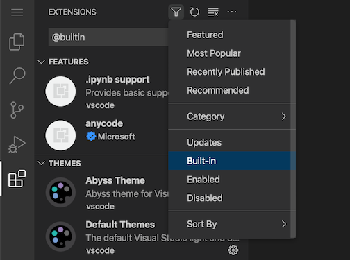
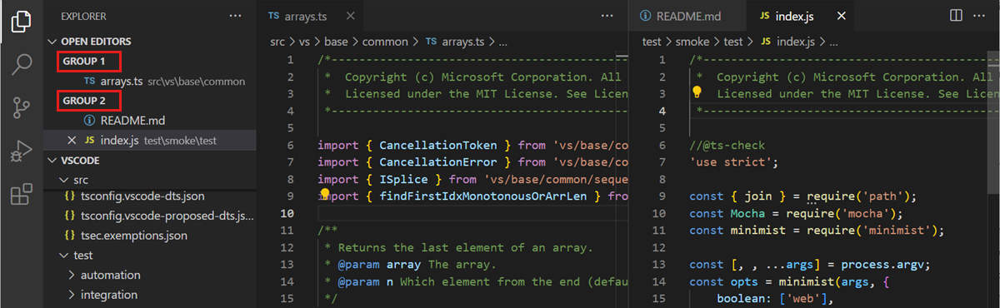
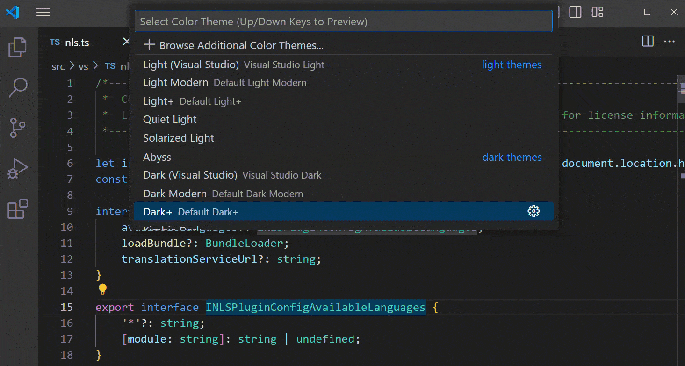
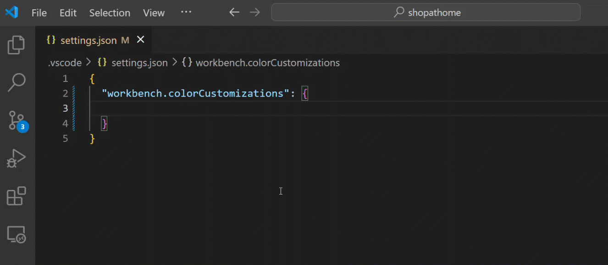

# VS Code 暗黑 UI 设计调研

> 调研范围：仅暗黑模式（Dark+ / Dark Modern / Dark High Contrast）。色值均取自 VS Code 官方主题 JSON 源码与 workbench 颜色注册源码（main 分支，2026-08 检索），标注 [n] 对应文末来源清单。图片为官方文档截图（默认即暗色主题），存于 `assets/vscode/`。

## 1. 概览

- **产品定位**：微软开源的跨平台代码编辑器，Electron + 自研 WebView 渲染（Monaco Editor），以扩展生态支撑"IDE 化"能力 [13]。
- **设计风格一句话**：以"编辑器内容为绝对核心"的扁平化深灰系暗色 UI——工作台（workbench）用**近黑中性灰分层**（编辑器 `#1E1E1E`、工作台 `#252526`），唯一的高饱和品牌蓝 `#007ACC` 只用于**强调**（状态栏、徽标、焦点、选中），其余全部靠灰阶明度差区分层级，无渐变、无强阴影、无大面积圆角 [1][2][3][5][6]。
- 默认暗色主题沿革：经典 `Dark+`（包含式继承 `Dark (Visual Studio)`）→ 1.91 起默认暗色主题改为 **Dark Modern**（在 Dark+ 基础上换用更深的 `#181818` 系配色与 `#0078D4` 强调色）[14][16]。

## 2. 视觉设计语言

### 2.1 配色

#### 2.1.1 背景灰度层级（Dark+ 下各区域实际值）

| 层级 | 区域 | 色值 | 来源 |
|------|------|------|------|
| L0 最深 | 编辑器画布 | `#1E1E1E` | [3] |
| L0' | 活跃页签（tab.activeBackground = editor.background） | `#1E1E1E` | [6] |
| L1 | 工作台基底 WORKBENCH_BACKGROUND / 侧栏 / 页签条 / 通知 / 编辑器控件（editorWidget.background） | `#252526` | [5][6] |
| L1.5 | 非活跃页签 | `#2D2D2D` | [6] |
| L2 | 活动栏 | `#333333` | [6] |
| L3 | 标题栏 | `#3C3C3C` | [6] |
| 选中态 | 页签 selected / 列表 inactiveSelection | `#37373D` | [3][5][6] |
| 强调 | 状态栏（有工作区时）/ 活动栏徽标 | `#007ACC` | [3][6] |
| 强调变体 | 状态栏（无文件夹） | `#68217A`（紫） | [6] |

#### 2.1.2 前景与文字色

| token | 值 | 说明 | 来源 |
|-------|-----|------|------|
| foreground | `#CCCCCC` | 全局默认前景 | [5] |
| editor.foreground | `#D4D4D4`（Dark+ 显式值；注册默认 `#BBBBBB`） | 编辑器文字 | [3][5] |
| strongForeground | `#FFFFFF` | 最高对比前景 | [5] |
| disabledForeground | `#CCCCCC80` | 禁用态（80% 透明） | [5] |
| descriptionForeground | foreground 70% 透明 | 次级说明文字 | [5] |
| icon.foreground | `#C5C5C5` | 工作台图标默认 | [5] |
| sideBarTitle.foreground | `#BBBBBB`（Dark+ 显式值） | 侧栏标题 | [3] |
| 页签前景 | 活跃=白 `#FFFFFF`，非活跃=白 50% 透明 | — | [6] |
| 状态栏前景 | 白 `#FFFFFF` | 蓝底白字 | [6] |
| titleBar.foreground | `#CCCCCC`（失焦 60% 透明） | — | [6] |

#### 2.1.3 强调色（focus / 选中 / 链接 / 按钮）

| token | 值 | 来源 |
|-------|-----|------|
| focusBorder | `#007FD4` | [5] |
| textLink.foreground | `#3794FF` | [5] |
| button.background | `#0E639C`（hover 时 lighten 20%） | [5] |
| progressBar.background | `#0E70C0` | [5] |
| 页签 activeModifiedBorder | `#3399CC` | [6] |
| menu.selectionBackground | `#0078d4`（Dark+ 显式值） | [3] |

#### 2.1.4 编辑器选区 / 查找 / 语义叠层（半透明设计）

| token | 值 | 说明 | 来源 |
|-------|-----|------|------|
| editor.selectionBackground | `#264F78` | 选区 | [5] |
| editor.inactiveSelectionBackground | 选区色 50% 透明 | 失焦选区 | [5] |
| editor.selectionHighlightBackground | `#ADD6FF26`（Dark+）/ 派生 | 同内容高亮 | [3][5] |
| editor.findMatchBackground | `#515C6A` | 当前查找命中 | [5] |
| editor.findMatchHighlightBackground | `#EA5C0055` | 其他命中（透明） | [5] |
| editor.hoverHighlightBackground | `#264f7840` | hover 词高亮 | [5] |
| widget.shadow | 黑 36% 透明 | 浮层阴影 | [5] |
| scrollbarSlider.background | `#797979` 40% 透明（hover 70%、active 40%） | 滚动条滑块 | [5] |
| statusBarItem.hoverBackground | 白 12% 透明（active 18%） | 状态栏 item hover | [6] |

#### 2.1.5 语义色（错误 / 警告 / 信息）

| token | 值 | 来源 |
|-------|-----|------|
| editorError.foreground | `#F14C4C` | [5] |
| editorWarning.foreground | `#CCA700` | [5] |
| editorInfo.foreground | `#59a4f9` | [5] |
| editorHint.foreground | `#eeeeee` 70% 透明 | [5] |
| errorForeground | `#F48771` | [5] |
| inputValidation error/warning/info 背景 | `#5A1D1D` / `#352A05` / `#063B49`（边框 `#BE1100` / `#B89500` / `#007acc`） | [5] |

#### 2.1.6 语法高亮（Dark+ tokenColors 关键映射）

| 语义 | 色值 | 来源 |
|------|------|------|
| 关键字 keyword | `#569cd6` | [2] |
| 字符串 string | `#ce9178` | [2] |
| 注释 comment | `#6A9955` | [2] |
| 数字 numeric | `#b5cea8` | [2] |
| 类型 type | `#4EC9B0` | [2] |
| 函数 function | `#DCDCAA` | [2] |
| 变量 variable | `#9CDCFE` | [2] |
| 控制流 keyword.control | `#C586C0` | [2] |
| 常量 constant | `#4FC1FF` | [2] |
| CSS 值 / 类名 | `#CE9178` / `#d7ba7d` | [2] |
| 正则字符类 / 转义 | `#d16969` / `#d7ba7d` | [2] |
| 无效 invalid | `#f44747` | [2] |

#### 2.1.7 当前默认暗色主题 Dark Modern（差异对照，均在 Dark+ 基础上覆盖）

| 区域 | Dark+ | Dark Modern | 来源 |
|------|-------|-------------|------|
| editor.background | `#1E1E1E` | `#1F1F1F` | [3][16] |
| 工作台/侧栏/标题栏/活动栏/状态栏 | `#252526`/`#3C3C3C`/`#333333`/`#007ACC` | 统一 `#181818`（无文件夹状态栏 `#1F1F1F`） | [6][16] |
| 页签条 / 页签边框 | `#252526` | `#181818` / `#2B2B2B` | [6][16] |
| 强调色系 | `#007ACC` / focusBorder `#007FD4` | 统一 `#0078D4`，页签顶边框 `tab.activeBorderTop: #0078D4` | [5][16] |
| 命令面板 quickInput.background | `#252526` | `#222222` | [5][16] |
| 输入框 / 下拉 / 复选框 | `#3C3C3C` | `#313131`（边框 `#3C3C3C`） | [5][16] |
| 通知 | `#252526`（header 提亮 30%） | `#1F1F1F`（header 同色，边框 `#2B2B2B`） | [6][16] |
| 状态栏调试态 | 蓝 | `statusBar.debuggingBackground: #0078D4` | [16] |
| badge | `#4D4D4D` | `#616161` | [5][16] |

> 高对比变体 Dark High Contrast（hc_black.json）：editor `#000000`/`#FFFFFF`、选区 `#008000`、contrastBorder `#6FC3DF`（HC 专用外描边，暗色下非 HC 为 null）[4][5]。



### 2.2 字体排版

- **编辑器字体**：Windows 默认 `Consolas, 'Courier New', monospace`（macOS `Menlo, Monaco, 'Courier New', monospace`，Linux `'Droid Sans Mono', monospace`）；`editor.fontSize` 默认 **14px**（macOS 12）；`fontWeight: normal`；`lineHeight: 0`（按字体自动计算）[12]。
- **工作台 UI 字号**：侧栏/面板等 part 标题栏 h2 为 **11px**（配合 `text-transform: uppercase` 全大写），part 内容区 **13px**，标题栏链接 13px [10][9]。
- **状态栏**：**12px**、行高 22px、`font-variant-numeric: tabular-nums`（等宽数字）[7]。

### 2.3 间距与尺寸

| 元素 | 值 | 来源 |
|------|-----|------|
| 活动栏宽度 | `48px`（CSS 变量 `--activity-bar-width`，可覆盖） | [8] |
| part 标题栏高度 | `35px`（padding 左右 8px，标题 label padding-left 12px） | [10] |
| 状态栏高度 | `22px` | [7] |
| 侧栏标题行动作按钮 | `28px` 宽、图标 16px | [9] |
| 进度条位置 | 标题栏底部 33px（35px 高容器内） | [10] |
| 页签条背景 | 即 editorGroupHeader.tabsBackground | [6] |

### 2.4 圆角与阴影

- 暗色主题（Dark+ / Dark Modern）整体 **0 圆角**（HC 变体强制 `border-radius: 0px`）[9]；macOS 上状态栏聚焦轮廓为 10px 圆角（Tahoe 系统 16px）[7]；「现代布局」浮层（surface）另有圆角处理，具体值**待核**。
- 阴影：widget 浮层黑 36% 透明阴影 [5]；活动栏在侧栏隐藏/右侧时使用 `box-shadow: var(--vscode-shadow-md)` [8]；滚动条阴影 `#000000` [5]。

### 2.5 截图





## 3. 交互动效

| 动画 | 时长 / 曲线 | 触发 | 来源/核实状态 |
|------|-------------|------|---------------|
| 状态栏背景色过渡 | `0.15s ease-out`（`transition: background-color 0.15s ease-out`） | 状态变化时背景变色（如 git 操作） | 源码确认 [7] |
| 通知 toast 进入 | 从窗口右下角滑入（源码注释 "Notifications slide in from the bottom right of the window"） | 新通知产生 | 存在性确认 [6]，时长参数**待核** |
| 列表/树 hover 背景 | 无 CSS transition 声明（`.monaco-list` 基础样式无过渡规则） | 鼠标悬停列表项 | CSS 层确认无过渡 [11]，是否 JS 层动画**待核** |
| 命令面板主题预览 | 选择主题即时全窗口换肤 | Color Theme picker 中逐项预览 | 官方 GIF 演示 [14] |
| 活动栏主题化 | 即时切换 | 切换主题 | 官方 GIF 演示 [14] |

- 所有动效挂载在 `.monaco-workbench.monaco-enable-motion` 前缀之下——该 class 由「减少动态效果」可访问性偏好控制（关闭动效时整个 workbench 的 transition/animation 全部停用），状态栏过渡即其一例 [7]。





## 4. 布局与组件结构

### 4.1 信息架构（自上而下、自左而右）

```
标题栏（Title Bar，含菜单栏 / 命令中心 commandCenter）   ← #3C3C3C（Dark+）/ #181818（Dark Modern）
├─ 活动栏 Activity Bar（最左，48px 图标列，视图切换）     ← #333333 / #181818
├─ 侧栏 Side Bar（Explorer 等视图容器，标题 11px 大写）   ← #252526 / #181818
├─ 编辑器区 Editor Area
│    ├─ 页签条（editorGroupHeader） + 面包屑 breadcrumb
│    └─ 编辑器组（可多组，border #444444）                ← #252526 / #1E1E1E
├─ 面板 Panel（底部，终端/输出/问题，可移到左右）          ← editor 背景，border #808080 35%
└─ 状态栏 Status Bar（22px）                              ← #007ACC（Dark+）/ #181818（Dark Modern）
```

官方组件定义：活动栏"最左侧，切换视图并提供上下文指示（如 Git 未推送数）"；侧栏"承载 Explorer 等视图"，有 Primary/Secondary 两条；状态栏"项目与文件信息"；面板"编辑器下方的附加视图区（输出/调试/问题/集成终端）" [13]。

### 4.2 组件拆解与暗黑设计细节

**活动栏（48px）** [8][6][13]
- 图标式导航，内容区 `flex-direction: column; justify-content: space-between`（上下两组图标）；宽度可经 `--activity-bar-width` 覆盖。
- 活跃项指示：左侧 2px 白边 `activityBar.activeBorder = 白`；图标前景活跃白、非活跃白 40% 透明。
- 徽标（badge）：`#007ACC` 蓝底白字，用于未读计数；远程/警告/错误徽标另有 `#B27C00` / `#F14C4C` 变体 [5]。

**侧栏** [9][6]
- 视图标题 11px 全大写；分区（section）header 背景 `#808080` 20% 透明；树的缩进线 `#585858`（非活跃 40% 透明）[5]。
- 列表交互色（List/Tree 通用）：hover `#2A2D2E`、active selection `#04395E`（深蓝）+ 白字、inactive selection `#37373D`、drop 目标 `#062F4A`、搜索命中前景 `#2AAAFF` [5]。
- 标题行动作按钮 hover 时从 `width: 0` 展开 [9]。

**编辑器页签** [6][3]
- 活跃页签背景 = 编辑器背景（视觉上"页签与编辑器连成一体"），非活跃 `#2D2D2D`；选中（multi-select）`#37373D` + 顶部 `#007FD4` 边。
- 分隔线 `#252526`；未保存修改标记：活跃页签顶部 `#3399CC`，非活跃 50% 透明；拖放插入指示线为白色。
- 页签 hover 背景默认 null（不显式变色，Dark Modern 覆盖为 `#1F1F1F`）。

**状态栏（22px）** [7][6]
- Dark+ 蓝底白字 `#007ACC`（无文件夹紫 `#68217A`）；Dark Modern 深底 `#181818` + `#0078D4` 调试态。
- item 交互：hover 白 12% 透明、active 白 18%；prominent 项黑 50% 透明；远程指示 `#16825D` 绿底白字（Dark Modern `#0078D4`）；离线 `#6c1717`。
- 左 items `flex-grow: 1` 推右组到最右；右组反向换行。

**命令面板 / Quick Pick** [5][6]
- 背景 `#252526`（Dark Modern `#222222`）、标题条白 10.5% 透明、分组标签 `#3794FF` 蓝、分组分隔 `#3F3F46`、聚焦项 `#04395E` 深蓝。
- 可拖拽移动位置（Customize Layout 提供预置位）[13]。

**通知中心 / Toast** [6][13]
- 右下角滑入；背景 `#252526`（= editorWidget），header 提亮 30%，图标按语义着色（error `#F14C4C` / warning `#CCA700` / info `#59a4f9`）。
- 状态栏铃铛图标可随时打开通知中心 [13]。

**输入框 / 下拉 / 按钮** [5]
- 输入框 `#3C3C3C` 底 + `#CCCCCC` 字（placeholder 50% 透明）；`inputOption.activeBorder: #007ACC`（radio/checkbox 同）。
- 下拉 `#3C3C3C` / `#F0F0F0`；右键菜单 `#252526`，选中项 `#0078d4`（Dark+ 显式值），分隔线 `#454545`（不透明）。
- 主按钮 `#0E639C`（hover 提亮 20%），次按钮 `#2A2D2E` 底。

## 5. 实现级参数

### 5.1 主题文件与 token 体系

- **主题文件路径**（官方仓库 `microsoft/vscode`）：
  - `extensions/theme-defaults/themes/dark_plus.json` —— Dark+（`include` 继承 `dark_vs.json`，仅追加 tokenColors/semanticTokenColors）[2]
  - `extensions/theme-defaults/themes/dark_vs.json` —— Dark (Visual Studio)，UI 色 + 基础 tokenColors [3]
  - `extensions/theme-defaults/themes/dark_modern.json` —— Dark Modern（`include` dark_plus，覆盖全部 UI 色）[16]
  - `extensions/theme-defaults/themes/hc_black.json` —— Dark High Contrast [4]
- **颜色注册源码**（编译期注册，运行时自动生成 CSS 变量 `--vscode-<token名>`）：
  - 平台层：`src/vs/platform/theme/common/colors/`（baseColors / miscColors / editorColors / listColors / inputColors / menuColors / quickpickColors / searchColors / minimapColors / chartsColors），统一 `registerColor('token', { dark, light, hcDark, hcLight }, 描述)` [5]
  - Workbench 层：`src/vs/workbench/common/theme.ts`（tab/statusBar/activityBar/sideBar/panel/titleBar/notification/commandCenter/surface 全部注册 + `WORKBENCH_BACKGROUND()` 函数）[6]
  - 组件 CSS 消费方式示例：`background-color: var(--vscode-sideBarTitle-background)`、`var(--vscode-statusBarItem-hoverBackground)`、`var(--vscode-activityBarTop-activeBorder)`、`var(--vscode-shadow-md)` [9][7][8]

### 5.2 Dark+ 主题 JSON 关键值（`dark_plus.json` / `dark_vs.json`）

```jsonc
// extensions/theme-defaults/themes/dark_vs.json（节选）
"colors": {
  "editor.background": "#1E1E1E",
  "editor.foreground": "#D4D4D4",
  "editor.inactiveSelectionBackground": "#3A3D41",
  "editorIndentGuide.background1": "#404040",
  "editorIndentGuide.activeBackground1": "#707070",
  "editor.selectionHighlightBackground": "#ADD6FF26",
  "activityBarBadge.background": "#007ACC",
  "sideBarTitle.foreground": "#BBBBBB",
  "menu.background": "#252526",
  "menu.foreground": "#CCCCCC",
  "menu.selectionBackground": "#0078d4",
  "statusBarItem.remoteBackground": "#16825D",
  "tab.selectedBackground": "#37373D",
  "tab.selectedForeground": "#FFFFFF",
  "widget.border": "#303031",
  "input.placeholderForeground": "#A6A6A6"
}
```

### 5.3 关键 CSS 变量与参数表

| CSS 变量 / 类 | 值 | 用途 | 来源 |
|---------------|-----|------|------|
| `--activity-bar-width` | `48px`（默认） | 活动栏宽度 | [8] |
| `--vscode-shadow-md` | 未定位定义文件（值待核） | 活动栏浮起阴影 | [8] |
| `.monaco-workbench.monaco-enable-motion` | — | 全部动效的开关前缀（可访问性控制） | [7] |
| `.part.statusbar` | `height: 22px; font-size: 12px` | 状态栏尺寸 | [7] |
| `.part > .title` | `height: 35px; padding: 0 8px` | part 标题栏 | [10] |
| `title-label h2` | `font-size: 11px` + `text-transform: uppercase` | 侧栏/面板标题 | [10][9] |

### 5.4 编辑器字体默认（`src/vs/editor/common/config/fontInfo.ts`）

```ts
DEFAULT_WINDOWS_FONT_FAMILY = 'Consolas, \'Courier New\', monospace';
EDITOR_FONT_DEFAULTS = { fontFamily: <平台分支>, fontWeight: 'normal',
  fontSize: isMacintosh ? 12 : 14, lineHeight: 0 /* 自动 */ };
```

## 6. 来源清单

| # | 来源 | URL |
|---|------|-----|
| [1] | 官方文档：Theme Color 参考（全部颜色 token 与默认值） | https://code.visualstudio.com/api/references/theme-color |
| [2] | 源码：`extensions/theme-defaults/themes/dark_plus.json` | https://github.com/microsoft/vscode/blob/main/extensions/theme-defaults/themes/dark_plus.json |
| [3] | 源码：`extensions/theme-defaults/themes/dark_vs.json` | https://github.com/microsoft/vscode/blob/main/extensions/theme-defaults/themes/dark_vs.json |
| [4] | 源码：`extensions/theme-defaults/themes/hc_black.json` | https://github.com/microsoft/vscode/blob/main/extensions/theme-defaults/themes/hc_black.json |
| [5] | 源码：`src/vs/platform/theme/common/colors/*.ts`（baseColors/miscColors/editorColors/listColors/inputColors/menuColors/quickpickColors 等，经 `colorRegistry.ts` 汇总导出） | https://github.com/microsoft/vscode/blob/main/src/vs/platform/theme/common/colors/baseColors.ts |
| [6] | 源码：`src/vs/workbench/common/theme.ts`（tab/statusBar/activityBar/sideBar/panel/titleBar/notification/commandCenter 颜色注册） | https://github.com/microsoft/vscode/blob/main/src/vs/workbench/common/theme.ts |
| [7] | 源码：`src/vs/workbench/browser/parts/statusbar/media/statusbarpart.css` | https://github.com/microsoft/vscode/blob/main/src/vs/workbench/browser/parts/statusbar/media/statusbarpart.css |
| [8] | 源码：`src/vs/workbench/browser/parts/activitybar/media/activitybarpart.css` | https://github.com/microsoft/vscode/blob/main/src/vs/workbench/browser/parts/activitybar/media/activitybarpart.css |
| [9] | 源码：`src/vs/workbench/browser/parts/sidebar/media/sidebarpart.css` | https://github.com/microsoft/vscode/blob/main/src/vs/workbench/browser/parts/sidebar/media/sidebarpart.css |
| [10] | 源码：`src/vs/workbench/browser/media/part.css` | https://github.com/microsoft/vscode/blob/main/src/vs/workbench/browser/media/part.css |
| [11] | 源码：`src/vs/base/browser/ui/list/list.css` | https://github.com/microsoft/vscode/blob/main/src/vs/base/browser/ui/list/list.css |
| [12] | 源码：`src/vs/editor/common/config/fontInfo.ts`（编辑器字体默认） | https://github.com/microsoft/vscode/blob/main/src/vs/editor/common/config/fontInfo.ts |
| [13] | 官方文档：User Interface（组件官方定义） | https://code.visualstudio.com/docs/getstarted/userinterface |
| [14] | 官方文档：Color Themes | https://code.visualstudio.com/docs/getstarted/themes |
| [15] | 官方文档：默认设置（Default Settings） | https://code.visualstudio.com/docs/reference/default-settings |
| [16] | 源码：`extensions/theme-defaults/themes/dark_modern.json`（当前默认暗色主题） | https://github.com/microsoft/vscode/blob/main/extensions/theme-defaults/themes/dark_modern.json |

**未能核实项**：
1. 通知 toast 滑入动画的时长与缓动参数（仅确认"右下角滑入"行为与通知色值）。
2. 命令面板/Quick Pick 打开/关闭动画参数。
3. 列表/树 hover 背景是否有 JS 层动画（CSS 层确认无 transition 声明）。
4. `--vscode-shadow-md` 阴影变量的具体取值定义文件未定位。
5. Dark Modern「现代布局」浮层（surface）圆角具体像素值。
6. 工作台 UI 字体族（Segoe UI 等）的定义 CSS 文件未定位，仅确认编辑器字体默认值。
