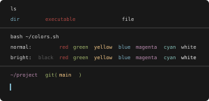
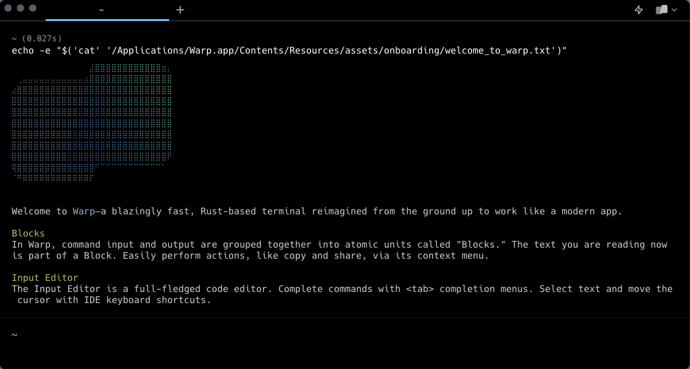
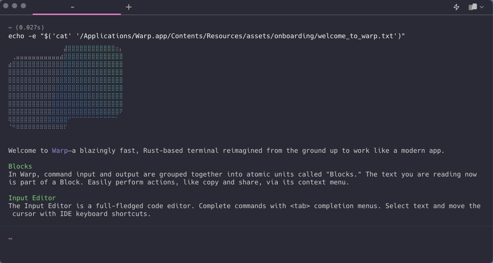
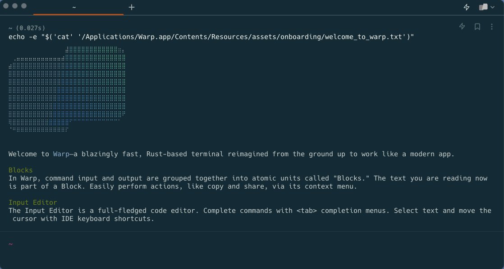
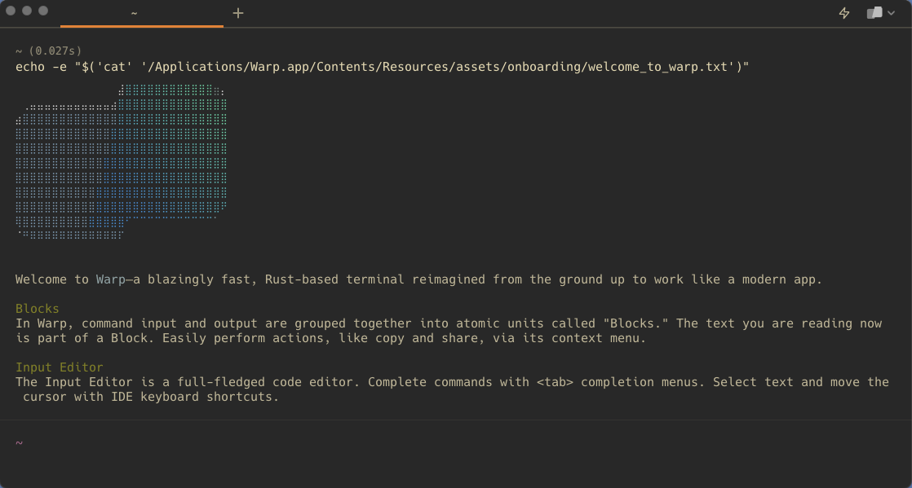
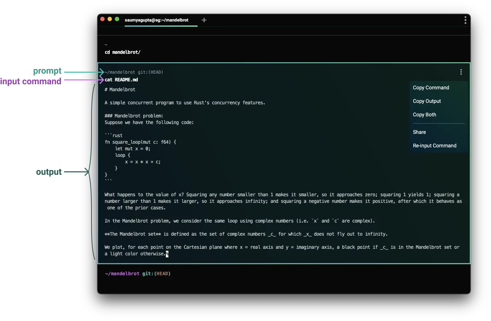
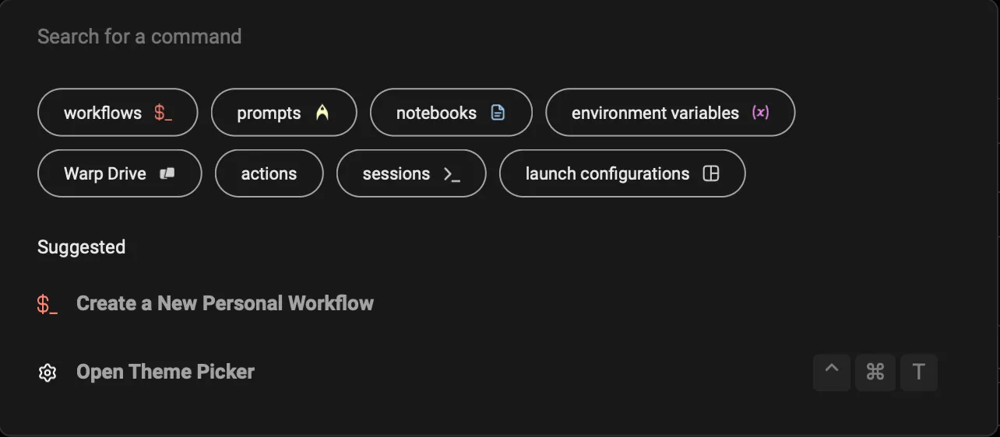

# Warp 暗黑 UI 设计调研

> 调研日期：2026-08-15。范围限定 Warp 终端暗黑模式。截图均为官方渠道下载，存于 `assets/warp/`。
> 约定：每条具体结论内联 [n] 指向「来源清单」；官方未披露的数值标注「待核」。

## 1. 概览

Warp 是一款完全用 Rust 编写、直接在 GPU 上渲染（macOS 用 Metal，跨平台走自研 wgpu/WarpUI 管线）的「现代终端」[20][21]。其设计核心是用 **Block（块）** 取代传统终端 50 年的字符流模型：命令与其输出被分组为可独立复制、搜索、折叠、书签、分享的原子单元 [6][23]。

暗黑模式是 Warp 的默认取向：默认主题即暗色（Warp Dark），内置 21 个主题中暗色占绝大多数 [3]。设计风格一句话定性：**「暗色 UI 表面 + 终端文本区」双层结构**——围绕主题色构建的扁平暗色界面（近纯黑背景、单 accent 色点缀、白 overlay 提层），叠加等宽字体 ANSI 16 色的传统终端文本区，全界面经 `accent` 单点色统一 [2][3]。

## 2. 视觉设计语言

### 2.1 配色

Warp 主题由 20 个字段控制（见第 5 节 YAML 结构），核心是背景/前景 + accent + 16 个 ANSI 色 [1]。

**官方文档示例主题（Solarized 暗色系）**[1]：

| 角色 | 色值 |
|------|------|
| background | `#002b36` |
| foreground | `#839496` |
| accent（UI 高亮） | `#268bd2` |
| cursor | `#95D886` |
| ANSI normal red（错误） | `#dc322f` |
| ANSI normal green | `#859900` |

**官方主题仓库 `default_dark.yaml`（暗色基调参考）**[5]：

| 角色 | 色值 |
|------|------|
| background | `#181818` |
| foreground | `#d8d8d8` |
| accent | `#7cafc2` |
| normal red / bright red | `#ab4642` |
| normal green | `#a1b56c` |
| normal yellow | `#f7ca88` |
| normal cyan | `#86c1b9` |
| normal magenta | `#ba8baf` |

**内置主题暗色背景（由官方主题预览图程序化提取，四角背景采样，与官方主题定义值基本一致）**：

| 内置主题 | 背景（提取值） | 与已知官方色值比对 |
|----------|---------------|-------------------|
| Warp Dark（默认） | `#000000`–`#070707`（近纯黑） | 官方无公开 YAML「待核」（官方仓库 `warp_bundled/` 已开源 13 个内置主题，但 Warp Dark 不在其中） |
| Dracula | `#292a35` | ≈ Dracula 官方 `#282a36` |
| Solarized Dark | `#142b35` | ≈ Solarized 官方 `#002b36`（渲染增亮） |
| Gruvbox Dark | `#282828` | 与 Gruvbox 官方一致 |
| Adeberry | `#1e2022` | 冷灰调 |
| Cyber Wave | `#0b1b24` | 深青黑 |
| Dark City | `#16262f` | 深蓝灰 |

错误/成功状态色：**非零退出码的 Block 渲染为红色背景 + 红色侧边栏** [7]，红色取自主题 ANSI red；命令输入编辑器内的非法命令以**红色虚线下划线**（"a dashed red underline"）标注 [17]。

官方主题仓库暗色主题的配色条缩略图（含圆角 rx=5 与各角色色值）[4]：



Warp Dark（默认主题）预览：



其余内置暗色主题预览：

  

   

### 2.2 字体排版

- 终端文本使用可配置的等宽字体（Font type/weight/size/line height 均可调），可开启 ligatures、thin strokes；「Enforce minimum contrast」默认开启，会将命名色调整到满足可访问性对比度 [16]。默认字体为 Hack——官方文档明示 "Warp's default font, Hack" [16]（第三方分析同此结论 [26]）。
- 主题内建语法高亮作用于输入编辑器：命令、子命令、选项/参数、变量分层着色 [17]。

### 2.3 间距

- Block 之间有**水平分隔线（Block dividers）**，默认开启，制造命令之间的视觉断裂 [11]。
- **Compact mode**（默认关闭）压缩 Block 间间距，让更多内容进入视野 [11]。具体像素值官方未披露（待核）。

### 2.4 圆角 / 阴影 / 层级

- 官方主题缩略图 SVG 中卡片圆角为 `rx=5`（主题预览卡本身，非终端主 UI）[4]。
- 浮层 UI（上下文菜单、自动建议浮层、对话框、命令面板）与背景的分离机制是设计博客明确披露的：「UI surface」= 主题背景色 + **白色 overlay（暗色主题，与前景文本色对齐）+ outline 描边**；亮色主题反之用黑色 overlay。即暗色下浮层通过"叠白提亮 + 描边"形成层次，而不是靠阴影 [2]。
- 主窗口支持透明度（1–100）与背景模糊（macOS blur 半径、Windows Acrylic）[15]。

## 3. 交互动效

Warp 官方不公开动画时长/缓动参数（文档与工程博客均无具体数值），以下动画清单中时长/缓动均标注「待核」，触发时机为官方确认。

| 动画/反馈 | 触发时机 | 时长 | 缓动 | 备注 |
|-----------|----------|------|------|------|
| 命令执行反馈：非零退出码 Block 变红底红边 | 命令结束时（precmd 事件携带退出码） | 待核 | 待核 | [7] |
| 块折叠/展开 | 用户点击 Block 折叠按钮；长输出可折叠 | 待核 | 待核 | [7][23] |
| Sticky Command Header 固定/最小化 | 滚动使长 Block 输出顶部离开视口时；点击头部的 ↑/↓ 可最小化 | 待核 | 待核 | 官方演示 GIF 见下 [10] |
| 滚动 | 贯穿始终——GPU 渲染的目标是 60fps 起步（4K/8K 也保持） | — | — | 输入延迟 5–6ms（第三方实测 [24]）；60fps 为官方硬指标（"always be running at 60fps even on 4K or 8K monitors"，4K 下可远超 144fps）[20] |
| 面板失焦调光（inactive pane dimming） | 多面板时非活动面板 | 待核 | 待核 | 默认关闭 [14] |
| 页签指示器 | 面板最大化、面板/页签同步、命令出错时 | 待核 | 待核 | [13] |
| 窗口透明/毛玻璃 | 拖动透明度滑块实时生效 | — | — | [15] |
| AI 工具调用状态字形 | Agent 执行时：○ 待执行、● 运行中、✓ 成功、× 失败、■ 已取消 | 待核 | 待核 | 属 Warp Agent TUI（TuiAIBlock）[22] |

第三方评测对动效的定性描述：滚动「fluid」、界面「responsive」、分栏调整丝滑 [25]；新增 GPU 渲染引擎宣称打字、滚动、分栏调整更顺滑 [21]。


## 4. 布局与组件结构

信息架构（自上而下）[8][13][14][18]：

```
窗口
├── 页签栏（tab bar，可 hover 显示；页签指示器：最大化/同步/出错）
│   └── 页签组（Tab groups：可命名、着色、折叠收纳成员页签）
├── 内容区（可拆分为多个面板 pane，失焦面板调光）
│   ├── Sticky Command Header（长输出时固定在顶部）
│   ├── Block 序列（自底向上生长）
│   │   ├── 命令块：提示符 + 命令（输入编辑器）
│   │   └── 输出块：输出 + 退出码 + 执行时间等元数据
│   │       ├── 错误块：红底 + 红侧栏
│   │       └── 背景块（后台进程输出，无命令）
│   └── Input Editor（输入位置三种模式）
└── 浮层：命令面板 / 自动建议浮层 / 上下文菜单 / 对话框
```

### 4.1 页签栏（Tabs）

- 默认窗口模式下可见、全屏隐藏，hover 顶部唤出；可设为 Always / Only on hover / When windowed [13]。
- 页签指示器（tab indicator）：面板最大化、面板或页签同步、命令出错三种情况给出视觉提示，可用 accent 色 [13][2]。
- 页签组（Tab groups）：命名 + 着色 + 可折叠收纳 [8]。

### 4.2 Block（命令块 / 输出块 / 背景块）

- Block 是"命令 + 输出"的原子单元，新 Block 从底部（输入编辑器上方）长出 [6][7]。
- 块操作：hover 右侧 kebab（三点）菜单或右键 → 复制命令/输出、分享（生成带格式的网页链接）、书签（右侧指示器 + OPTION-↑/↓ 跳转）、块内查找、块内过滤 [8]。
- 背景块：后台进程的输出自动归入无命令的 background block，可混排于命令块之间 [9]。
- 非零退出码 → 红底 + 红侧栏 [7]。



### 4.3 Sticky Command Header

长输出 Block 的头部在滚动时钉在窗口顶部；点击跳回块顶；可最小化。全屏类命令（如 `git log`）只在开始上滚后才显示，避免遮挡输出 [10]。

### 4.4 输入区与提示符

- 输入位置三模式：Pin to bottom（Warp 默认，块向上流出）、Pin to top（Reverse）、Start at top（Classic）[12]。
- Warp Prompt：原生提示符显示 context chips（当前目录、git 分支、svn、k8s context、pyenv、日期时间等），右键可编辑 [19]。
- 输入编辑器是完整文本编辑器：光标点击定位、多光标、多行、语法高亮 + 错误波浪下划线 [17][20]。

### 4.5 命令面板 / AI 块

- 命令面板（Cmd-P / Ctrl-Shift-P）为全局搜索浮层，支持按类型过滤（workflows/prompts/notebooks/actions/sessions 等）[18]。
- AI 对话块（TuiAIBlock）分段：Input、RichText（markdown/代码/表格）、ToolCall、Thinking（可折叠推理）、TodoList（可折叠任务列表）[22]。



## 5. 实现级参数

### 5.1 主题 YAML 结构与 token 体系 [1][4]

主题文件为 YAML，存放于各平台 themes 目录（macOS `~/.warp/themes/`、Windows `%APPDATA%\warp\Warp\data\themes\`、Linux `${XDG_DATA_HOME:-$HOME/.local/share}/warp-terminal/themes/`），官方仓库 `warpdotdev/themes` 提供 130 个标准主题 YAML（`standard/` 目录实测；含 README/previews 等非 YAML 条目计 137）[4]。

| 字段 | 含义 | 取值 |
|------|------|------|
| `name` | 主题名，显示于 Theme picker | 字符串 |
| `accent` | UI 高亮色：页签指示器、块选择、光标高亮 | hex，或渐变子级 `left/right` 或 `top/bottom` |
| `cursor` | 输入光标色 | hex；省略时默认取 accent |
| `background` | 终端背景色 | hex，或渐变子级（如 `top: '#474747'` / `bottom: '#ffffff'`） |
| `foreground` | 主文本色 | hex |
| `details` | 明暗指示：`darker`（暗主题）/ `lighter`（亮主题），用于 UI 对比度决策 | 枚举 |
| `background_image` | 背景图：`path`（相对 themes 目录，仅支持 .jpg/.jpeg/.JPEG）+ `opacity`（0–100） | 子级 |
| `terminal_colors` | 16 个 ANSI 色（`normal` 8 + `bright` 8，各含 black/red/green/yellow/blue/magenta/cyan/white） | hex |

- 所有色值必须为 `#` 开头 hex [1]。
- 主题体系分「standard」（常规 16 色布局）与「base16」（chriskempson base16 框架）两类 [1][4]。
- 主题选择持久化；支持「Sync with OS」分别指定亮/暗主题 [3]。
- 已知限制：主题**不能**独立设置链接色——链接恒取 foreground 色，accent 不影响链接（GitHub issue #15126）[27]。

### 5.2 UI surface 机制（浮层配色推导）[2]

暗色浮层 = 主题 background + 白色 overlay（与前景色对齐）+ outline 描边。即：浮层色可由 background 与 foreground 推出，无需新增主题字段——这是 Warp 控制"全部 UI"而不只文本区的核心手段。

### 5.3 官方内置主题清单（暗色）[3]

Warp Dark（默认）、Dracula、Solarized Dark、Gruvbox Dark、Jellyfish、Dark City、Cyber Wave、Willow Dream、Fancy Dracula、Phenomenon、Solar Flare、Adeberry 等（另有数个亮色主题不在本调研范围）。

### 5.4 渲染与性能参数 [20][21]

- 渲染管线：GPU 直渲（macOS Metal；Windows/Linux 经 wgpu，可选 Vulkan/OpenGL 后端），60fps 为硬性要求（4K/8K 亦然）。
- 每个 Block 是独立渲染对象（独立 hit-test 与动画状态），即时模式重建元素树，仅 Rect/Glyph/Image/Icon 四种 GPU 批量图元 [23]。
- 新增 GPU 渲染引擎（2026-03）进一步提升打字、滚动、分栏调整的顺滑度 [21]。

## 6. 来源清单

1. [Custom Themes | Warp 官方文档](https://docs.warp.dev/terminal/appearance/custom-themes/) — YAML 字段定义、渐变、背景图、安装路径
2. [How we designed themes for the terminal - a peek into our process | Warp 官方博客](https://www.warp.dev/blog/how-we-designed-themes-for-the-terminal-a-peek-into-our-process) — accent 设计动机、UI surface（白/黑 overlay + outline）
3. [Terminal themes | Warp 官方文档](https://docs.warp.dev/terminal/appearance/themes/) — 内置主题清单与预览图
4. [warpdotdev/themes | GitHub 官方主题仓库](https://github.com/warpdotdev/themes) — 130 个标准主题 YAML（standard/ 目录）、previews 缩略图（rx=5）、warp_bundled/ 13 个内置主题
5. [default_dark.yaml | warpdotdev/themes 官方仓库](https://raw.githubusercontent.com/warpdotdev/themes/main/standard/default_dark.yaml) — 官方暗色主题色值
6. [Terminal Blocks overview | Warp 官方文档](https://docs.warp.dev/terminal/blocks/)
7. [Terminal Block Basics | Warp 官方文档](https://docs.warp.dev/terminal/blocks/block-basics/) — 错误块红底红边、块选择/导航
8. [Block Actions | Warp 官方文档](https://docs.warp.dev/terminal/blocks/block-actions/) — kebab 菜单、书签、分享、Tab groups
9. [Background Blocks | Warp 官方文档](https://docs.warp.dev/terminal/blocks/background-blocks/)
10. [Sticky Command Header | Warp 官方文档](https://docs.warp.dev/terminal/blocks/sticky-command-header/) — 官方演示 GIF
11. [Blocks Behavior | Warp 官方文档](https://docs.warp.dev/terminal/appearance/blocks-behavior/) — Compact mode、Block dividers
12. [Input position | Warp 官方文档](https://docs.warp.dev/terminal/appearance/input-position/)
13. [Tabs Behavior | Warp 官方文档](https://docs.warp.dev/terminal/appearance/tabs-behavior/) — 页签指示器、tab bar 可见性
14. [Pane Dimming & Focus | Warp 官方文档](https://docs.warp.dev/terminal/appearance/pane-dimming/)
15. [Size, Opacity, & Blurring | Warp 官方文档](https://docs.warp.dev/terminal/appearance/size-opacity-blurring/) — 透明度 1–100、blur、Acrylic
16. [Text, Fonts, & Cursor | Warp 官方文档](https://docs.warp.dev/terminal/appearance/text-fonts-cursor/) — 字体/行高/连字/最小对比度/光标
17. [Syntax & Error Highlighting | Warp 官方文档](https://docs.warp.dev/terminal/editor/syntax-error-highlighting/) — 红色虚线错误下划线
18. [Command Palette | Warp 官方文档](https://docs.warp.dev/terminal/command-palette/)
19. [Terminal prompt | Warp 官方文档](https://docs.warp.dev/terminal/appearance/prompt/) — Warp Prompt context chips
20. [How Warp Works | Warp 官方工程博客](https://www.warp.dev/blog/how-warp-works) — Rust + Metal、60fps 目标、块实现
21. [New GPU-accelerated rendering engine launches | Warp Newsroom](https://www.warp.dev/newsroom/2026/3/8/new-gpu-accelerated-rendering-engine-launches)
22. [TUI Agent Blocks and Rendering | DeepWiki（warpdotdev/Warp 源码分析）](https://deepwiki.com/warpdotdev/Warp/11.2-tui-agent-blocks-and-rendering) — TuiAIBlock 分段与工具调用状态字形
23. [Warp Terminal's Block Architecture | Starlog（第三方分析）](https://starlog.is/articles/ai-agents/warpdotdev-warp) — Block 数据结构、渲染对象、缩放/内存
24. [Warp Rust & GPU Architecture Deep Dive | Lushbinary（第三方分析）](https://lushbinary.com/blog/warp-rust-gpu-architecture-technical-deep-dive/) — 输入延迟 5–6ms、重度滚动下维持 60fps
25. [Warp Review | aicoolies（第三方评测）](https://aicoolies.com/reviews/warp-review) — 滚动流畅度定性描述
26. [Warp 终端图标显示问题分析 | gitcode 博客（第三方）](https://blog.gitcode.com/1a69529457c9df640b624969202a25d0.html) — 默认字体 Hack（待核）
27. [Custom themes: add a key for link color · Issue #15126 | warpdotdev/warp](https://github.com/warpdotdev/warp/issues/15126) — 链接色限制

**未核实项（待核）清单**：
- 动画时长/缓动曲线具体数值（官方全部渠道均未披露，仅定性描述）
- Warp Dark（应用内置默认主题）官方 YAML 色值（官方仓库 `warp_bundled/` 已开源 13 个内置主题，但 Warp Dark 不在其中；本文给出的是官方预览图提取值）
- Block 间距、主 UI 圆角的具体像素值
- Sticky Command Header / 块折叠的动画参数
