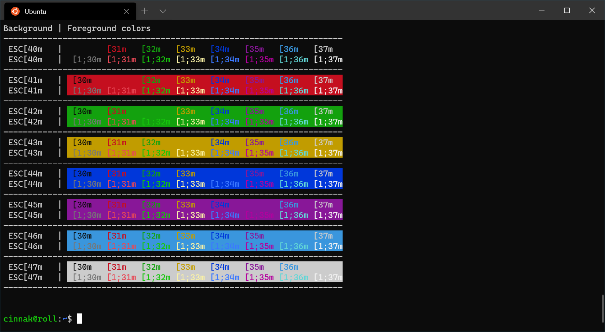
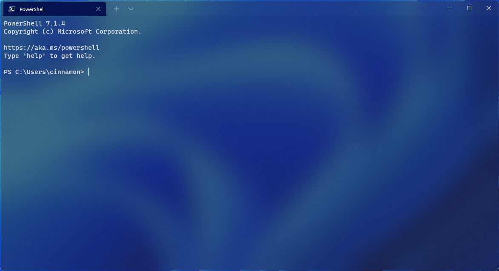
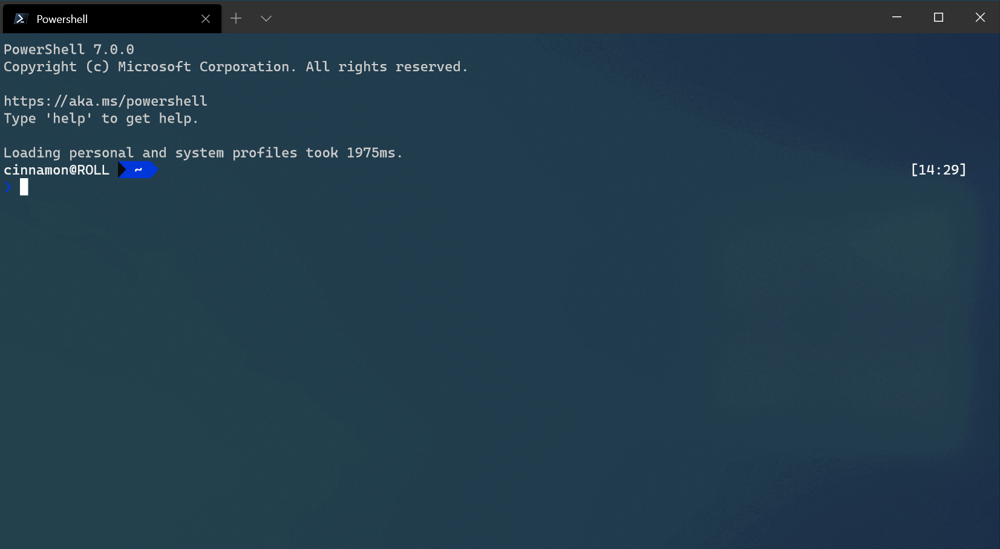
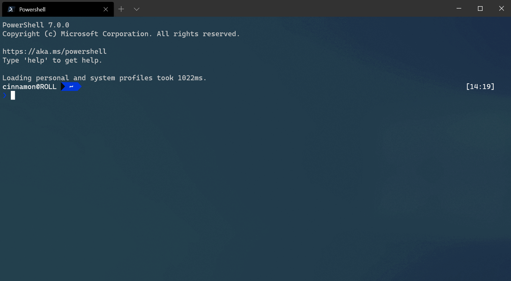
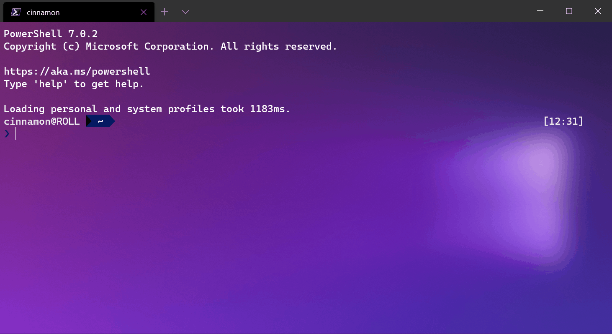
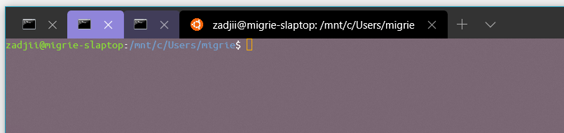
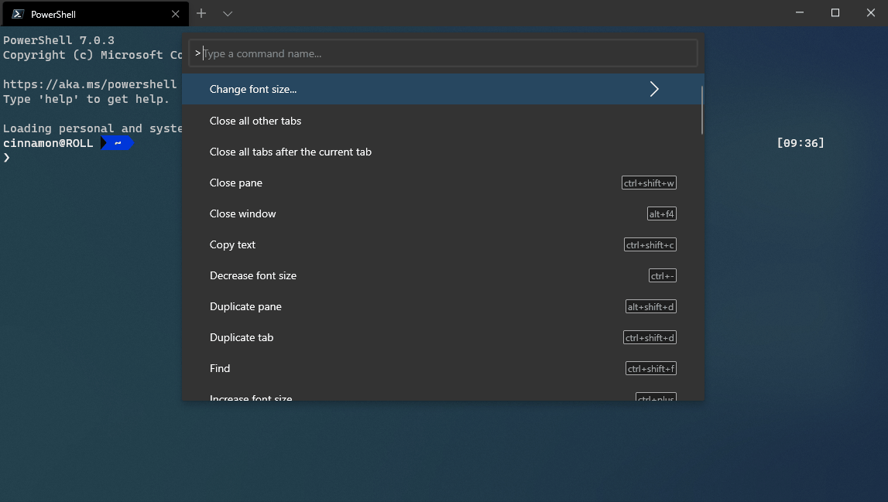
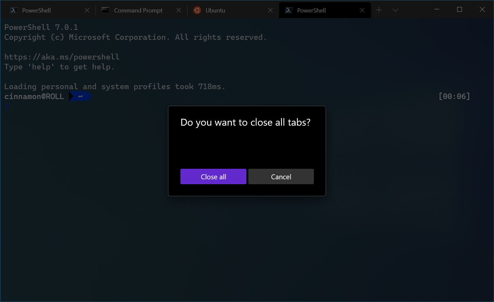
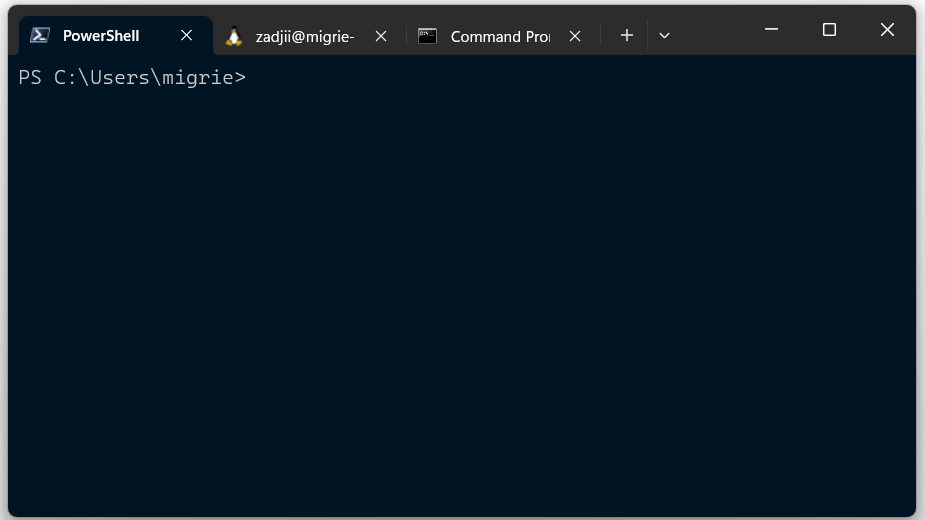

# Windows Terminal 暗黑 UI 设计调研

> 调研范围限定暗黑模式（Windows Terminal 默认主题即暗色）。所有色值、参数、截图均来自官方文档、官方源码与微软官方博客，内联编号 [n] 对应文末「来源清单」。标注「待核」的条目为当前无法从一手来源核实的信息。

## 1. 概览

Windows Terminal 是微软官方开源（MIT，microsoft/terminal 仓库）的 Windows 终端模拟器，2020 年随 Windows 10 发布，面向命令行用户与开发者 [1]。它是微软 Fluent Design（流畅设计）体系在「工具类应用」上的落地样板：**深灰底 + 材质化背景（Mica/亚克力）+ WinUI 控件 + 高对比终端内容配色**，暗色是其出厂默认（`"theme": "dark"`）[5][2]。

设计上有两条独立但并行的配色轨道：

- **UI 层**：窗口外壳（页签栏、标题栏、命令面板、设置 UI）走 WinUI 暗色系统资源 + 少量自定 XAML 刷子，整体是 `#2e2e2e` 系深灰；
- **内容层**：终端文本区走 profile 配色方案（默认 Campbell），背景 `#0C0C0C` 近黑，与 UI 层深灰形成两个明度台阶 [5][7]。

「seamless（无缝）」理念是暗黑模式的核心视觉主张：默认主题下页签背景直接取 `terminalBackground`（当前面板的背景色），使页签栏与终端内容融为一体 [2][16]。

## 2. 视觉设计语言

### 2.1 配色（暗黑）

**UI 层（XAML / 主题 JSON 定义）**

| 元素 | 值 | 说明 |
|------|-----|------|
| 页签栏背景 `TabViewBackground`（聚焦时） | `#2e2e2e` | `App.xaml` Dark 字典；注释说明：系统 `ApplicationPageBackgroundThemeBrush` 对比度不足，此值专为对比度选定（GH #12356）[7] |
| 页签栏背景（未聚焦） | `#333333FF` | 内置 dark 主题 `tabRow.unfocusedBackground` [2] |
| 页签背景（active，默认主题） | `terminalBackground` | 取当前活动面板背景，无缝融合 [2] |
| 页签背景（inactive，默认主题） | `#00000000` | 全透明 [2] |
| 页签背景（无主题定义时的暗色 fallback） | `#282828` | 源码实测值（commit ad6473d）[13] |
| 页签栏亚克力（`useAcrylicInTabRow`） | `#FF333333` + 50% 不透明度 | 标题栏 acrylic 背景刷（commit ed7c716）[14][3] |
| 设置 UI 页签刷 `SettingsUiTabBrush` | `#0c0c0c` | `App.xaml` Dark 字典 [7] |
| 命令面板背景（当前 main 分支） | `FlyoutPresenterBackground` 系统刷子 | WinUI 暗色系统资源，精确值「待核」[6] |
| 命令面板背景（早期版本） | `#333333` | 自带 `CommandPaletteBackground` 样式（commit f892e52 起）[26] |
| Seamless 主题页签栏未聚焦背景 | `#2C2C2CFF` | 官方主题画廊示例 [16] |
| 广播窗格边框 `BroadcastPaneBorderColor` | `SystemAccentColorDark2` | 强调色暗色变体 [7] |
| 页签栏亚克力 tint（`tabRow.acrylicOpacity`） | 小数 0–1 | 主题可配 tint 不透明度（theme 设计注记）[23][19] |

**内容层（Campbell 默认配色方案，内置 `defaults.json` 一手值 [5]，官方文档同值 [1]）**

| 槽位 | hex | 槽位 | hex |
|------|-----|------|-----|
| background | `#0C0C0C` | brightBlack | `#767676` |
| foreground | `#CCCCCC` | brightRed | `#E74856` |
| cursorColor | `#FFFFFF` | brightGreen | `#16C60C` |
| black | `#0C0C0C` | brightYellow | `#F9F1A5` |
| red | `#C50F1F` | brightBlue | `#3B78FF` |
| green | `#13A10E` | brightPurple | `#B4009E` |
| yellow | `#C19C00` | brightCyan | `#61D6D6` |
| blue | `#0037DA` | brightWhite | `#F2F2F2` |
| purple | `#881798` | — | — |
| cyan | `#3A96DD` | — | — |
| white | `#CCCCCC` | — | — |

Campbell 系（含 Campbell Powershell `#012456` 背景）均为暗色方案；`defaults.json` 还内置 One Half Dark、Tango Dark、Vintage、Dimidium 等暗色方案 [5][1]。暗色阶（background/brightBlack）与亮色阶（bright*）明度差明显，保证暗底高可读性。





### 2.2 材质（Mica / Acrylic）

- **Mica（云母）**：`window.useMica: true` 在窗口最底层开启 Mica，需要其上所有层透明才能透出（如页签栏背景 alpha 置 0）；仅 Windows 11 build ≥ 22621 可用 [2]。Mica 开启时终端 pane 若用 `opacity`（不带 acrylic）也会透出 Mica——官方明确「无法同时获得无模糊透明终端背景 + Mica 页签栏」[2]。
- **Acrylic（亚克力）**：profile 级 `useAcrylic` + `acrylicOpacity`（0–1 小数）控制终端内容区；窗口级 `useAcrylicInTabRow` 控制页签栏（固定 50% 不透明度）[3][1]。`tintOpacity` / `fallbackColor` 是 WinUI 3 `MicaController` / `DesktopAcrylicController` 的底层属性（非 Windows Terminal 直接暴露的配置项），Mica/DesktopAcrylic 内置 backdrop 类不暴露它们，需自定义 `SystemBackdrop` 派生类才能定制「待核」[25]。

### 2.3 字体排版

- 默认字体：**Cascadia Mono，12pt**（`defaults.json` 中 PowerShell/CMD 两个默认 profile 均为 `"fontFace": "Cascadia Mono", "fontSize": 12`）[5]。
- Cascadia Code 与 Windows Terminal 同批开发，是微软官方等宽字体：Cascadia Code 含编程连字，Cascadia Mono 不含，另有 PL（Powerline 字形）变体 [22]。
- 命令面板内部：命令标题用内容字号（继承）、副标题 10pt（`SubtitleTextStyle`，`SystemBaseMediumColor`）、快捷键徽章 12pt、图标 16×16px、嵌套菜单箭头 FontIcon 12pt（Segoe MDL2/Symbol 字体）[6]。

### 2.4 间距

- profile 内容区 padding 默认 `8, 8, 8, 8`（`defaults.json`）[5]。
- 命令面板：整体 Margin 8；搜索框 Padding `18,8,8,8`（左侧 18px 为前缀字符 `>` 让位）；列表与搜索框 Margin `8,0,8,8`；行内列间距 `ColumnSpacing=8`；图标槽宽 16px、滚动条留白槽 16px；「无匹配」提示高 36px [6]。
- 页签栏顶部 padding 压平为 `TabViewHeaderPadding: 0,0,0,0`；页签项边框 `TabViewItemBorderThickness: 1,1,1,0`（下缘无边框，贴合内容区）[7]。

### 2.5 圆角与阴影/层级

- 命令面板外框：`CornerRadius="{ThemeResource OverlayCornerRadius}"`（WinUI 覆盖层圆角资源，Windows 11 上为系统圆角，「待核」精确值）[6]。
- 快捷键徽章：`CornerRadius=2`、`BorderThickness=1`、边框 `SystemControlForegroundBaseMediumBrush` [6]。
- 按钮圆角：`ControlCornerRadius`（WinUI 系统资源）[7][21]。
- 阴影：命令面板挂 `ThemeShadow`（`SharedShadow`）+ `Translation="0,0,32"`，即 **32px 深度**（XAML 三维 z 轴提升）压住终端内容 [6][7]。这是暗色 UI 上唯一明确的层级表现——无边框分隔，靠阴影 + 明度差分层。

## 3. 交互动效

### 3.1 动画清单

| 动画 | 触发时机 | 时长 | 缓动 | 备注 |
|------|----------|------|------|------|
| Pane 进入/退出 | 创建/关闭 pane | **200ms** | **QuadraticEase**（PR #7364 diff 两处 `Media::Animation::QuadraticEase{}` 明确） | `AnimationDurationInMilliseconds = 200`；166ms 只可见一帧、300ms 过长，200ms 为折中；C++/WinRT 代码创建（pane 全代码生成）[9] |
| Pane 退出动画 | 关闭 pane | 200ms | easing + `EnableDependentAnimation(true)` | 退出时把子 pane 的虚拟网格缩放至 0；若任一分窗处于 zoom 状态则跳过 [9] |
| TabView 页签滑入 | 启动/新建页签 | 禁用 | — | 显式移除 `EntranceThemeTransition` 与 `AddDeleteThemeTransition`（后者在系统动画开启时延迟新页签出现）[7][11] |
| 页签图标「弹出」 | 图标异步加载完成 | 禁用 | — | coroutine `resume_foreground` 造成的闪烁动画，移除后启动延迟降约 10%（约 500ms 总量）[11] |
| 命令面板列表项动画 | 输入过滤增删条目 | 禁用 | — | `NoAnimationsPlease` 样式：移除 AddDelete/Reorder 过渡，仅保留 `ContentThemeTransition`（内容渐变）[7] |
| 颜色按钮（设置 UI） | hover / 按下 | 即时（KeyFrame 0） | 无 | 背景 Opacity 1 → 0.9（hover）→ 0.8（pressed），边框换 `ButtonBorderBrushPointerOver/Pressed` [7] |
| 删除按钮背景过渡 | hover / 按下 | WinUI 默认 | — | `BackgroundTransition` + 故事板换 `DeleteButtonBackgroundPointerOver` / `Pressed`；背景按下色为 Opacity 0.8 的 `DeleteButtonColor`，`#B3FFFFFF`（70% 白）为前景文字按下色（`DeleteButtonForegroundPressed`）[21] |
| 命令面板显隐 | Ctrl+Shift+P | 「待核」 | 「待核」 | spec 未给参数；依赖 WinUI 系统过渡，未从源码提取到明确时长 [8] |

### 3.2 全局开关与门控

- `disableAnimations: true`（默认 `false`）关闭应用自带动画 [5][3]。
- 双重门控：动画执行前检查 OS 级 `UISettings.AnimationsEnabled()`（系统「显示动画」设置）与 app 级 `Timeline::AllowDependentAnimations()`；任一关闭则跳过（commit 204c9d2 修复了仅退出动画检查 app 设置的疏漏，进入动画同样受控）[10][9]。
- 局限：`disableAnimations` 管不到 WinUI 控件自带动画（如命令面板列表的过滤动画），官方在 issue #8405 承认该命名名不副实，建议改 `disablePaneAnimations` [12]。

## 4. 布局与组件结构

### 4.1 信息架构

单窗口分层：**标题栏/页签栏（默认合体，`showTabsInTitlebar: true`）→ pane 内容网格 → 命令面板覆盖层 → 设置 UI（独立子窗口）**。无传统状态栏——状态信息（进度、铃铛等）由页签栏图标与 pane 标题承载 [2][3][8]。







### 4.2 页签栏（Tab Row）

- 默认合入标题栏，页签栏高度以 32px 参与窗口尺寸测量（`tabRowHeight = 32` 源码计算值）[20]。
- 聚焦背景 `TabViewBackground`（暗色 `#2e2e2e`），未聚焦 `#333333FF` [7][2]。
- 页签：active 背景取 `terminalBackground`（无缝）；inactive 全透明 `#00000000`；页签色（`tabColor`）优先级最高 [2]。
- 关闭按钮：`showCloseButton` 四态——`always`（默认）/ `hover` / `never` / `activeOnly`；`never` 同时禁用中键关闭 [2]。
- 宽度模式：`equal`（默认等宽）/ `titleLength` / `compact`（非活动页签收窄为图标宽，活动页签享全宽）[3]。
- 活动页签标题 = 当前 pane 标题（`showTerminalTitleInTitlebar: true`，默认）[3]。

### 4.3 命令面板（Command Palette）

- 呼出：`Ctrl+Shift+P`（可改绑）[4]。定位：水平居中、从页签栏下方「下拉」，覆盖全部 pane 而非附着单个 pane（避免小尺寸 pane 拥挤与「找覆盖层」问题）[8]。
- 结构：网格列比 `2* / 6* / 2*`、行比 `8* / 2*`，面板只占中上部；搜索框（左侧 `>` 前缀字符，删掉即进入 commandline 模式）+ 结果列表 + 面包屑（嵌套命令时出现返回按钮 + 斜体父命令名）[6][8][4]。
- 列表条目：图标 16px + 命令名 + 副标题（10pt）+ 右侧快捷键徽章（圆角 2 边框）；模糊匹配（fuzzy search）命中字符**加粗**；打开时自动高亮首条，↑↓ 导航、Enter 执行、Esc 关闭后清空搜索文本 [6][8]。
- 页签条目专属：ProgressRing 进度环、铃铛（EA8F）、zoom（E8A3）、只读锁（E72E）、输入广播（EC05）四个状态图标 + 8px 页签色圆点 [6]。
- 解析结果（wt 命令行模式）以 16px 内边距卡片展示，`CardBackgroundFillColorDefaultBrush` / `CardStrokeColorDefaultBrush` 系统刷子 [6]。





### 4.4 设置 UI

- 独立子窗口，位于 `src/cascadia/TerminalSettingsEditor/`（MainPage、Profiles_Base、Appearances、ColorSchemes、Actions、Launch 等 XAML 页面）[21]。
- 暗黑表现：页面背景沿用 WinUI 系统背景刷；页签刷 `#0c0c0c`；主题选择器仅两个实体项「Dark / Light（含 legacy 变体）」，无自定义主题 UI（主题仅能改 settings.json）[7][13][2]。
- 设置 UI 走 WinUI brushes 而非旧 UWP/OS 刷子（UX 精修 PR #19001）[21]。



### 4.5 Seamless 主题（1.16 起默认观感）

页签、页签栏背景均取 `terminalBackground`，未聚焦时页签栏退为 `#2C2C2CFF`——「无缝」即 UI 层让位于内容层（暗色）[16][15]。



## 5. 实现级参数

### 5.1 配置文件与源码路径

| 层 | 位置 |
|----|------|
| 用户/自定义主题 | `settings.json`（`themes` 数组 + 顶层 `theme`）[2] |
| 内置默认设置 | `src/cascadia/TerminalSettingsModel/defaults.json`（自动生成文件，Campbell 等全部内置配色与默认值所在）[5] |
| UI 暗色刷子 | `src/cascadia/TerminalApp/App.xaml`（`ThemeDictionaries`：Dark / Light / HighContrast 三套字典）[7] |
| 命令面板 UI | `src/cascadia/TerminalApp/CommandPalette.xaml` [6] |
| 设置 UI | `src/cascadia/TerminalSettingsEditor/`（MainPage.xaml、CommonResources.xaml 等）[21] |
| 主题数据模型 | `src/cascadia/TerminalSettingsModel/Theme.cpp`（Theme/ThemeColor/TabTheme/TabRowTheme/WindowTheme）[28] |

### 5.2 关键默认值（暗黑）

| 设置 | 默认值 |
|------|--------|
| `theme` | `"dark"`（`defaults.json` main 分支源码；文档 appearance 页写默认 `"system"`——两处冲突「待核」；issue #14858 改回 `"system"` 计划已于 v1.18 执行完毕（2023-07-05 关闭），当前 main 分支仍为 `"dark"`）[5][3][15] |
| `window.applicationTheme` | `"dark"`（主题对象内）[2] |
| `useMica` | `false`，需 Win11 ≥ 22621 [2] |
| `useAcrylicInTabRow` | `false`（开启 = 50% 亚克力）[3] |
| `disableAnimations` | `false` [5] |
| `alwaysShowTabs` / `showTabsInTitlebar` | `true` / `true` [3] |
| 字体/字号 | Cascadia Mono / 12 [5] |
| profile padding | `8, 8, 8, 8` [5] |

### 5.3 主题 JSON token 语法

- 颜色：`#rgb` / `#rrggbb` / `#rrggbbaa`（省略 alpha 视为不透明）[2]。
- 特殊值：`"accent"`（系统强调色）、`"terminalBackground"`（活动 pane 的 profile 背景色，忽略 backgroundImage）[2]。
- 主题绑定系统深浅：`"theme": { "dark": "<名称>", "light": "<名称>" }` 随 OS 主题自动切换 [2]。
- `tabRow.background` 忽略 alpha（恒不透明）；`tabRow.acrylicOpacity` 将背景当亚克力 tint（`TintOpacity` 语义）[23][19]。
- 页签栏背景 fallback 链：主题 `tabRow.background` → `TabViewBackground`（`App.xaml` 暗色 `#2e2e2e`）[17][7]。

### 5.4 内置主题定义（暗色完整 JSON，官方文档）

```json
{
    "name": "dark",
    "window": { "applicationTheme": "dark" },
    "tab": {
        "background": "terminalBackground",
        "unfocusedBackground": "#00000000"
    },
    "tabRow": { "unfocusedBackground": "#333333FF" }
}
```

[2] 原文照录。

## 6. 来源清单

1. Windows Terminal Color Schemes（官方文档）— https://learn.microsoft.com/en-us/windows/terminal/customize-settings/color-schemes
2. Windows Terminal Theme Settings（官方文档）— https://learn.microsoft.com/en-us/windows/terminal/customize-settings/themes
3. Windows Terminal Appearance Settings（官方文档）— https://learn.microsoft.com/en-us/windows/terminal/customize-settings/appearance
4. How to use the command palette（官方文档）— https://learn.microsoft.com/en-us/windows/terminal/command-palette
5. microsoft/terminal `src/cascadia/TerminalSettingsModel/defaults.json`（内置默认设置源码）— https://github.com/microsoft/terminal/blob/main/src/cascadia/TerminalSettingsModel/defaults.json
6. microsoft/terminal `src/cascadia/TerminalApp/CommandPalette.xaml`（命令面板源码）— https://github.com/microsoft/terminal/blob/main/src/cascadia/TerminalApp/CommandPalette.xaml
7. microsoft/terminal `src/cascadia/TerminalApp/App.xaml`（UI 暗色资源字典源码）— https://github.com/microsoft/terminal/blob/main/src/cascadia/TerminalApp/App.xaml
8. Command Palette 设计 spec（`doc/specs/#2046`）— https://github.com/microsoft/terminal/blob/main/doc/specs/%232046%20-%20Command%20Palette.md
9. PR #7364 Add an animation to pane entrance/exit — https://github.com/microsoft/terminal/pull/7364
10. commit 204c9d2 Make sure to disable pane entrance animation if user requests — https://github.com/microsoft/terminal/commit/204c9d2cf4ec9db4289a26668e7eaa5a8ec156b6
11. commit 4d4111b Avoid animations during startup — https://github.com/microsoft/terminal/commit/4d4111b9ed56a10429753d3ee6c3df3dc1a0e96e
12. Issue #8405 disableAnimations not disabling all animations — https://github.com/microsoft/terminal/issues/8405
13. commit ad6473d Add tab color setting to settings UI（暗色 tab fallback #282828）— https://github.com/microsoft/terminal/commit/ad6473d6ae020f3d2417d81df40512fad3556b97
14. commit ed7c716 Add titlebar acrylic（#FF333333）— https://github.com/microsoft/terminal/commit/ed7c716978475205ef29a3bc79f47d3b898b1502
15. Issue #14858 Plan for new default theme — https://github.com/microsoft/terminal/issues/14858
16. Windows Terminal Themes Gallery（Seamless 主题）— https://learn.microsoft.com/en-us/windows/terminal/custom-terminal-gallery/theme-gallery
17. commit 024b9fc Add a setting for the unfocused tabRow background color — https://github.com/microsoft/terminal/commit/024b9fc0f44501efd71d4cb34a1138f5ba53153a
18. commit c1df08e Update the default themes for 1.16 — https://github.com/microsoft/terminal/commit/c1df08e4f79fbe017e453f463497e93db3b54650
19. commit 0d2e8ce Use theme tabRow color as acrylic tint — https://github.com/microsoft/terminal/commit/0d2e8cecd0058e269422dc4620f13127a98f6a09
20. microsoft/terminal `src/cascadia/TerminalApp/TerminalWindow.cpp`（tabRowHeight 32）— https://github.com/microsoft/terminal/blob/main/src/cascadia/TerminalApp/TerminalWindow.cpp
21. commit 48b796f [UX] Settings UI refinements（WinUI brushes）— https://github.com/microsoft/terminal/commit/48b796f102420dea6dbf605011ff6cd5a1a666cf
22. Cascadia Code（官方文档）— https://learn.microsoft.com/en-us/windows/terminal/cascadia-code
23. commit 5c5b671 theming 设计注记（tabRow.acrylicOpacity）— https://github.com/microsoft/terminal/commit/5c5b671e12d474bc03eb6e71c5c96de85a39ccd0
24. PR #6635 Add support for the Command Palette（暗色截图来源）— https://github.com/microsoft/terminal/pull/6635
25. WinUI SystemBackdrop / MicaController / DesktopAcrylicController 文档（tintOpacity / fallbackColor）— https://github.com/MicrosoftDocs/winapps-winrt-api/blob/docs/microsoft.ui.xaml.media/systembackdrop.md
26. commit f892e52 align visuals with the SearchBoxControl（CommandPaletteBackground #333333）— https://github.com/microsoft/terminal/commit/f892e52077ef31b6e9d5733d5357b384614ecc49
27. commit 6d63605 Add the background back to `showTabsInTitlebar: false`'s tab row — https://github.com/microsoft/terminal/commit/6d636056a0905f28c60f0b7f754ae5b89235916d
28. microsoft/terminal `src/cascadia/TerminalSettingsModel/Theme.cpp`（主题数据模型源码）— https://github.com/microsoft/terminal/blob/main/src/cascadia/TerminalSettingsModel/Theme.cpp
29. Issue #9539 Remove base layer from settings UI（设置分层）— https://github.com/microsoft/terminal/issues/9539

---

**附录：调研说明**

- 截图全部下载自官方来源（MicrosoftDocs/terminal 文档仓库与 microsoft/terminal PR 附件），经像素亮度校验均为暗色主题（平均亮度 22–105/255）；GIF 截图使用场景默认即暗色主题。
- WebFetch 被网络策略拦截，所有页面改用 curl 直取官方 raw 源与文档 HTML；GitHub API 触发限流后以 raw 直链与 WebSearch 摘要交叉验证。
- 无法核实项：① `FlyoutPresenterBackground`、`OverlayCornerRadius` 等 WinUI 系统资源暗色精确值（WinUI 仓库主题资源文件路径不可达，标注「待核」）；② 命令面板显隐动画的时长与缓动曲线（源码未提取到明确参数）；③ `theme` 顶层默认值在源码（dark）与文档（system）间存在差异，两处均已如实引用。
