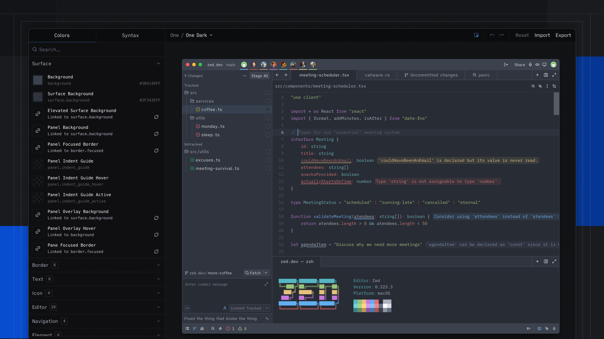
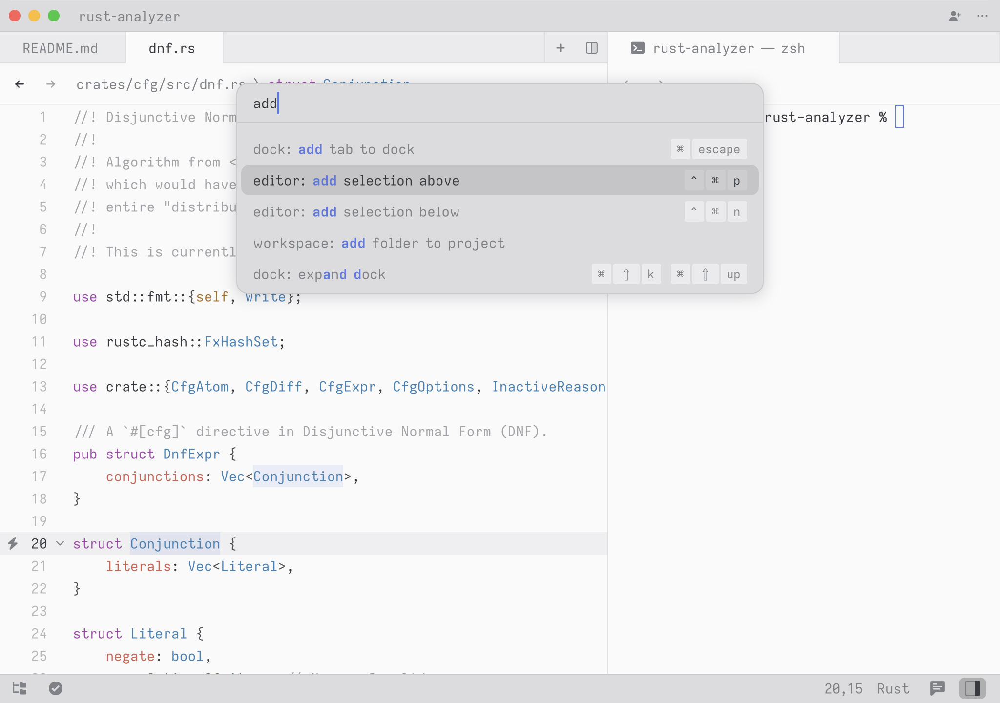
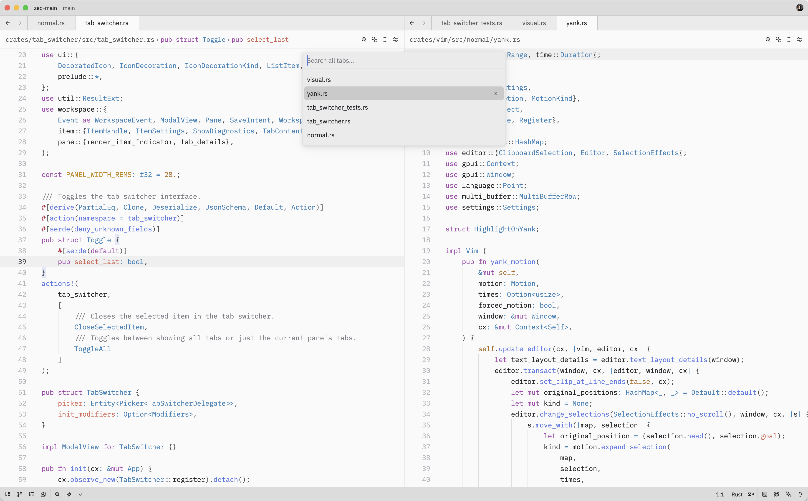
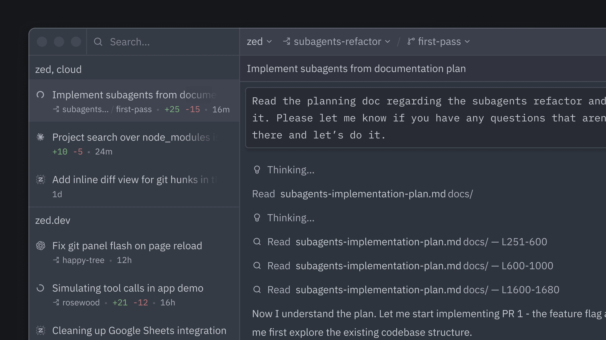

# Zed 暗黑 UI 设计调研

> 调研范围：仅暗黑模式。以 Zed 默认暗色主题 **One Dark** 为准（`assets/themes/one/one.json`，One Dark 同时是官方文档中动态主题的默认 dark 值 [2]）。
> 色值一律为 8 位 RGBA hex（末两位为 alpha），与主题文件原文一致 [7]。无法核实处标注「待核」。

## 1. 概览

Zed 是由 Zed Industries 开发的**开源协作代码编辑器**：Rust 编写、自研 GPUI 即时模式 UI 框架直接绘制到 GPU，无 Electron/浏览器壳 [1]。

**设计风格一句话定性**：以"速度"为第一原则的**极简扁平暗色 UI**——官方团队在 GitHub 讨论中明确表示 UI 是"非常刻意地极简"（*very intentionally minimal*），核心理念是「你的编辑器应该消失」（*Your editor should disappear*），让界面退到背景中、注意力完全留在代码上 [8]。社区对其设计语言的关键词归纳为：sketch（草稿感）、minimalism（极简）、engineering（工程感）、retro（复古）、disappear（隐没）[8]。

这一"极简"直接由工程目标驱动：平滑滚动动画的 PR 曾被官方以 *"A core goal of Zed is speed"*（Zed 的核心目标是速度）为由拒绝 [13]；Zed 的暗色 UI 整体不依赖投影与透明度特效，层级靠背景色阶与 1px 边框表达 [7]。

## 2. 视觉设计语言

### 2.1 配色（One Dark 默认暗色主题）

来源：官方主题源码 `assets/themes/one/one.json` [7]。全局 hex 值以 `#RRGGBBAA` 格式给出。

**底色分层**——Zed 暗色 UI 的层级系统，自上而下按亮度分 3~4 档：

| Token | 色值 | 用途 |
|-------|------|------|
| `background` | `#3b414dff` | 窗口底色；title bar、status bar 背景 |
| `toolbar.background` | `#282c33ff` | 工具栏、**活动页签**背景 |
| `tab.active_background` | `#282c33ff` | 活动页签（与 toolbar 同色，形成"当前文件"连续面） |
| `surface.background` / `elevated_surface.background` | `#2f343eff` | 面板/页签栏/弹层通用表面色 |
| `panel.background` / `tab_bar.background` | `#2f343eff` | 侧栏面板、页签栏 |
| `editor.background` / `editor.gutter.background` | `#282c33ff` | 编辑器画布（最暗层） |
| `element.background` | `#2e343eff` | 控件基底（按钮/输入框等） |
| `title_bar.inactive_background` | `#2e343eff` | 失焦窗口标题栏（降一档以示失焦） |

**文字与图标**：

| Token | 色值 |
|-------|------|
| `text` / `icon` | `#dce0e5ff`（主文本，近白） |
| `text.muted` / `icon.muted` | `#a9afbcff`（次级） |
| `text.placeholder` / `text.disabled` / `icon.disabled` | `#878a98ff`（占位/禁用） |
| `text.accent` / `icon.accent` | `#74ade8ff`（柔和蓝，全 UI 唯一强调色） |
| `editor.foreground` | `#acb2beff`（编辑区正文，比 UI 主文本暗） |

**边框**（Zed 层级的主要表达手段，1px）：

| Token | 色值 |
|-------|------|
| `border` | `#464b57ff` |
| `border.variant` | `#363c46ff`（细分隔线） |
| `border.focused` | `#47679eff`（聚焦态，偏蓝） |
| `border.selected` | `#293b5bff` |
| `border.transparent` | `#00000000` |

**控件状态**（hover/active 均为即时颜色切换，无过渡）：

| Token | 色值 |
|-------|------|
| `element.background` | `#2e343eff` |
| `element.hover` | `#363c46ff` |
| `element.active` / `element.selected` | `#454a56ff` |

**编辑器细节**：

| Token | 色值 |
|-------|------|
| `editor.line_number` | `#4e5a5f`（行号，暗灰蓝） |
| `editor.active_line_number` | `#d0d4da` |
| `editor.active_line.background` | `#2f343ebf`（75% 透明度高亮行） |
| `editor.wrap_guide` | `#c8ccd40d`（引导线，几乎不可见） |
| `editor.document_highlight.read_background` | `#74ade81a`（引用高亮，极淡蓝） |
| `scrollbar.thumb.background` | `#c8ccd44c`（半透明白；轨道全透明） |

**语义状态色**（每色带 background/border 两级变体，如 `error.background #d072771a`、`error.border #4c2b2cff`）：

| 语义 | 主色 |
|------|------|
| error / deleted / `property` | `#d07277ff`（红） |
| warning / conflict / modified | `#dec184ff`（黄） |
| success / created | `#a1c181ff`（绿） |
| info / renamed / link | `#74ade8ff`（蓝） |
| hint | `#788ca6ff` |
| predictive（AI 补全） | `#5a6a87ff`（暗蓝灰，斜体） |
| hidden / ignored | `#878a98ff` |

**终端 ANSI 16 色**（经典 One Dark 终端配色，背景 `#282c34ff` 与编辑器 `#282c33ff` 有细微差异）：

| 色 | 值 | 色 | 值 |
|----|----|----|----|
| red | `#e06c75ff` | bright_red | `#EA858Bff` |
| green | `#98c379ff` | bright_green | `#AAD581ff` |
| yellow | `#e5c07bff` | bright_yellow | `#FFD885ff` |
| blue | `#61afefff` | bright_blue | `#85C1FFff` |
| magenta | `#c678ddff` | bright_magenta | `#D398EBff` |
| cyan | `#56b6c2ff` | bright_cyan | `#6ED5DEff` |
| white | `#abb2bfff` | bright_white | `#fafafaff` |

**语法高亮**（约 40 个 token，来自 theme 的 `syntax` 节 [7]；除 `link_text`/`predictive` 用斜体、`emphasis.strong` 用 700 字重外，全部无字重/字型修饰）：

| Token | 色值 | Token | 色值 |
|-------|------|-------|------|
| keyword / preproc | `#b477cfff`（紫） | string / text.literal | `#a1c181ff`（绿） |
| function / constructor / variant | `#73ade9ff`（蓝） | type / enum / operator / link_uri | `#6eb4bfff`（青） |
| number / boolean | `#bf956aff`（橙） | tag / attribute / label / emphasis | `#74ade8ff`（蓝） |
| comment | `#5d636fff`（暗灰） | comment.doc / string.escape | `#878e98ff` |
| property / variable.parameter / title | `#d07277ff`（红） | punctuation / variable / primary | `#acb2beff` |
| constant / selector | `#dfc184ff` | punctuation.bracket / delimiter | `#b2b9c6ff` |

**多人协作光标**（`players` 数组，8 组）：`#74ade8`、`#be5046`、`#bf956a`、`#b477cf`、`#6eb4bf`、`#d07277`、`#dec184`、`#a1c181`（selection 为同色 24% 透明度）[7]。

### 2.2 字体排版

- **默认字体**：UI 用 `.ZedSans`（当前别名指向 **IBM Plex Sans**）、编辑器用 `.ZedMono`（当前别名指向 **Lilex**）[5]。历史上 Zed Sans/Zed Mono 是官方基于 Iosevka 定制的专属字体（"准等宽"设计，`zed-fonts` 仓库开源）[12]，v0.143 起 PR #13596 将默认字体改为 IBM Plex Sans/Mono（省约 8MB、修复 Linux 字体回退问题），`.ZedSans`/`.ZedMono` 作为别名保留 [11][5]。
- **字号**：`ui_font_size` 默认 **16**，`buffer_font_size` 默认 **15**（像素）[5]。
- **行高**：`buffer_line_height` 默认 `"comfortable"`（**1.618**，黄金比例）；`"standard"` = **1.3**；终端 `line_height` 默认 `"standard"`（1.3）[4][5]。
- **字重**：`ui_font_weight` / `buffer_font_weight` 默认 **400** [5]。

### 2.3 间距、圆角、阴影

- **圆角**：GPUI 的圆角字段为 `corner_radii: Corners<AbsoluteLength>`——**每角独立、绝对长度值，无圆角 token 体系** [33]。具体组件半径在代码中逐组件硬编码，官方未文档化（「待核」）。截图目测：命令面板弹层为小圆角（约 4–8px 级），页签/面板基本直角。
- **阴影**：主题 JSON **不存在任何 shadow token**（One Dark 全文无阴影键）[7]；GPUI 本身支持 BoxShadow（blur/spread radius 字段）[33]，但 Zed 暗色 UI 实际几乎不用投影表达层级（「待核」：未逐组件核实）。层级 = 背景色阶 + 1px 边框（见 2.1）。
- **间距**：无全局间距 token，组件内以像素绝对值书写（「待核」具体数值）。

### 2.4 截图

*Zed UI 全景（官方 Theme Builder 的暗色复刻视图）：标题栏 → 页签栏 → 左侧项目面板 → 编辑器 → 底部状态栏，整体为低对比扁平暗色 [6]。*

## 3. 交互动效

Zed 的动效策略与其"速度优先"定位一致：**几乎不做位移/缩放型动画，动态反馈只保留必要的最小形式**。

**已核实的动效清单**：

| 动效项 | 时长/参数 | 缓动曲线 | 触发时机 | 证据 |
|--------|-----------|----------|----------|------|
| 光标闪烁 | 每 500ms 切换可见/不可见（方波） | 无（纯开关） | 常驻；编辑器与终端复用同一 `BlinkManager` | [27][38] |
| 键入暂停闪烁 | 键入时立即显示光标，500ms 后恢复闪烁 | 无 | 每次按键 | [27] |
| 面板开关 | 无动画，即时展开/收起 | — | 点击面板图标 | [30][31] 源码抽样无 `with_animation` |
| 命令面板 | 无动画，即时出现 | — | `cmd-shift-p` / `ctrl-shift-p` | [32] 源码抽样无 `with_animation` |
| 滚动 | 无动画，像素级即时滚动 | — | 滚轮/滚动条 | [13][14][15] |
| 悬停高亮 | 无过渡，即时切换 `element.hover` 色 | — | hover | [7] |
| 光标移动动画 | 未实现（issue 长期开放） | — | — | [16] |

**要点说明**：

1. **平滑滚动动画被官方否决**：PR #31671（引入 `ScrollAnimationManager` + 可配置时长）经官方实测后关闭，理由是"会让 Zed 变慢，违背核心速度目标"；若要做必须以不牺牲"手感快"为前提 [13][14]。滚动条点击跳转同样无动画 [13]。
2. **光标闪烁是唯一常驻循环动画**：`BlinkManager` 以 500ms 定时器自旋切换可见性；键入时 `pause_blinking()` 先强制显示光标再恢复闪烁，避免打字时光标消失 [27]。设置项 `cursor_blink` 默认 `true`，`cursor_shape` 默认 `"bar"` [5]。
3. **GPUI 提供但 Zed 克制使用的动画基础设施**：`AnimationExt` 缓动集合仅含 `linear`、`quadratic`、`ease_in_out`（二次缓入缓出）、`ease_out_quint`（快速启动、减速停止）、`bounce`（往返回弹）、`pulsating_between`（正弦+三次方复合的"呼吸"透明度循环，用于脉冲式提示）[26]。注意导出集中**没有** CSS 风格的 `ease_out`，减速用 `ease_out_quint` [26]。另有 `App::reduce_motion` 全局减动效开关（装饰性动效会遵循它，GPUI 侧注释明确）[34]。
4. 「待核」：以上"无动画"结论基于对 `workspace.rs`、`dock.rs`、`command_palette.rs` 三个核心文件的源码 grep（三者均无 `with_animation` 调用）[30][31][32]；不排除少数组件（如加载指示、拖拽预览）存在零星动画，未逐一核验。

## 4. 布局与组件结构

### 4.1 信息架构

单窗口单工作区：**标题栏 → 页签栏（含工具栏）→ 中央窗格区 + 左/右侧栏 → 底部状态栏**。窗格可横向/纵向分割为多 pane [36]。侧栏左侧为项目面板（文件树），右侧为 Agent/协作面板等（见下方截图）[37][4]。居中布局 `centered_layout` 默认左右留白各 0.2 相对宽度 [5]。图标主题独立于颜色主题，默认暗色图标主题为 "Zed (Default)" [2]。

*命令面板：`cmd-shift-p`/`ctrl-shift-p` 打开（`cmd-k`/`ctrl-k` 是主题选择器等命令的前缀键），模糊过滤全部命令与动作，键盘全程导航 [35]。*

### 4.2 标题栏

- macOS 上为**统一标题栏**（GPUI 全尺寸内容视图实现，`NSFullSizeContentViewWindowMask` 式融合）：项目名 + Git 分支切换器直接嵌入编辑器 chrome，与红绿灯按钮同层，无系统默认标题栏 [23][21]。
- v0.94.3 起"项目名下方加项目与分支切换器" [22]；PR #46641 引入多项目工作区下拉（后因"设计与最近项目选择器差异过大"而回退收敛）[21]。
- 标题栏背景与窗口背景同色 `#3b414dff`，失焦时降为 `#2e343eff`（见 2.1）[7]。
- 隐藏标题栏/状态栏的"禅模式"PR（#11137）已被官方关闭——会破坏协作体验 [25]。

### 4.3 页签栏与页签切换器

- 每缓冲区一页签；活动页签背景 `#282c33ff` 与工具栏连成一体、非活动页签 `#2f343eff` 与页签栏同色——当前文件通过"唯一凸出的浅色面"识别 [7]。
- **Tab Switcher**（`ctrl-tab`）：按**最近使用顺序**列出所有打开页签；按住 `ctrl` 保持打开，松键切换 [36]。

*Tab Switcher：多窗格状态下按最近使用排序的页签浮层 [36]。*

### 4.4 状态栏

- **左侧**：面板开关类控件（项目面板切换等），与后续项目（诊断、更新提示等）之间有小分隔线 [17]。
- **右侧**：LSP 语言服务器按钮（显示服务器名，点击可重启/停止，hover 显版本）[19]、诊断计数指示器（实时跟随 LSP 诊断总数）[17][19]、光标位置、当前语言、行尾/编码按钮 [20][5]。
- 可控显隐（现行文档，`status_bar` 嵌套设置）：`active_language_button`（默认 true）、`cursor_position_button`（默认 true）、`line_endings_button`（默认 false）、`experimental.show`（实验性）[5]。
- 状态栏背景同窗口底色 `#3b414dff` [7]（左右元素精确排列顺序「待核」）。

### 4.5 侧栏与 Agent 面板

*右侧面板示例：Agent 面板（会话列表 + 消息流 + 输入框），面板底色 `#2f343e`、悬停项 `#363c46` [7][4]。*

项目面板（左侧）以文件树承载项目结构，活动文件高亮 [37]。

## 5. 实现级参数

### 5.1 主题文件与结构

- **路径**：`assets/themes/one/one.json`（GitHub 主分支；本调研下载了副本：`assets/zed/one.json`）[7][3]。
- **Schema**：`https://zed.dev/schema/themes/v0.2.0.json` [7]。
- **结构**：`Theme Family`（`name`/`author`/`themes[]`）→ `Theme`（`name`、`appearance: "dark"|"light"`、`style{...}`）[7][3]。
- **style 分区**（One Dark 暗色 141 个顶层键，含嵌套叶值约 278 个）[7]：
  - 基础：`background`、`foreground`、`accent`；
  - 表面：`surface.background`、`elevated_surface.background`；
  - 控件：`element.*`/`ghost_element.*` 各五态（background/hover/active/selected/disabled）；
  - 边框：`border.*` 五态；文本/图标：`text.*`/`icon.*` 五态；
  - 区域：`status_bar`、`title_bar`（含 inactive）、`toolbar`、`tab_bar`、`tab`（active/inactive）、`search`、`panel`、`pane`、`scrollbar`（thumb/track 各带 hover/border）；
  - 编辑器：`editor.background/foreground/gutter/subheader/active_line/highlighted_line/line_number/active_line_number/hover_line_number/invisible/wrap_guide/active_wrap_guide/document_highlight.read|write`；
  - 终端：`terminal.background/foreground/bright_foreground/dim_foreground` + ANSI 16 色 ×3 组（normal/bright/dim）；
  - 语义状态色 14 组 ×3 级（主色/background/border）：conflict、created、deleted、error、hidden、hint、ignored、info、modified、predictive、renamed、success、unreachable、warning；
  - `version_control.*`、`link_text.hover`、`players[8]`、`syntax{约 40 键}`（每键 `color`/`font_style`/`font_weight`）。
- **规模**：官方博客公布主题系统共 **200+ 颜色 token**，分 **16 类 UI 颜色**（surfaces、borders、scrollbars、terminal 等）与 **10 类语法颜色** [6]。

### 5.2 主题工具链

- **Theme Builder**（zed.dev/theme-builder，2026-02-12 发布 [6]）：可视化编辑 200+ token；核心机制：
  - **实时预览**：交互式 Zed UI 复刻，改色即时生效（底层用 CSS 自定义属性，支持 undo/redo 与本地持久化）[6]；
  - **Inspector**：右键任意元素显示其对应的主题 token（类似浏览器 DevTools）[6]；
  - **颜色联动（color linking）**：token 间建立关联，改源色自动同步联动色（内置推荐联动）[6]；
  - 语法高亮预览用 Tree-sitter（与 Zed 一致）而非 TextMate，保证所见即所得 [6]。

### 5.3 关键默认值（暗色相关）

| 设置 | 默认值 |
|------|--------|
| `ui_font_family` | `.ZedSans`（别名 → IBM Plex Sans）[5] |
| `buffer_font_family` | `.ZedMono`（别名 → Lilex）[5] |
| `ui_font_size` | 16 [5] |
| `buffer_font_size` | 15 [5] |
| `buffer_line_height` | `"comfortable"`（1.618）[5] |
| `ui_font_weight` / `buffer_font_weight` | 400 [5] |
| `cursor_blink` | `true` [5] |
| `cursor_shape` | `"bar"` [5] |
| `theme`（动态模式） | `{ "mode": "system", "light": "One Light", "dark": "One Dark" }` [2] |
| `icon_theme`（暗色） | `"Zed (Default)"` [2] |

### 5.4 渲染层（GPUI）参数

- 缓动函数集：`linear` / `quadratic` / `ease_in_out`（二次） / `ease_out_quint` / `bounce` / `pulsating_between` [26]；
- 圆角：`corner_radii: Corners<AbsoluteLength>`（每角独立绝对长度）[33]；
- 阴影：`BoxShadow{ blur_radius, spread_radius, inset }`，`blur_radius`/`spread_radius` 默认 `0px` [33]；
- 减动效：`App::reduce_motion` 全局开关 [34]；
- 光标闪烁：`BlinkManager`，`Duration::from_millis(500)` 恒定（不可配置）[27]。

## 6. 来源清单

**官方（文档/博客/官网）**

- [1] Zed 官网 — https://zed.dev/
- [2] 官方文档 Appearance — https://zed.dev/docs/appearance
- [3] 官方文档 Themes — https://zed.dev/docs/themes
- [4] 官方文档 Fonts & Visual Tweaks — https://zed.dev/docs/visual-customization
- [5] 官方文档 Configuring Zed（全部设置及默认值）— https://zed.dev/docs/configuring-zed
- [6] 官方博客 Introducing Theme Builder（200+ token / 16 类 UI 色 / 10 类语法色 / Inspector / 颜色联动）— https://zed.dev/blog/theme-builder
- [35] 官方文档 Command Palette — https://zed.dev/docs/command-palette
- [36] 官方文档 Tab Switcher — https://zed.dev/docs/tab-switcher
- [37] 官方文档 Project Panel — https://zed.dev/docs/project-panel

**官方源码（GitHub zed-industries/zed）**

- [7] 主题源码 `assets/themes/one/one.json`（One Dark 全部色值）— https://github.com/zed-industries/zed/blob/main/assets/themes/one/one.json
- [26] `crates/gpui/src/elements/animation.rs`（缓动曲线）— https://raw.githubusercontent.com/zed-industries/zed/main/crates/gpui/src/elements/animation.rs
- [27] `crates/editor/src/blink_manager.rs`（光标闪烁 500ms）— https://raw.githubusercontent.com/zed-industries/zed/main/crates/editor/src/blink_manager.rs
- [28] `crates/editor/src/editor_settings.rs` — https://raw.githubusercontent.com/zed-industries/zed/main/crates/editor/src/editor_settings.rs
- [29] `crates/gpui/src/window.rs` — https://raw.githubusercontent.com/zed-industries/zed/main/crates/gpui/src/window.rs
- [30] `crates/workspace/src/workspace.rs` — https://raw.githubusercontent.com/zed-industries/zed/main/crates/workspace/src/workspace.rs
- [31] `crates/workspace/src/dock.rs` — https://raw.githubusercontent.com/zed-industries/zed/main/crates/workspace/src/dock.rs
- [32] `crates/command_palette/src/command_palette.rs` — https://raw.githubusercontent.com/zed-industries/zed/main/crates/command_palette/src/command_palette.rs
- [33] `crates/gpui/src/style.rs`（corner_radii / BoxShadow）— https://raw.githubusercontent.com/zed-industries/zed/main/crates/gpui/src/style.rs
- [34] `crates/gpui/src/elements/animation.rs`（reduce_motion 注释）— https://raw.githubusercontent.com/zed-industries/zed/main/crates/gpui/src/elements/animation.rs
- [38] commit `18df6158` terminal_view 复用编辑器 blink manager — https://github.com/zed-industries/zed/commit/18df6158ee939865ebc8932b3a4aa3c7ef6f1949
- [10] PR #40035 主题模式切换 action（closed 未合并，不作依据；动态主题默认值由 [2] 支撑）— https://github.com/zed-industries/zed/pull/40035
- [11] PR #13596 Move from Zed fonts to IBM Plex — https://github.com/zed-industries/zed/pull/13596
- [12] zed-fonts 仓库（Zed Sans/Zed Mono，Iosevka 衍生）— https://github.com/zed-industries/zed-fonts
- [13] PR #31671 editor: Smooth scroll（官方拒绝，速度优先）— https://github.com/zed-industries/zed/pull/31671
- [14] Discussion #31518 smooth scrolling 提案 — https://github.com/zed-industries/zed/discussions/31518
- [15] Issue #4355 Smooth scrolling — https://github.com/zed-industries/zed/issues/4355
- [16] Issue #4991 Animated/smooth cursor movement — https://github.com/zed-industries/zed/issues/4991
- [17] Issue #5460 Status bar 左右侧内容 — https://github.com/zed-industries/zed/issues/5460
- [18] Issue #890 Design Implementation: Statusbar — https://github.com/zed-industries/zed/issues/890
- [19] zed.tips：状态栏 LSP 按钮（右下角，可重启/停止）— https://zed.tips/tips/language-server-ui-controls
- [20] PR #8241 状态栏项显隐设置（closed 未合并，不作依据；现行设置名见 all-settings 文档）— https://github.com/zed-industries/zed/pull/8241
- [21] PR #46641 多项目工作区 UX（标题栏项目下拉）— https://github.com/zed-industries/zed/pull/46641
- [22] Issue #4629 项目名下的项目/分支切换器 — https://github.com/zed-industries/zed/issues/4629
- [23] 第三方项目 Issue #707（以 Zed 统一标题栏为范本，佐证其全尺寸内容视图实现）— https://github.com/jsmestad/minga/issues/707
- [24] Issue #7955 透明/毛玻璃标题栏请求（未实现）— https://github.com/zed-industries/zed/issues/7955
- [25] PR #11137 隐藏标题栏/状态栏（已关闭）— https://github.com/zed-industries/zed/pull/11137

**社区/第三方分析**

- [8] GitHub Discussion #8499 "UI more modern"（官方"编辑器应消失/刻意极简"表态）— https://github.com/zed-industries/zed/discussions/8499
- [9] GitHub Discussion #8763 "Zed Needs to Improve UI. Create a Design Pattern." — https://github.com/zed-industries/zed/discussions/8763

**截图素材（已下载至 `assets/zed/`，均为官方暗色素材）**

- `command-palette.jpg` ← https://zed.dev/img/features/command-palette.jpg
- `tab-switcher.png` ← https://zed.dev/img/features/tab-switcher.png
- `theme-builder-thumb.webp` ← https://images.zed.dev/blog/theme-builder/thumbnail.webp
- `sidebar-agent.webp` ← https://zed.dev/img/parallel-agents/sidebar.webp
- `video-agent.webp` ← https://images.zed.dev/video-posters/agent.webp
- `video-git.webp` ← https://images.zed.dev/video-posters/git.webp
- `agentic-explore.webp` ← https://zed.dev/img/agentic/posters/explore-poster.webp
- `edit-prediction.webp` ← https://zed.dev/img/edit-prediction/edit-1-poster.webp
- `one.json`（One Dark 主题源码副本）← https://raw.githubusercontent.com/zed-industries/zed/main/assets/themes/one/one.json
